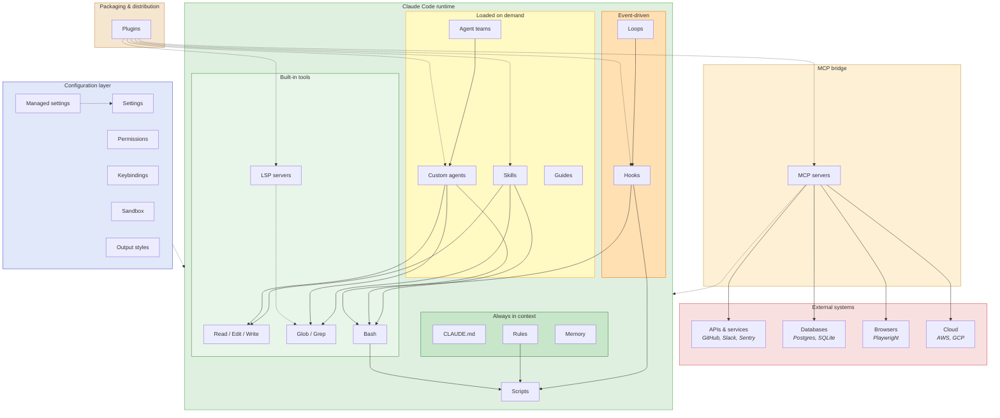
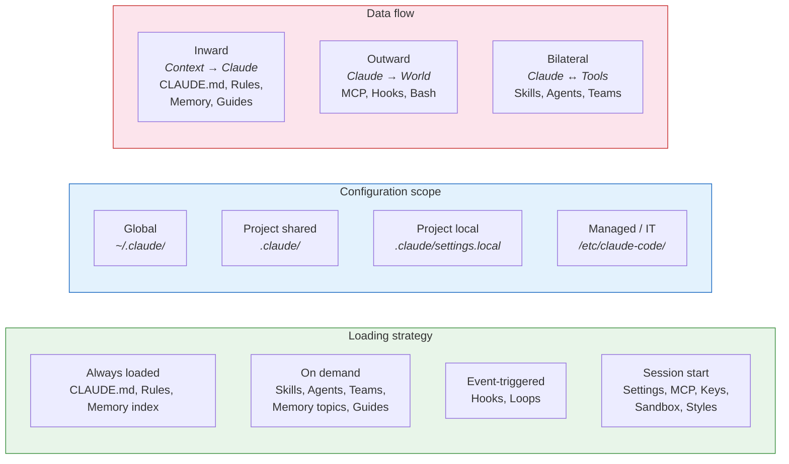
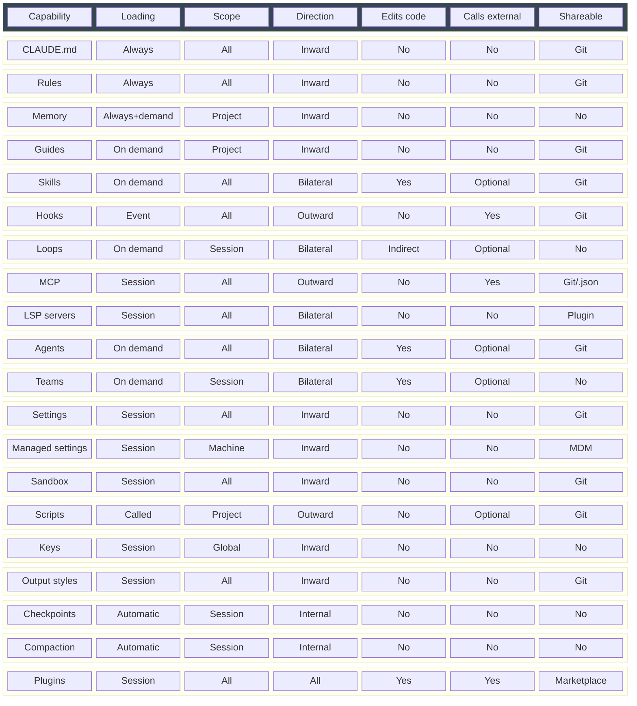
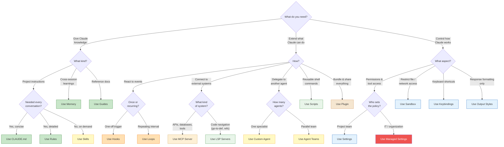
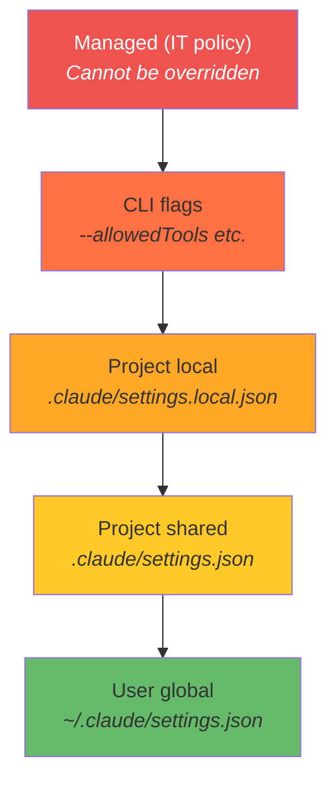

# Claude Code Capability Guides

Reference guides for every Claude Code extension mechanism that you configure in a project. Each guide covers what it is, when to use it, and real-world examples.

## Architecture overview

## How capabilities relate

## Capability matrix

## Decision flowchart

## Precedence hierarchy

## Guides

### Authoring — teach Claude what to do

| Guide | Mechanism | Loading |
|-------|-----------|---------|
| [claude-md.md](authoring/claude-md.md) | CLAUDE.md project instructions | Always in context |
| [rules.md](authoring/rules.md) | `.claude/rules/` topic files | Always in context |
| [skills.md](authoring/skills.md) | `.claude/skills/` task templates | On-demand |
| [memory.md](authoring/memory.md) | Persistent notes across sessions | Index always, topics on-demand |
| [guides.md](authoring/guides.md) | Reference documentation in `.claude/guides/` | On-demand |

### Execution — extend what Claude can do

| Guide | Mechanism | Loading |
|-------|-----------|---------|
| [hooks.md](execution/hooks.md) | Event-driven shell automation | Triggered by events |
| [loops.md](execution/loops.md) | Recurring scheduled tasks | On-demand interval |
| [mcp-servers.md](execution/mcp-servers.md) | External tool integration | At session start |
| [lsp-servers.md](execution/lsp-servers.md) | Code intelligence (go-to-def, refs) | At session start |
| [custom-agents.md](execution/custom-agents.md) | Specialized subagents | On-demand |
| [agent-teams.md](execution/agent-teams.md) | Coordinated parallel agents | On-demand |
| [scripts.md](execution/scripts.md) | Reusable shell helpers | Called from rules/hooks |
| [plugins.md](execution/plugins.md) | Packaged extension bundles | At session start |

### Configuration — control how Claude works

| Guide | Mechanism | Loading |
|-------|-----------|---------|
| [settings.md](config/settings.md) | Permissions, config, modes | At session start |
| [managed-settings.md](config/managed-settings.md) | Organization-wide policy enforcement | At session start |
| [sandbox.md](config/sandbox.md) | Filesystem/network isolation | At session start |
| [keybindings.md](config/keybindings.md) | Keyboard shortcuts | At session start |
| [output-styles.md](config/output-styles.md) | Response formatting | At session start |

### Session — automatic behavior

| Guide | Mechanism | Loading |
|-------|-----------|---------|
| [checkpoints.md](session/checkpoints.md) | Session snapshots and rewind | Automatic |
| [context-compaction.md](session/context-compaction.md) | Conversation summarization | Automatic at ~95% capacity |
