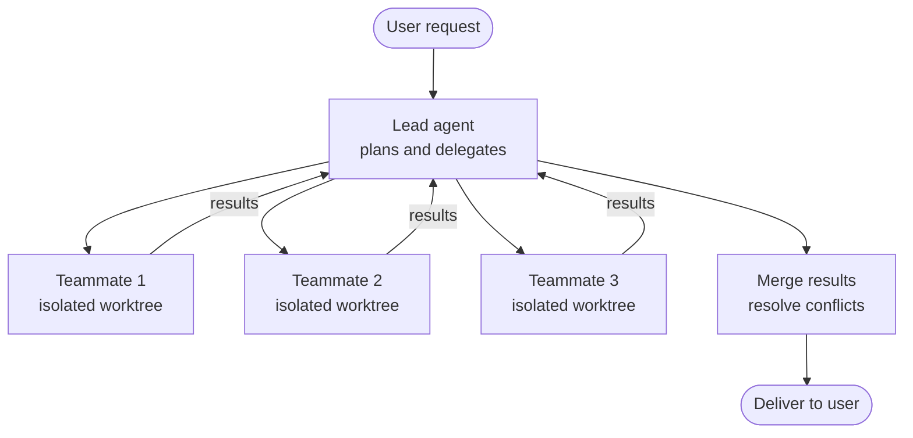

# Agent Teams — Coordinated Parallel Work

## What it is

Multiple Claude agents working in parallel on related tasks with shared coordination and message passing. Unlike subagents (ephemeral, one-off delegations), agent teams persist across turns, operate on separate branches or worktrees, and communicate results to each other.

## How to activate

- `/team` command — Start or manage an agent team
- Configuration in settings for persistent team setups

## When to use

- Large refactors that can be split into independent modules
- Parallel investigation of competing hypotheses
- Multi-service changes that touch separate codebases
- Code review where multiple reviewers check different aspects
- Bulk operations across many files that benefit from parallelism

## When NOT to use

- Sequential tasks where each step depends on the previous → use normal workflow
- Simple tasks that a single agent handles in seconds → overhead isn't worth it
- Tasks requiring tight coordination on the same files → agents will conflict

## How it works



## Key concepts

| Concept | Description |
|---------|-------------|
| **Lead agent** | Coordinates the team, delegates tasks, merges results |
| **Teammates** | Independent agents with assigned tasks and isolated context |
| **Message passing** | Agents communicate via structured messages, not shared state |
| **Plan approval** | User approves the delegation plan before teammates begin |
| **Context isolation** | Each teammate has its own context window and working state |
| **Worktree isolation** | Each teammate can work in a separate git worktree |

## Team vs. subagents

| Feature | Subagents | Agent Teams |
|---------|-----------|-------------|
| Lifecycle | Single turn | Multi-turn, persistent |
| Coordination | Fire and forget | Message passing |
| Context | Subset of parent | Fully independent |
| Branching | Optional worktree | Typically separate worktrees |
| Typical use | Quick research task | Large parallel workload |

## Examples

### 1. Parallel module refactoring

```
User: Refactor the auth, billing, and notification modules to use the new event bus.

Lead agent:
- Plans the migration pattern
- Creates 3 teammates, one per module
- Each teammate works in an isolated worktree

Teammate 1: Migrates auth module → auth-event-bus branch
Teammate 2: Migrates billing module → billing-event-bus branch
Teammate 3: Migrates notification module → notification-event-bus branch

Lead agent: Merges all three, runs integration tests
```

### 2. Competing hypothesis investigation

```
User: Production latency spiked at 3am. Find the root cause.

Lead agent delegates:
- Teammate 1: Investigate database query performance (slow query log, indexes)
- Teammate 2: Investigate infrastructure (CPU, memory, network, recent deploys)
- Teammate 3: Investigate application code (recent changes, error rates, timeouts)

Each teammate reports findings. Lead agent correlates and identifies root cause.
```

### 3. Multi-aspect code review

```
User: Review this PR from all angles.

Lead agent delegates:
- Teammate 1 (security-reviewer agent): Check for vulnerabilities
- Teammate 2 (perf-analyzer agent): Check for performance issues
- Teammate 3 (test-writer agent): Evaluate test coverage and gaps

Lead agent: Consolidates into a unified review with prioritized findings.
```

### 4. Bulk migration across services

```
User: Upgrade all 5 microservices from Express 4 to Express 5.

Lead agent:
- Reads migration guide
- Creates one teammate per service
- Each teammate: reads service code, applies migration, runs tests
- Reports back: success, failures, manual steps needed

Lead agent: Summarizes migration status across all services.
```

### 5. Documentation sprint

```
User: Generate API docs for all 8 route files.

Lead agent delegates one teammate per route file:
- Each reads the handlers, extracts endpoints, generates OpenAPI YAML
- Reports completion status

Lead agent: Merges all YAML into a single API spec, validates, and resolves conflicts.
```

### 6. Test coverage blitz

```
User: Our coverage is 45%. Get it to 80%.

Lead agent:
- Analyzes coverage report to find gaps
- Groups uncovered code by module
- Delegates one teammate per module to write tests
- Each teammate: reads source, writes focused tests, verifies they pass

Lead agent: Merges test files, runs full suite, reports new coverage.
```

### 7. Cross-platform compatibility

```
User: Make sure our CLI works on macOS, Linux, and Windows.

Lead agent delegates:
- Teammate 1: Audit for macOS-specific path handling
- Teammate 2: Audit for Linux-specific assumptions (systemd, /proc)
- Teammate 3: Audit for Windows incompatibilities (path separators, line endings)

Each reports platform-specific issues. Lead agent creates a unified fix plan.
```

### 8. Monorepo dependency update

```
User: Update React from 18 to 19 across all packages in the monorepo.

Lead agent:
- Maps which packages depend on React
- Creates one teammate per package
- Each teammate: updates deps, fixes breaking changes, runs package tests
- Reports back with status and any manual fixes needed

Lead agent: Runs cross-package integration tests, resolves shared dependency conflicts.
```

### 9. Parallel feature development

```
User: Build the user profile page — frontend, backend API, and database migration.

Lead agent delegates:
- Teammate 1: Database migration and model
- Teammate 2: Backend API endpoints (waits for Teammate 1's schema)
- Teammate 3: Frontend components (uses API contract, doesn't wait for backend)

Lead agent: Coordinates the dependency, integrates when all are done.
```

### 10. Incident response team

```
User: The checkout flow is down. All hands.

Lead agent delegates:
- Teammate 1: Analyze error logs and stack traces
- Teammate 2: Check recent deployments and config changes
- Teammate 3: Monitor recovery attempts and test fixes

Lead agent: Coordinates findings, directs mitigation, documents the incident timeline.
```
