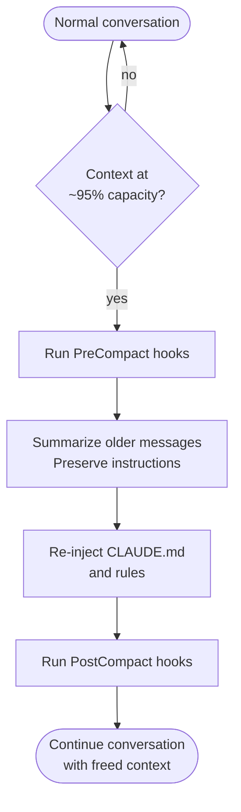

# Context Compaction — Automatic Conversation Summarization

## What it is

When a conversation approaches the context window limit (~95% capacity), Claude automatically summarizes older messages to free up space. This allows long sessions to continue indefinitely without losing critical instructions. CLAUDE.md files and rules are re-injected after compaction to ensure instructions persist.

## Where it's configured

- Automatic — triggers at ~95% context capacity by default
- `PreCompact` hook — runs before compaction begins
- `PostCompact` hook — runs after compaction completes
- Context usage is visible in the status line (if configured)

## When it matters

- Long coding sessions with many file reads and edits
- Sessions with large file contents that consume context quickly
- Multi-step tasks where early context becomes less relevant
- Sessions where you've pasted large error logs or data

## What's preserved vs. summarized

| Preserved exactly | Summarized |
|-------------------|------------|
| CLAUDE.md files | Old file read contents |
| Rules (`.claude/rules/`) | Intermediate tool results |
| Current task context | Earlier conversation turns |
| Active plan | Previous exploration paths |
| Loaded skills | Superseded file versions |

## How it works



## What to know

### After compaction, re-derive values

Previously read file contents are no longer verbatim in context. If you need to modify a file after compaction:

1. **Re-read the file** — don't rely on the summary
2. **Re-derive dates and versions** — run the source commands again
3. **Re-check variable values** — the summary may not include them
4. **Re-read all files in a multi-file change** — don't assume earlier reads are accurate

### Subagents are not affected

Subagent conversations have their own context windows. Compaction of the parent conversation does not affect active subagents.

### CLAUDE.md is re-injected

After compaction, all CLAUDE.md files (project root, `.claude/CLAUDE.md`, parent directories, global) are loaded again. This ensures project instructions survive indefinitely across any number of compaction cycles.

## Examples

### 1. PreCompact hook to save state

```json
{
  "hooks": {
    "PreCompact": [
      {
        "type": "command",
        "command": "echo 'Context compaction starting' >> /tmp/claude-session.log"
      }
    ]
  }
}
```

Log when compaction happens for session tracking.

### 2. PostCompact hook to notify

```json
{
  "hooks": {
    "PostCompact": [
      {
        "type": "command",
        "command": "osascript -e 'display notification \"Context compacted\" with title \"Claude Code\"'"
      }
    ]
  }
}
```

Desktop notification when compaction occurs (macOS).

### 3. Monitoring context usage in the status line

Configure the status line to show context usage percentage:

```json
{
  "statusline": {
    "items": [
      { "type": "context-usage" }
    ]
  }
}
```

Shows `Context: 45%` in the status bar so you can anticipate compaction.

### 4. Handling compaction during multi-file refactoring

```
[Before compaction]
Claude: I've read all 8 files and planned the refactoring.
*edits 3 files*

[Compaction occurs — context at 95%]

Claude: Context was compacted. Let me re-read the remaining files
        before continuing the refactoring.
*re-reads files 4-8*
*continues editing with fresh, accurate file contents*
```

### 5. Long debugging session

```
[Turn 1-50: Investigating the bug]
- Read 30 files
- Ran 15 commands
- Explored 4 hypotheses

[Compaction at turn 50]
Summary preserves: current hypothesis, key findings, files identified
Discards: contents of files already ruled out, intermediate grep results

[Turn 51+: Continues with focused context]
Claude: Based on our investigation so far, the issue is in the
        cache invalidation. Let me re-read that specific file...
```

### 6. Preserving plan across compaction

```
[Turn 1: Create plan]
Claude: Here's the implementation plan:
1. Add database migration
2. Update models
3. Add API endpoints
4. Write tests

[Turn 20: Compaction occurs]

[Turn 21: Plan is preserved in summary]
Claude: Continuing with step 3 of our plan — adding API endpoints.
        Let me re-read the model file since context was compacted...
```

### 7. Version and date re-derivation

```
[After compaction]
Claude: I need to re-derive the current version before bumping it.

$ cat project-meta.yaml | grep version  # Re-read, don't recall
version: "0.38.1"

$ date +%Y-%m-%d  # Re-derive, don't guess
2026-03-18
```

### 8. Reducing context pressure proactively

To delay compaction and keep more context available:

- Use `@file` mentions instead of asking Claude to read large files
- Keep conversations focused on one topic
- Start a new session for unrelated work
- Use subagents for large exploration tasks (they have their own context)

### 9. Multi-session workflow

When a task is too large for one context window:

```
Session 1: Research and plan (plan mode)
→ Save findings to memory

Session 2: Implement phase 1
→ Memory loads the plan automatically

Session 3: Implement phase 2
→ Memory provides continuity
```

Memory bridges sessions without relying on context surviving compaction.

### 10. Compaction-safe instructions

Instructions that survive compaction:

```
# In CLAUDE.md (always re-injected):
Always run tests before committing.
Use snake_case for Python functions.

# In .claude/rules/ (always re-injected):
[All rule files are preserved across compaction]
```

Instructions that do NOT survive compaction:

```
User: "For the rest of this session, always use TypeScript strict mode."
→ This may be summarized away after compaction
→ Put it in CLAUDE.md or rules instead
```
