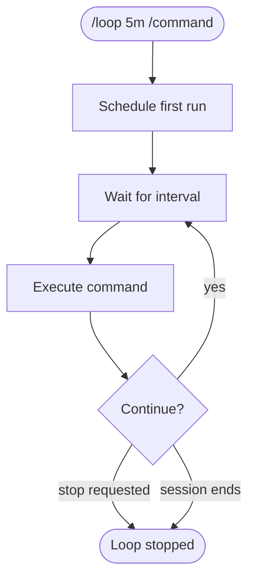

# Loops — Recurring Scheduled Tasks

## What it is

A built-in mechanism for running prompts or slash commands on a recurring interval. Loops let Claude automatically repeat an action — checking deploy status, running tests, polling for changes — without you having to re-type the command each time.

## How to use

```
/loop <interval> <command>
```

- **interval**: How often to run (e.g., `5m`, `10m`, `1h`). Defaults to 10 minutes if omitted.
- **command**: Any prompt or slash command to execute each interval.

## When to use

- Polling deploy status until it completes
- Running a health check repeatedly during an incident
- Periodically checking CI/CD pipeline results
- Monitoring a long-running process
- Babysitting PRs (checking for review comments, CI status)
- Running a build after each round of changes

## When NOT to use

- One-off tasks → just run the command directly
- Permanent automation → use Hooks (they persist across sessions)
- Cron jobs on a server → use actual cron or systemd timers
- Tasks that need to run when Claude isn't active → use CI/CD

## How it works



## Key behaviors

- Loops run within the current session — they stop when the session ends
- Each iteration executes the full command as if you typed it
- You can stop a loop by asking Claude to stop it
- Multiple loops can run concurrently
- Loops have a 3-day maximum expiry as a safety net

## Examples

### 1. Monitor a deployment

```
/loop 2m Check the deploy status with `gh run list --limit 1` and tell me when it completes
```

Checks every 2 minutes until the deployment finishes.

### 2. Babysit PR checks

```
/loop 5m Check if there are new review comments on PR #42 and summarize them
```

### 3. Watch for CI failures

```
/loop 10m Run `gh run list --branch main --limit 5` and alert me if any failed
```

### 4. Periodic test runs during development

```
/loop 3m Run pytest tests/test_auth.py -v and report any failures
```

Useful when you're editing files in another window and want continuous feedback.

### 5. Monitor error rates

```
/loop 5m Check the last 50 lines of /var/log/app/error.log and summarize any new errors
```

### 6. Poll for merge readiness

```
/loop 5m Check if PR #87 has all required approvals and passing checks. If ready, tell me.
```

### 7. Recurring code quality check

```
/loop 10m Run ruff check src/ and report any new linting issues
```

### 8. Watch for dependency vulnerabilities

```
/loop 1h Run pip-audit and report any new vulnerabilities since last check
```

### 9. Monitor disk usage during large operations

```
/loop 1m Check disk usage with df -h /tmp and warn if above 90%
```

### 10. Repeated skill invocation

```
/loop 15m /review
```

Runs the review skill every 15 minutes — useful during active development sprints.
