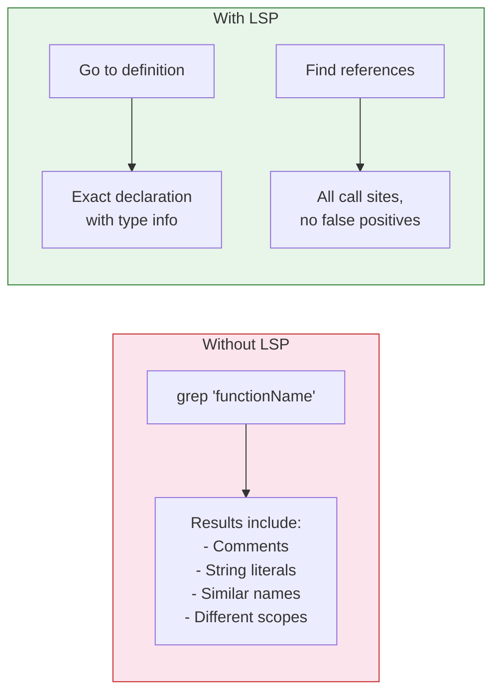

# LSP Servers — Code Intelligence

## What it is

Language Server Protocol (LSP) servers provide code intelligence features — go-to-definition, find-references, hover documentation, and symbol search — that Claude can use to navigate codebases more precisely. Instead of searching with Grep (text-level matching), LSP gives Claude semantic understanding of code structure.

## Where it's configured

- Inside plugins that provide LSP integration
- `.mcp.json` with `type: "lsp"` for direct LSP server configuration
- Project-level or user-level settings

## When to use

- Large codebases where text search returns too many false positives
- Typed languages (TypeScript, Go, Rust, Java) where LSP provides accurate navigation
- Refactoring tasks that need to find all usages of a symbol
- Understanding type hierarchies and interface implementations
- When you need precise "find all references" instead of grep-based text search

## When NOT to use

- Dynamic languages without good LSP support (plain JavaScript, Python without type hints)
- Small projects where Grep is fast enough
- One-off file reads where full code intelligence isn't needed
- CI/CD environments where LSP startup time is wasteful

## How it helps



## LSP capabilities Claude can use

| Capability | What it does |
|-----------|-------------|
| **Go to definition** | Jump to where a symbol is declared |
| **Find references** | List all usages of a symbol across the codebase |
| **Hover** | Get type information and documentation for a symbol |
| **Workspace symbols** | Search for symbols by name across all files |
| **Rename** | Safely rename a symbol everywhere it's used |
| **Diagnostics** | Get real-time errors and warnings from the compiler |

## Examples

### 1. TypeScript LSP via plugin

```json
{
  "plugins": [
    {
      "name": "typescript-lsp",
      "lsp": {
        "command": "typescript-language-server",
        "args": ["--stdio"],
        "languages": ["typescript", "javascript"]
      }
    }
  ]
}
```

### 2. Go LSP (gopls)

```json
{
  "plugins": [
    {
      "name": "go-lsp",
      "lsp": {
        "command": "gopls",
        "args": ["serve"],
        "languages": ["go"]
      }
    }
  ]
}
```

### 3. Python LSP (pyright)

```json
{
  "plugins": [
    {
      "name": "python-lsp",
      "lsp": {
        "command": "pyright-langserver",
        "args": ["--stdio"],
        "languages": ["python"]
      }
    }
  ]
}
```

### 4. Rust LSP (rust-analyzer)

```json
{
  "plugins": [
    {
      "name": "rust-lsp",
      "lsp": {
        "command": "rust-analyzer",
        "languages": ["rust"]
      }
    }
  ]
}
```

### 5. Precise refactoring with find-references

```
User: Rename the `getUserProfile` function to `fetchUserProfile` everywhere.

Without LSP: grep finds 47 matches including comments and strings
With LSP: find-references returns exactly 12 actual call sites
```

### 6. Understanding type hierarchies

```
User: What implements the `PaymentProvider` interface?

LSP: Returns all implementing types:
  - StripeProvider (src/payments/stripe.go:15)
  - PayPalProvider (src/payments/paypal.go:22)
  - MockProvider (tests/mock_provider.go:8)
```

### 7. Getting type information on hover

```
User: What type does `processOrder` return?

LSP hover: func processOrder(order Order) (Receipt, error)
```

### 8. Workspace symbol search

```
User: Find all exported types related to authentication.

LSP workspace symbols: AuthConfig, AuthMiddleware, AuthToken,
  AuthProvider, AuthError (with exact file locations)
```

### 9. Real-time diagnostics

```
User: Are there any type errors in the codebase?

LSP diagnostics:
  src/api/handler.go:45 — cannot use string as int in argument
  src/models/user.go:78 — field 'Email' undefined on type 'Profile'
```

### 10. Token-efficient navigation

Without LSP, Claude might read 5 files to trace a function call chain. With LSP, "go to definition" resolves it in one step — saving tokens and time.

```
Step 1: Hover on `processPayment` → sees it returns (Receipt, error)
Step 2: Go to definition → jumps to src/billing/processor.go:89
Step 3: Find references → sees 3 callers in handler.go, worker.go, cli.go
```

Three precise queries instead of reading dozens of files.
