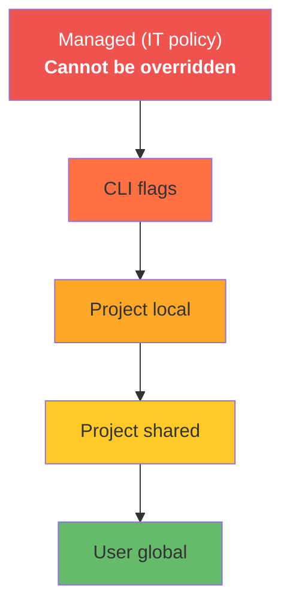

# Managed Settings — Organization-Wide Policy Enforcement

## What it is

Settings deployed by IT or organization administrators that apply to all Claude Code users on managed machines. Managed settings cannot be overridden by users, projects, or CLI flags — they are the highest-priority configuration layer.

## Where it lives

- `.managed-settings.json` — Deployed via MDM, configuration management, or file distribution
- System-level paths vary by OS:
  - macOS: `/Library/Application Support/claude-code/managed-settings.json`
  - Linux: `/etc/claude-code/managed-settings.json`
  - Windows: `%ProgramData%\claude-code\managed-settings.json`

## When to use

- Enforce security policies across all developers (block dangerous tools, require sandbox)
- Mandate authentication methods (SSO, API key restrictions)
- Control MCP server visibility (only approved servers)
- Restrict models or features for compliance
- Set organization-wide defaults that individual developers shouldn't change

## When NOT to use

- Personal preferences → use `~/.claude/settings.json`
- Project conventions → use `.claude/settings.json`
- Local overrides → use `.claude/settings.local.json`
- Temporary restrictions → use CLI flags

## Precedence hierarchy



Managed settings always win. If a managed setting says `sandbox.enabled: true`, no user or project can disable it.

## Examples

### 1. Enforce sandbox on all machines

```json
{
  "sandbox": {
    "enabled": true,
    "paths": {
      "deny": [
        "${HOME}/.ssh",
        "${HOME}/.aws",
        "${HOME}/.gnupg",
        "**/*.pem",
        "**/*.key"
      ]
    }
  }
}
```

All developers have sandbox enabled with sensitive paths blocked.

### 2. Restrict allowed tools

```json
{
  "permissions": {
    "deny": [
      "Bash(rm -rf *)",
      "Bash(curl * | bash)",
      "Bash(sudo *)",
      "Bash(chmod 777 *)"
    ]
  }
}
```

Block dangerous shell patterns organization-wide.

### 3. Mandate MCP server allowlist

```json
{
  "mcpServers": {
    "allowlist": [
      "github-enterprise",
      "jira-internal",
      "postgres-readonly"
    ]
  }
}
```

Only approved MCP servers can be used.

### 4. Require authentication

```json
{
  "auth": {
    "required": true,
    "method": "sso",
    "provider": "okta"
  }
}
```

All users must authenticate via corporate SSO.

### 5. Control model access

```json
{
  "models": {
    "allowed": [
      "claude-sonnet-4-6",
      "claude-haiku-4-5-20251001"
    ]
  }
}
```

Restrict to specific models (e.g., exclude Opus for cost control).

### 6. Enforce network restrictions

```json
{
  "sandbox": {
    "network": {
      "enabled": true,
      "allow": [
        "*.company.internal",
        "api.github.com",
        "registry.npmjs.org",
        "pypi.org"
      ]
    }
  }
}
```

Only internal services and approved registries.

### 7. Disable specific features

```json
{
  "features": {
    "voiceDictation": false,
    "remoteSessions": false,
    "plugins": {
      "marketplace": false
    }
  }
}
```

Disable features that don't meet security requirements.

### 8. Set audit logging

```json
{
  "audit": {
    "enabled": true,
    "destination": "syslog",
    "level": "tool-calls"
  }
}
```

Log all tool calls for compliance and audit trails.

### 9. Enforce attribution policy

```json
{
  "attribution": {
    "required": false
  }
}
```

Control whether AI attribution is required or prohibited in commits.

### 10. Combined enterprise policy

```json
{
  "sandbox": {
    "enabled": true,
    "paths": {
      "deny": ["${HOME}/.ssh", "${HOME}/.aws", "**/*.pem"]
    },
    "network": {
      "enabled": true,
      "allow": ["*.company.internal", "api.github.com"]
    }
  },
  "permissions": {
    "deny": ["Bash(sudo *)", "Bash(curl * | bash)"]
  },
  "auth": {
    "required": true,
    "method": "sso"
  },
  "audit": {
    "enabled": true,
    "destination": "syslog"
  },
  "models": {
    "allowed": ["claude-sonnet-4-6", "claude-haiku-4-5-20251001"]
  }
}
```

Full enterprise lockdown: sandbox, network restrictions, auth, audit, model control.
