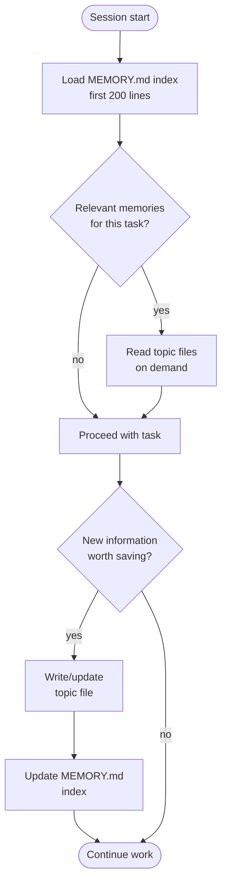

# Auto Memory — Persistent Context Across Sessions

## What it is

A file-based memory system where Claude writes and reads notes that persist across conversations. Memory captures learnings, preferences, and project context that would otherwise be lost when a session ends. Unlike CLAUDE.md (instructions you write), memory is context Claude captures.

## Where it lives

- `~/.claude/projects/<project-hash>/memory/` — Per-project memory (shared across worktrees)
- `MEMORY.md` — Index file loaded at conversation start (first 200 lines)
- Topic files (e.g., `debugging.md`, `user_role.md`) — Loaded on demand when relevant

## When to use

- Store learnings that help future sessions (build commands, architecture decisions, debugging insights)
- Capture user preferences and role information
- Record project-specific context not derivable from code
- Track feedback and corrections to avoid repeating mistakes
- Note references to external systems (issue trackers, dashboards, Slack channels)

## When NOT to use

- Code patterns or architecture → read the code directly
- Git history → use `git log` / `git blame`
- Debugging solutions → the fix is in the code, the context is in the commit message
- Temporary task state → use todos or plan mode
- Anything already in CLAUDE.md or rules

## Memory types

| Type | Purpose | When to save |
|------|---------|-------------|
| `user` | Role, preferences, knowledge level | When you learn about the user's background |
| `feedback` | Corrections and guidance from the user | When the user corrects your approach |
| `project` | Ongoing work, goals, decisions, deadlines | When you learn who/what/why/when about work |
| `reference` | Pointers to external systems | When you learn where information lives outside the repo |

## Memory file format

```markdown
---
name: user_role
description: User is a senior backend engineer new to React
type: user
---

User has 10 years of Go experience but is touching the React frontend
for the first time. Frame frontend explanations using backend analogues
(components as handlers, props as function arguments, state as in-memory cache).
```

## MEMORY.md index format

```markdown
# Project Memory

- [user_role.md](user_role.md) — Senior backend engineer, new to React
- [feedback_testing.md](feedback_testing.md) — Always use real database in integration tests
- [project_auth_rewrite.md](project_auth_rewrite.md) — Auth middleware rewrite driven by compliance
```

## How Claude uses memory



## Examples

### 1. Capturing user role

```markdown
---
name: user_backend_engineer
description: User is a senior backend engineer exploring the frontend codebase
type: user
---

Senior backend engineer with deep Go and PostgreSQL experience. First time
working with React and TypeScript in this project. Prefers explanations
that map frontend concepts to backend analogues.
```

### 2. Recording feedback about testing approach

```markdown
---
name: feedback_real_database
description: Integration tests must hit a real database, never mocks
type: feedback
---

Integration tests must use a real database, not mocks.

**Why:** Last quarter, mocked tests passed but the production migration failed.
Mock/prod divergence masked a broken migration.

**How to apply:** For any test tagged `integration`, spin up a test database
rather than patching the database layer.
```

### 3. Tracking a project decision

```markdown
---
name: project_auth_rewrite
description: Auth middleware rewrite motivated by legal/compliance, not tech debt
type: project
---

Auth middleware rewrite is driven by legal/compliance requirements around
session token storage, not tech-debt cleanup.

**Why:** Legal flagged the old middleware for storing session tokens in a way
that doesn't meet new compliance requirements.

**How to apply:** Scope decisions should favor compliance over ergonomics.
When in doubt about auth design tradeoffs, prioritize the compliance angle.
```

### 4. Saving a reference to an external system

```markdown
---
name: reference_linear_bugs
description: Pipeline bugs are tracked in Linear project INGEST
type: reference
---

Pipeline bugs are tracked in the Linear project "INGEST".

When the user mentions pipeline issues or asks about bug status,
check Linear INGEST first.
```

### 5. Recording a date-sensitive project note

```markdown
---
name: project_merge_freeze
description: Merge freeze starts 2026-03-20 for mobile release cut
type: project
---

Merge freeze begins 2026-03-20 for mobile release branch cut.

**Why:** Mobile team is cutting a release branch and needs a stable base.

**How to apply:** Flag any non-critical PR work scheduled after that date.
Convert all relative dates to absolute when saving.
```

### 6. Remembering a user preference for terse output

```markdown
---
name: feedback_no_summaries
description: User wants terse responses with no trailing summaries
type: feedback
---

Do not summarize what was just done at the end of responses.

**Why:** User can read the diff and finds trailing summaries redundant.

**How to apply:** End responses after the last meaningful action or decision.
Skip "In summary..." or "To recap..." paragraphs.
```

### 7. Storing a deployment context reference

```markdown
---
name: reference_grafana_latency
description: Oncall latency dashboard at grafana.internal/d/api-latency
type: reference
---

grafana.internal/d/api-latency is the oncall latency dashboard.

Check it when editing request-path code. If changes could affect
p99 latency, mention the dashboard in the PR description.
```

### 8. Capturing a naming convention preference

```markdown
---
name: feedback_branch_naming
description: Always use ticket ID prefix in branch names
type: feedback
---

Include the ticket ID in branch names when one exists (e.g., `PROJ-123/feat/description`).

**Why:** Team convention for traceability; CI links branches to tickets automatically.

**How to apply:** Ask for the ticket ID before creating a branch. If none exists,
use the standard date-prefix format.
```

### 9. Recording a debugging insight

```markdown
---
name: project_flaky_test_redis
description: Flaky test_cache_invalidation requires Redis 7.2+
type: project
---

`test_cache_invalidation` is flaky on CI because some runners have Redis 7.0.
The test uses GETDEL which requires Redis 7.2+.

**Why:** CI fleet is heterogeneous; not all runners are upgraded yet.

**How to apply:** If this test fails, check the Redis version first.
The fix is a runner label constraint, not a test change.
```

### 10. Storing build command context

```markdown
---
name: project_build_commands
description: Non-obvious build commands and their purpose
type: project
---

Key build commands that aren't obvious from the Makefile:

- `make gen` must run before `make test` — it generates protobuf stubs
- `make seed` populates the dev database (takes ~2 minutes)
- `make lint-fix` auto-fixes most linting issues (ruff + eslint)
- CI runs `make ci` which is `gen + lint + test + build` in sequence

**How to apply:** Always run `make gen` before testing after pulling changes.
