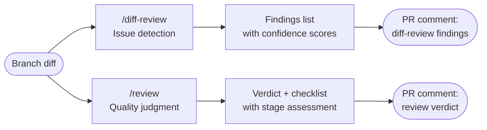
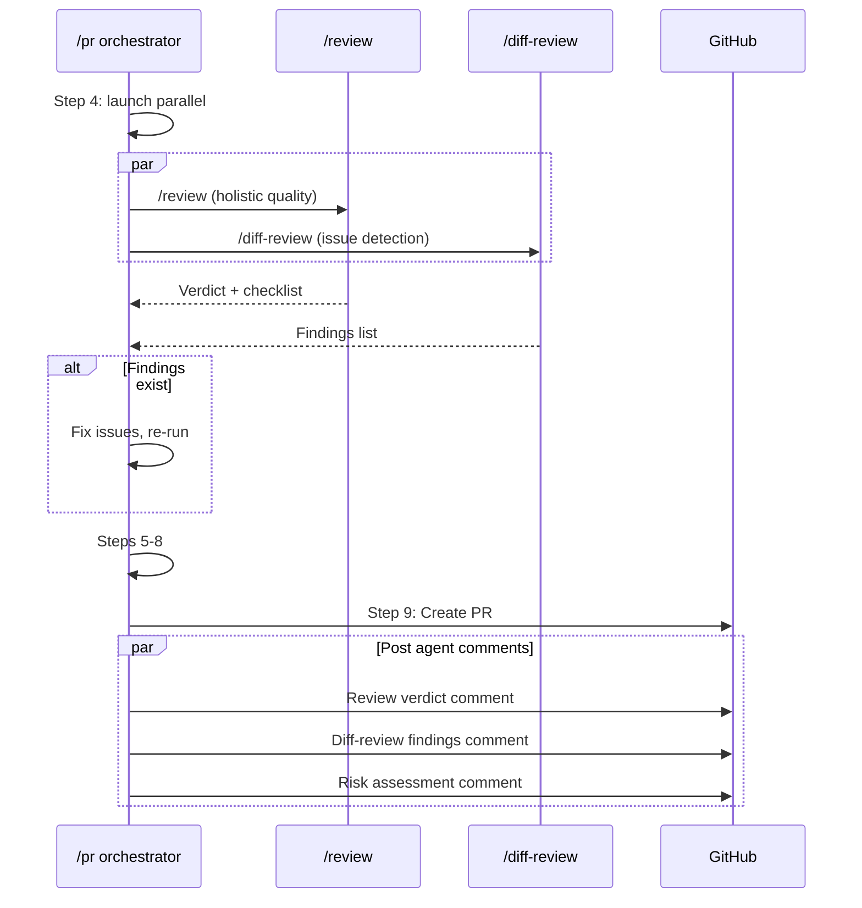

# Review Pipeline

The project uses two complementary review systems that run in parallel during the PR pipeline. Each reviews the same changed code but asks a fundamentally different question.

## The two review systems

### `/review` — Holistic quality judgment

**Scope:** Touched modules + direct interfaces

**Question:** "Is this work excellent for its stage?"

`/review` is the quality framework. It evaluates whether the work meets the world-class standard for its current development stage (prototype, MVP, alpha, beta, etc.), whether it's ready to advance to the next stage, and whether the touched surface area is strong. It produces a single coherent verdict from a single evaluator.

Key capabilities:
- Stage-aware evaluation (9 development stages with distinct bars)
- Dual verdict model (current-stage excellence + next-stage readiness)
- Scope enforcement (introduced/worsened/touched/out-of-scope rules)
- Per-stage quantitative gates
- Review tone discipline (no vague praise, no hedging)

**When to use standalone:** Anytime you want a quality assessment of the current state of work — mid-development, before a PR, after refactoring.

### `/diff-review` — Mechanical issue detection

**Scope:** Raw diff hunks + git blame

**Question:** "Are there specific bugs, violations, or pattern deviations in this diff?"

`/diff-review` is the issue detection engine. It launches 3 independent review agents in parallel, each focused on a specific concern area. Every finding is scored for confidence (0-100), and only findings above the threshold (default: 80) are reported. This architecture reduces blind spots through diversity of perspective and reduces noise through confidence-based filtering.

The three agents:

| Agent | Focus | Input |
|---|---|---|
| **Guideline compliance** | Audits changes against `.claude/rules/`, `CLAUDE.md`, and `ARCHITECTURE.md` | Diff + guideline files |
| **Bug detection** | Scans for resource leaks, logic errors, unhandled exceptions, type mismatches | Diff + language info |
| **History consistency** | Detects deviations from patterns established in the file's history | Diff + git blame + recent commits |

**When to use standalone:** Anytime you want a mechanical scan of recent changes — after writing new code, before committing, during development.

## Comparison

| Aspect | `/diff-review` | `/review` |
|---|---|---|
| **Question answered** | "Are there specific issues in this diff?" | "Is this work excellent for its stage?" |
| **Scope** | Raw diff hunks + git blame | Touched modules + direct interfaces |
| **Output format** | Findings list with confidence scores and file:line references | Structured verdict with stage, scope, checklist, and decision |
| **Agent architecture** | 3 parallel independent agents (diversity reduces blind spots) | Single coherent evaluator (consistency in judgment) |
| **Scoring** | Confidence 0-100 per finding, threshold filtering | Binary PASS/FAIL per checklist item |
| **PR comment scope label** | "Scope: Raw diff hunks + git blame" | "Scope: Touched modules + direct interfaces" |
| **When useful outside `/pr`** | Mechanical scan of recent changes | Quality assessment of current state |
| **Failure mode if merged** | Holistic judgment drowns in findings; loses forest for trees | Bugs get lost in quality philosophy; misses trees for forest |

## Why they are separate

They answer different questions and have different failure modes. Merging them would either:

1. **Bloat a single agent** — forcing one agent to do both fine-grained bug scanning and holistic quality evaluation, which are competing cognitive tasks
2. **Drown judgment in findings** — specific issues (off-by-one, missing context manager) overwhelm the holistic quality assessment
3. **Lose specificity** — quality philosophy ("is this world-class for MVP?") obscures concrete bugs

The Claude Code code-review plugin demonstrated that independent specialized agents with confidence scoring produce better results than a single generalist reviewer.

## Integration in the PR pipeline

Both run as part of `/pr` Step 4 in parallel — neither blocks the other, so no serial latency is added.

### Fix-before-shipping

All diff-review findings above the confidence threshold must be resolved before the PR is created. The PR comment is the audit trail showing what was found and that it was addressed — not a list of open issues.

### PR comments

Each review system posts its own PR comment with a scope label:

- `/review` comment: **"Scope: Touched modules + direct interfaces"** — verdict, checklist, stage assessment
- `/diff-review` comment: **"Scope: Raw diff hunks + git blame"** — findings table with confidence scores

These scope labels make it clear what each comment covers and what it does not.

## Configuration

| Setting | Location | Default | Description |
|---|---|---|---|
| Confidence threshold | `diff_review_threshold` in `project-meta.yaml` | 80 | Minimum confidence for a finding to be reported |
| Stage | `phase` in `project-meta.yaml` | — | Determines the quality bar for `/review` |
| Quality gate | `quality_gate` in `project-meta.yaml` | Derived from phase | Determines which deterministic checks run |
