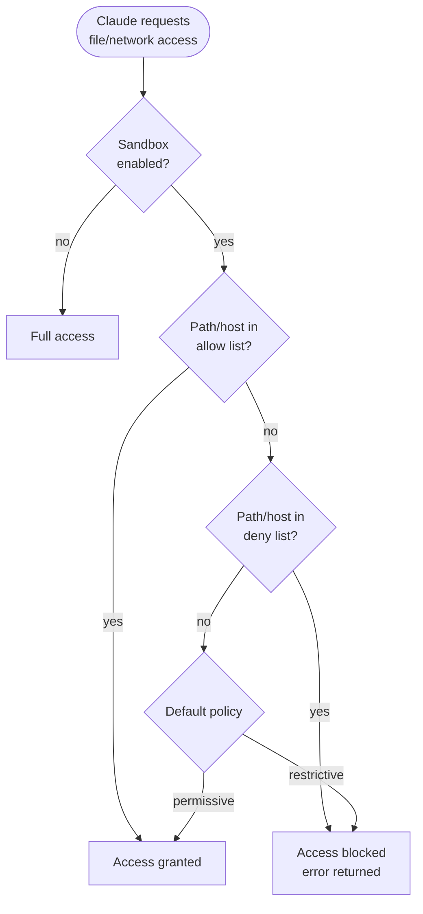

# Sandbox — Filesystem and Network Isolation

## What it is

A security layer that restricts Claude's access to the filesystem and network. The sandbox uses a filesystem overlay and network proxy to prevent unintended reads, writes, or external connections. It's the defense-in-depth layer that limits blast radius if Claude encounters prompt injection or makes a mistake.

## Where it's configured

- `~/.claude/settings.json` — User-level sandbox settings
- `.claude/settings.json` — Project-level sandbox settings
- `.claude/settings.local.json` — Local overrides (not checked in)
- Managed settings — Organization-enforced sandbox policies

## When to use

- Working in repositories that contain sensitive data alongside code
- Running Claude in CI/CD pipelines where isolation is critical
- Projects where Claude should not access parent directories or home folder
- When using untrusted MCP servers or plugins
- Defense against prompt injection in tool results

## When NOT to use

- Solo development where you trust all project content
- Projects that require broad filesystem access (monorepos with cross-references)
- When sandbox restrictions would require constant approval overrides

## Configuration

### Filesystem sandbox

```json
{
  "sandbox": {
    "enabled": true,
    "paths": {
      "allow": [
        "/Users/me/project",
        "/tmp"
      ],
      "deny": [
        "/Users/me/.ssh",
        "/Users/me/.aws",
        "/Users/me/.env"
      ]
    }
  }
}
```

### Network sandbox

```json
{
  "sandbox": {
    "network": {
      "enabled": true,
      "allow": [
        "api.github.com",
        "registry.npmjs.org"
      ]
    }
  }
}
```

## How it works



## Evaluation order

1. **Deny list** — checked first, always wins
2. **Allow list** — checked second
3. **Default policy** — if neither list matches

Deny always takes precedence over allow, regardless of specificity.

## Examples

### 1. Basic project isolation

```json
{
  "sandbox": {
    "enabled": true,
    "paths": {
      "allow": [
        "${PROJECT_DIR}",
        "/tmp"
      ],
      "deny": [
        "${HOME}/.ssh",
        "${HOME}/.aws",
        "${HOME}/.gnupg"
      ]
    }
  }
}
```

Restricts Claude to the project directory and temp files. Blocks access to SSH keys, AWS credentials, and GPG keys.

### 2. CI/CD pipeline lockdown

```json
{
  "sandbox": {
    "enabled": true,
    "paths": {
      "allow": [
        "/workspace",
        "/tmp",
        "/usr/local/bin"
      ],
      "deny": [
        "/etc/secrets",
        "/var/run/docker.sock"
      ]
    },
    "network": {
      "enabled": true,
      "allow": [
        "registry.npmjs.org",
        "pypi.org",
        "api.github.com"
      ]
    }
  }
}
```

Tight lockdown for CI: only workspace, package registries, and GitHub API.

### 3. Protect environment files

```json
{
  "sandbox": {
    "enabled": true,
    "paths": {
      "deny": [
        "**/.env",
        "**/.env.*",
        "**/credentials.json",
        "**/secrets.yaml"
      ]
    }
  }
}
```

Prevents reading any `.env` or credentials files, even within the project.

### 4. Monorepo with selective access

```json
{
  "sandbox": {
    "enabled": true,
    "paths": {
      "allow": [
        "${PROJECT_DIR}/packages/frontend",
        "${PROJECT_DIR}/packages/shared",
        "${PROJECT_DIR}/package.json"
      ],
      "deny": [
        "${PROJECT_DIR}/packages/backend",
        "${PROJECT_DIR}/packages/infrastructure"
      ]
    }
  }
}
```

Gives Claude access to the frontend and shared packages only. Backend and infrastructure are off-limits.

### 5. Read-only access to reference code

```json
{
  "sandbox": {
    "enabled": true,
    "paths": {
      "allow": [
        "${PROJECT_DIR}",
        "/opt/reference-implementations"
      ],
      "deny": [
        "/opt/reference-implementations/**/*.env"
      ]
    }
  }
}
```

Claude can read reference code for examples but can't access its environment files.

### 6. Database credential protection

```json
{
  "sandbox": {
    "enabled": true,
    "paths": {
      "deny": [
        "**/database.yml",
        "**/db-config.*",
        "**/*password*",
        "**/*secret*"
      ]
    }
  }
}
```

### 7. Network-only restrictions

```json
{
  "sandbox": {
    "network": {
      "enabled": true,
      "allow": [
        "*.internal.company.com",
        "api.github.com"
      ]
    }
  }
}
```

Allow internal services and GitHub, block everything else.

### 8. Plugin isolation

```json
{
  "sandbox": {
    "enabled": true,
    "paths": {
      "allow": [
        "${PROJECT_DIR}",
        "${HOME}/.claude/plugins"
      ],
      "deny": [
        "${HOME}/.claude/settings.json",
        "${HOME}/.claude/memory"
      ]
    }
  }
}
```

Plugins can read project files but not Claude's settings or memory.

### 9. Temporary sandbox for untrusted work

```json
{
  "sandbox": {
    "enabled": true,
    "paths": {
      "allow": [
        "/tmp/sandbox-workspace"
      ]
    },
    "network": {
      "enabled": true,
      "allow": []
    }
  }
}
```

Maximum isolation: single temp directory, no network access.

### 10. Organization-managed sandbox policy

```json
{
  "managed": {
    "sandbox": {
      "enabled": true,
      "paths": {
        "deny": [
          "/etc/passwd",
          "/etc/shadow",
          "${HOME}/.ssh",
          "${HOME}/.aws",
          "${HOME}/.gnupg",
          "**/*.pem",
          "**/*.key"
        ]
      }
    }
  }
}
```

IT-managed policy that applies to all users. Cannot be overridden by user or project settings.
