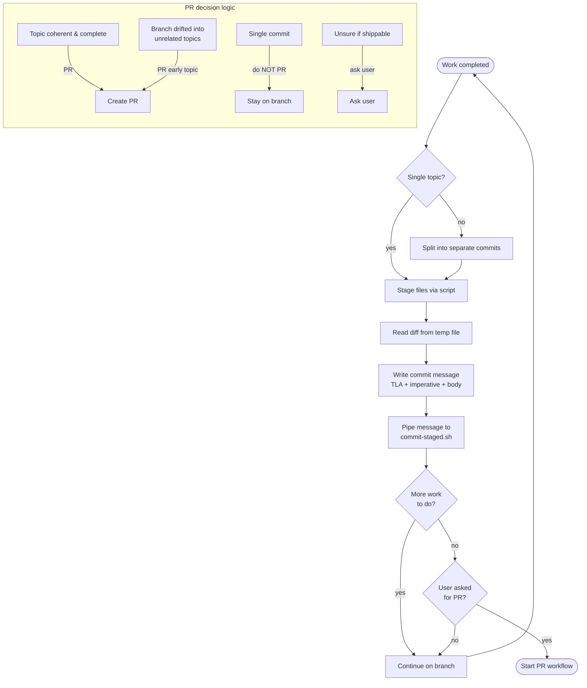

# Git Commit Rules (CRITICAL -- always follow)

## Commit and PR decision flow



## Master branch protection

Never commit directly to `master` or `main`. All changes must go through a feature branch and be merged via pull request. A local `pre-commit` hook in `.git/hooks/pre-commit` enforces this — do not bypass it with `--no-verify`.

## When to commit

Commit proactively — do not wait for the user to say "commit". After completing a logical unit of work (a feature, a fix, a refactor, a rename, a test update), commit it immediately before moving on to the next task. Each commit should be atomic: one topic, one commit.

## Splitting changes into multiple commits

Before committing, review all changed files. If the changes span multiple unrelated topics, split them into separate commits. Use the selective staging script to commit each topic independently.

Examples of distinct topics that deserve separate commits:

- A rename or rebrand (e.g. changing the project name across files)
- A new feature (e.g. adding license selection to the questionnaire)
- A template change (e.g. adding badges, callouts, or sections to README.md.j2)
- A test update (e.g. new tests or fixing tests for the above changes)
- A config/schema change (e.g. changing defaults in metadata or JSON schema)

When in doubt, prefer more smaller commits over fewer larger ones.

## When to create a pull request

The primary signal for creating a PR is **topic coherence**, not commit count or time. A PR should tell one clear story.

### PR when

- A coherent unit of work is complete (a feature, a bug fix cycle, a refactoring pass).
- The commits on the branch have drifted into unrelated topics. PR the completed topic first, then continue the rest on a new branch.

### Consider PRing when

These are not hard rules — use judgment based on context:

- The branch has accumulated many commits and the completed work forms a shippable unit, even if more work is planned.
- The PR description would need more than 3-4 category headings to organize the changes — this suggests the scope has grown too broad.

### One theme per PR

- **Feature PRs**: one feature (plus its tests, docs, and config changes).
- **Fix PRs**: one bug fix or a set of closely related fixes.
- **Maintenance PRs**: refactoring, dependency updates, or housekeeping.
- **Mixed work**: if a branch drifted into multiple themes, PR the completed theme first, then continue on a new branch for the rest.

### Ask the user when

- The branch has grown large but the work is interconnected and hard to split.
- Unsure whether the current state is shippable or needs more work before PR.

### Do NOT PR unless asked

Never create a PR autonomously. The default after committing is: stay on the branch and continue working.

Create a PR only when:

- The user explicitly says "pr" or asks for a pull request.
- The user's next task is so different from the current branch's work that it belongs on a separate branch — PR the current work first, then start a new branch.

A single commit does not mean "ready for PR". Multiple commits on the same branch is the normal workflow.

### What to avoid

- PRs that mix features with large refactors — if one needs to be reverted, the other is lost too.
- Waiting until "everything is done" — ship increments, not monoliths.
- PRing after every commit — commit and continue working on the same branch.

## Step 1: Get the diff

### For committing all changed files

Run:

```bash
bash ".claude/scripts/stage-all-files.sh"
```

### For committing only specific files

Run:

```bash
bash ".claude/scripts/stage-files.sh" <file1> <file2> ...
```

Provide the file paths you want to commit as arguments.

---

Both scripts stage the specified files and print the path to a temporary file containing the staged diff. Read that file and use its content as the diff input. Do NOT run any `git diff` commands yourself. Do NOT stage any additional files.

## Step 2: Write the commit message

Write a high-quality commit message based on the diff from step 1. Return it in a code block.

### Format

- **First line**: max 50 characters, prepended with a TLA prefix (see below).
- Use **imperative mood** after the prefix: "Add feature", not "Added feature" or "Adds feature".
- Capitalize the first word after the prefix.
- No trailing period on the first line.
- **Body**: paragraphs with prepended headings. Use only headings that are necessary and as few as possible. Do not line-break within paragraphs or bullet points -- the user handles wrapping.
- Order description items by importance (most important first).

### Available headings (use only what applies)

Use as few headings as possible. Most commits need only one or two.

| Heading | When to use |
|---------|-------------|
| **Context/background:** | The diff alone doesn't explain why the change was needed. |
| **Description of changes:** | Multiple files or topics need summarizing (bullet list of what changed and why, not how). |
| **Rationale:** | A non-obvious approach was chosen over a plausible alternative. State what was considered and why this path won. |
| **Breaking changes:** | Any public API, CLI, config format, or schema change that breaks consumers. |
| **Known limitations:** | The commit intentionally leaves something incomplete or scoped down. Reference an issue or follow-up if one exists. |
| **Follow-up:** | Work is deliberately deferred to a separate commit or branch. |
| **Migration:** | Downstream projects or users need to take action after updating. |

### TLA prefixes (pick one)

- `API` -- incompatible API change
- `BLD` -- build-related change
- `BUG` -- bug fix
- `DAT` -- data added to the repo
- `DEP` -- deprecation or removal of deprecated object
- `DEV` -- development tool or utility
- `DOC` -- documentation
- `ENH` -- enhancement
- `MAINT` -- maintenance (refactoring, typos, etc.)
- `REV` -- revert an earlier commit
- `STY` -- style fix (whitespace, formatting)
- `TST` -- test addition or modification
- `REL` -- release-related (version bumps, etc.)
- `WIP` -- work in progress (if unsure)

- **NEVER** add a `Co-Authored-By` trailer or any other attribution trailer to commit messages.
- **NEVER** mention AI assistance, Claude, or any tool in commit messages.
- **NEVER** include AI attribution in PR descriptions (e.g., "Generated with Claude Code", "🤖", "Co-Authored-By: Claude"). No AI tool branding anywhere in commits or PRs.

## Step 3: Commit

Commit using the message from step 2. Do NOT add any files to staging -- the script in step 1 already handled that. Only commit what is already staged.

Pipe the commit message to `commit-staged.sh` via stdin. This handles the temp file lifecycle internally — no manual `mktemp`, `cat`, or `git commit -F` needed:

```bash
bash .claude/scripts/commit-staged.sh <<'EOF'
TLA Short summary

Description of changes:
- What changed and why
EOF
```

Do NOT use manual `mktemp` + `cat` + `git commit -F` sequences. The script wraps all of that in a single command that is auto-approved via the `Bash(bash *.claude/scripts/*)` permission pattern.
