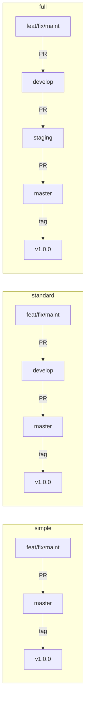
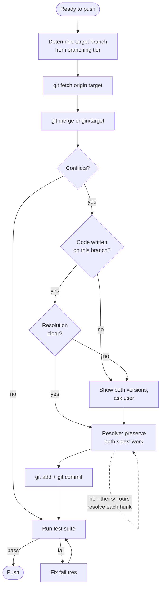
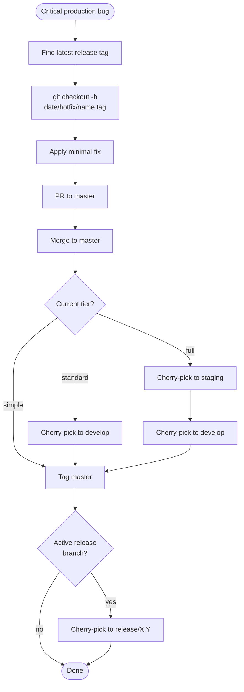

# Branching Rules

> **CRITICAL**: Before any file edit, check your branch with `git branch --show-current`. If on `master`/`main`, create a worktree first. See `01-branch-before-edit.md`.

## Branch types and naming

Work branches use a date-prefixed format with a type identifier:

```
{yyyy-mm-dd}/{type}/{name}
```

| Type | Purpose | Example |
|------|---------|---------|
| `feat` | New feature or enhancement | `2026-03-17/feat/user-auth` |
| `fix` | Bug fix | `2026-03-17/fix/null-pointer` |
| `maint` | Maintenance, refactoring, dependency updates | `2026-03-17/maint/dep-updates` |
| `rel` | Release preparation | `2026-03-17/rel/v1.4.0` |
| `hotfix` | Critical production fix | `2026-03-17/hotfix/payment-crash` |

Always derive the date prefix by running `date +%Y-%m-%d` — never guess or infer the date from memory or context.

If a branch with the chosen name already exists, append an incrementing suffix: `-2`, `-3`, etc.
Example: `2026-03-17/feat/user-auth-2`

### Permanent branches

These branches are long-lived and never deleted:

| Branch | Present in | Purpose |
|--------|-----------|---------|
| `master` | All tiers | Production-ready code, tagged releases |
| `develop` | Standard, full | Integration branch for feature work |
| `staging` | Full only | Pre-production validation |

### Release branches

Release maintenance branches use the format `release/{major.minor}` (e.g., `release/1.3`). These are cut from a release tag on master to backport critical fixes to older releases. Only one active release branch at a time.

To cut a new release branch:

```bash
bash .claude/scripts/cut-release-branch.sh <major.minor>
```

## Branching tiers

The project's `branching_complexity` in `project-meta.yaml` determines which branches and workflows are active:



### Simple tier

- Work branches target `master` directly.
- No environment branches.
- Suitable for solo devs, prototypes, and early-phase projects.

### Standard tier

- Work branches target `develop`.
- `develop` is promoted to `master` via PR when ready for release.
- Suitable for team projects and beta-phase work.

### Full tier

- Work branches target `develop`.
- `develop` is promoted to `staging` via PR for validation.
- `staging` is promoted to `master` via PR for release.
- Suitable for production systems.

See `environment-branches.md` for promotion procedures (standard and full tiers only).

## Repository setup

When setting up a new clone or project, configure git hooks and branch protection:

```bash
bash .claude/scripts/setup-git-hooks.sh
bash .claude/scripts/setup-branch-protection.sh
```

`setup-git-hooks.sh` configures git to use the project's `.githooks/` directory. `setup-branch-protection.sh` enables GitHub branch protection on the default branch (requires `gh` with admin permissions).

## Isolation: always use a worktree

Multiple Claude Code sessions may run concurrently on the same repository. To avoid conflicts, **always** create new branches in a worktree — never switch branches in the current checkout.

```bash
bash .claude/scripts/create-worktree.sh <type> <name> [base-branch]
```

This single command handles everything: date derivation, branch naming, worktree creation, venv setup, and permission registration. The last line of output is the worktree path — `cd` to it and start working.

- Branch naming follows the date-prefix rules above (the script derives the date automatically).
- For manual worktree creation (e.g., custom directory placement), use `git worktree add` directly and then run `bash .claude/scripts/setup-worktree-venv.sh` from within the worktree.
- Clean up after PR merge: `bash .claude/scripts/cleanup-worktree-permissions.sh ../<repo>-<branch-name>`, then `git worktree remove ../<repo>-<branch-name>`.
- **Empty repos**: `git worktree add` requires at least one commit. If the repo has no commits yet and you need a worktree, create an empty initial commit first: `git commit --allow-empty -m "Initial commit"` and push it before creating the worktree.
## Integrating changes from the target branch

Before pushing a branch for PR, merge the latest target branch into it to surface conflicts early and ensure the branch is up to date.

### Flowchart



### Procedure

1. Determine the target branch: `master` (simple), `develop` (standard/full).
2. Fetch latest: `git fetch origin <target>`.
3. Merge: `git merge origin/<target>`.
4. If conflicts occur:
   - Read each conflicted file in full. Do not resolve from the diff markers alone — understand both sides.
   - If the conflict is in code written on this branch, resolve it.
   - If the conflict is in code from another branch (work you did not write), show the user both versions and ask which to keep before editing.
   - **Never discard the other branch's work.** The default resolution must preserve functionality from both sides. If both branches added code to the same region, include both additions. Only drop code if the user explicitly confirms it should be removed.
   - **Never use whole-file resolution shortcuts without permission.** Do not use `git checkout --theirs <file>`, `git checkout --ours <file>`, `git merge -X theirs`, `git merge -X ours`, or `git rebase -X theirs`/`-X ours`. These discard one side entirely per file, silently dropping content that may not be recoverable (e.g., changelog entries, config additions, documentation updates). Resolve each conflict hunk individually. Exception: `--theirs`/`--ours` may be used when (1) the user explicitly requests it for a specific file, or (2) the file is machine-generated (lockfiles, compiled output) and the user confirms which side is authoritative.
   - **Append-only files need special care.** For files where both branches add content (CHANGELOG.md, migration lists, registry files, config arrays), the correct resolution is almost always to keep both additions in the right order — not to pick one side.
   - **Ask when uncertain.** If a conflict is ambiguous — both sides changed the same logic in incompatible ways, or you cannot determine which version is correct — stop and ask the user. Show the conflict with both sides and explain what each branch intended. Do not guess. Specific questions to ask:
     - "Both branches modified this function differently — which behavior should the merged version have?"
     - "This file was restructured on both branches — should I keep the structure from `<ours>` or `<theirs>`, or combine them?"
     - "This looks like a machine-generated file — should I take the version from `<branch>` wholesale?"
   - After resolving all conflicted files: `git add <files>` and complete the merge commit.
5. After resolution, run the full test suite. Do not push until tests pass.

### Stats marker conflicts during cherry-pick

STATS/PLOT marker blocks in `README.md` and similar docs (e.g., scope-intent matrix, test counts) will conflict on every cherry-pick because the current branch always has newer values. These conflicts have one correct resolution: **keep HEAD**. The cherry-picked commit's stat values are stale by definition — the markers are regenerated by `make refresh-stats` and `make test-paradigm`, not hand-authored.

Recognise these by their marker pattern:
```
<<<<<<< HEAD
<!-- STATS:... -->
<current value>
=======
<older value from cherry-picked commit>
>>>>>>> <sha>
```

Resolve them immediately by taking HEAD without asking the user. After all cherry-picks complete, run `make refresh-stats` to verify no markers drifted.

`tests/TEST_PARADIGM.md` and `docs/plots/*.png` are covered by `.gitattributes merge=ours` so git resolves them automatically. `README.md` cannot be covered wholesale — resolve its STATS/PLOT hunks manually using the rule above.

### Why merge-default

PRs are squash-merged into master, so the branch's intermediate commit history does not survive — the linear-history benefit of rebase is moot. Merge is the default because it:

- **Never rewrites history** — no force-push needed, even if the branch was already pushed.
- **Resolves conflicts in a single pass** — unlike rebase, which can require conflict resolution per commit.
- **Is safer for AI agents** — fewer failure modes, no abort-and-fallback logic, no destructive operations.

### Opt-in rebase

If the user explicitly requests a rebase (e.g., to clean up commit history before review), use rebase instead of merge. In that case:

1. `git rebase origin/<target>`.
2. If conflicts occur, resolve per commit. If the rebase produces more than 3 conflict steps, abort (`git rebase --abort`) and fall back to merge. Inform the user.
3. If the branch was already pushed, use the safe push wrapper: `bash .claude/scripts/post-rebase-push.sh`. Never use raw `git push --force-with-lease`.
4. Never force-push without explicit user approval.

## Branching from

Determine the correct base branch from the branching tier:

- **Simple**: branch from `master`.
- **Standard/Full**: branch from `develop` for feature work; branch from `master` for hotfixes.

If the current branch is not the expected base branch, ask the user whether to branch from the base branch or the current branch.

## Hotfix workflow

Hotfixes bypass the normal promotion flow and go directly to master:



1. Create the hotfix branch from the latest release tag using the hotfix script:

   ```bash
   bash .claude/scripts/hotfix.sh <name>
   ```

   This finds the latest release tag, derives the date, and creates `{date}/hotfix/{name}` from that tag.

2. Apply the minimal fix. Do not bundle unrelated changes.
3. PR to master and merge.
4. Cherry-pick to lower environment branches (staging, develop) as applicable for the tier.
5. If an active release branch exists, cherry-pick there too and create a patch tag.
