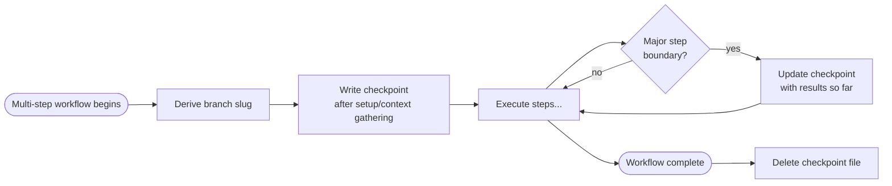

# Context Checkpointing

Proactively write session state to a checkpoint file during multi-step workflows so that critical context survives compaction.

## Why

Context compaction discards intermediate state — decisions, rationale, workflow position, and what was tried. Rules and CLAUDE.md survive compaction, but the semantic state of an in-progress workflow does not. The checkpoint file bridges this gap.

## Checkpoint file

Multiple Claude Code threads may run concurrently on the same repo, each on its own branch (via worktrees). Each thread gets its own checkpoint file keyed by branch name.

- **Location:** `.claude/session-state-<branch-slug>.md`
- **Branch slug:** derived by running `git branch --show-current | tr '/' '-'`
- **Format:** Markdown with structured sections (see template below)
- **Lifecycle:** Overwritten at each trigger point. Deleted when the workflow completes successfully.

### Deriving the checkpoint path

At the start of any workflow that uses checkpointing, derive the path once and reuse it:

```bash
BRANCH_SLUG=$(git branch --show-current | tr '/' '-')
# Checkpoint file: .claude/session-state-${BRANCH_SLUG}.md
```

Example: branch `2026-03-18/feat/compression-resilient-checkpointing` produces `.claude/session-state-2026-03-18-feat-compression-resilient-checkpointing.md`.

## When to write a checkpoint



Write a checkpoint at these points:

1. **After initial context gathering** — capture the workflow type, scope, and user instructions
2. **After each major step group completes** — capture results and decisions
3. **Before presenting results to the user** — capture the full state so feedback can resume after compaction

Do not checkpoint after every minor sub-step. Limit to 3-5 writes per workflow to avoid clutter.

## When to read a checkpoint

Read the checkpoint file for the current branch at the **start of any step that depends on prior step results**, if the file exists. This covers both post-compaction recovery and session resumption.

If the file does not exist, proceed normally — the workflow is either fresh or the checkpoint was already cleaned up.

## Checkpoint template

```markdown
# Session State

**Workflow:** <skill name> (e.g., /pr, /polish, /prd)
**Started:** <timestamp>
**Current step:** <step number and name>
**Branch:** <current branch name>

## Completed Steps

- **Step N: <name>** — <1-line result summary>
- **Step M: <name>** — <1-line result summary>

## Decisions

- <Decision made and why, with enough context to reconstruct rationale>

## Key Results

- <Test outcome, coverage number, review verdict, or other intermediate result>

## User Instructions

- <Any user-provided guidance that affects remaining steps>

## Next

<What to do next — the immediate next step and any remaining steps>
```

## What to capture

| Category | Examples | Why it matters |
|---|---|---|
| Workflow position | "Step 6 of 10 in /pr" | Prevents restarting from step 1 |
| Decisions with rationale | "Chose patch bump because only bug fixes" | Prevents re-asking the user |
| Intermediate results | "Tests passed, coverage 84%, review PASS" | Prevents re-running expensive steps |
| User instructions | "User said skip phase evaluation" | Prevents ignoring mid-workflow guidance |
| What was tried and failed | "Ruff failed on line 42, fixed by..." | Prevents repeating failed approaches |

## What NOT to capture

- File contents (re-read the file instead)
- Dates, versions, paths (re-derive from source commands per `03-anti-hallucination.md`)
- Information already in rules or CLAUDE.md (survives compaction natively)

## Cleanup

Delete the checkpoint file for the current branch when:

- The workflow completes successfully
- The user explicitly abandons the workflow
- A new workflow starts on the same branch (overwrite replaces the old checkpoint)

Use the cleanup script to delete the checkpoint (auto-approved via the `bash .claude/scripts/*` pattern):

```bash
bash .claude/scripts/cleanup-session-state.sh              # current branch
bash .claude/scripts/cleanup-session-state.sh <branch-slug> # specific branch
```

If a branch slug is provided, the script deletes that branch's checkpoint directly. If omitted, it derives the slug from the current branch. **Pass the branch slug explicitly when cleanup runs after switching branches** (e.g., after merging a PR and checking out master):

```bash
bash .claude/scripts/cleanup-session-state.sh 2026-03-18-feat-my-feature
```

Do not use raw `rm -f` — it triggers a permission prompt.

A stale checkpoint from an abandoned session is harmless — the next workflow on that branch will overwrite it. Checkpoints from other branches are left untouched — do not clean up checkpoints you did not create in this session.
