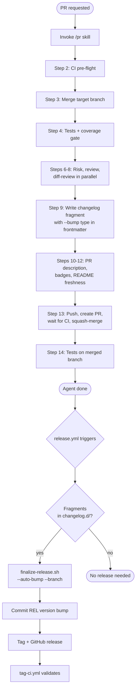

# Pull Requests, Changelog & Versioning (CRITICAL -- always follow)

The authoritative PR workflow lives in the `/pr` skill (`SKILL.md`). This rule file documents the design principles and the conventions that the skill implements. Do not follow step-by-step instructions from this file — invoke `/pr` instead.

## Design rationale: post-merge release automation

Version bumps, changelog assembly, tagging, and GitHub release creation are handled by a **post-merge GitHub Actions workflow** (`release.yml`), not by the agent. This eliminates version races between concurrent PRs.

Feature branches write changelog **fragments** to `changelog.d/<branch>.md` instead of editing `CHANGELOG.md` directly. Each fragment file is unique to its branch, so concurrent branches never conflict during development.

### How it works



### Fragment lifecycle

1. **Agent writes fragment** (Step 9): `bash .claude/scripts/write-changelog-fragment.sh "<branch>" --stdin --bump <type> [--phase <name>]`
2. **Fragment includes bump type** in YAML frontmatter: `bump: patch|minor|major`
3. **Fragment is committed** on the feature branch and merged with the PR
4. **release.yml collects the fragment** for this branch only (`--branch` filtering), assembles `CHANGELOG.md`, bumps version, tags, and creates the GitHub release
5. **Other branches' fragments are untouched** — no cross-contamination

### Concurrent PR safety

Multiple PRs can merge in sequence. The `release.yml` workflow:
- Uses a concurrency group (`cancel-in-progress: false`) to serialize release runs
- Syncs to latest master before processing (`git pull --ff-only`)
- Collects only the triggering PR's fragment via `--branch` filtering
- Each run sees only its own fragment — no data loss from concurrent merges

## Changelog fragment format

Use Keep a Changelog subsection headings (`### Added`, `### Changed`, `### Deprecated`, `### Removed`, `### Fixed`, `### Security`). Do **not** include a `## [X.Y.Z]` version heading — the release workflow adds that.

## Bump type selection

- **MAJOR**: incompatible or fundamental changes. Exception: avoid jumping to `1.0.0` if the codebase is not production-ready.
- **MINOR**: new features or capabilities that are backward-compatible.
- **PATCH**: backward-compatible bug fixes or minor enhancements that don't add features.

Additional guidelines:
- Initial development starts at `0.1.0`.
- When incrementing MAJOR, reset MINOR and PATCH to zero.
- Pre-release versions: `1.0.0a1`, `1.0.0rc1`, `1.0.0.post1`.
- Deprecated features remain until the next MAJOR increment.

## PR description format

### Get the commit history

1. Run `bash ".claude/scripts/get-pr-commit-log.sh"`.
2. It prints a path to a temporary file.
3. Read that file's content — it contains the commit messages and a `REPOSITORY URL` label at the top.

### Write the PR description

Use the commit history to produce a categorised PR description following these rules:

- **H1 title**: a single overarching title for the pull request.
- **Categorised sections** with bullet points describing what was done.
- Each bullet point must contain **clickable commit-ID references** in the format `([abcdef0](<URL>/commit/abcdef0))`, where `<URL>` is the `REPOSITORY URL` from the file. On GitHub you only need `(abcdef0)` because GitHub auto-links commit SHAs.
- **NEVER** write "We did X" — use passive or imperative voice.
- **NEVER** include a final summary paragraph or a request for review.
- **Intra-branch fixes belong under features**: if a commit fixes or improves something introduced earlier in the same branch, group it under the feature, not under "Fixes" or "Improvements". The changelog compares release-to-release, not commit-to-commit.
- **NEVER** reuse commit messages as the PR body. The PR description is a separate artifact — always write it from scratch using the format below, even for single-commit PRs.

#### Example format

```markdown
# Provider architecture and core orchestration setup

### Core service architecture

- Establishes the modular prompt-orchestration layer with skeletal classes for request preparation, execution, parsing, and validation ([65e9987](<URL>/commit/65e9987)).
- Implements a YAML-driven configuration system with default/override merging and type enforcement ([8d6c1c4](<URL>/commit/8d6c1c4), [d7b6324](<URL>/commit/d7b6324), [c5a6606](<URL>/commit/c5a6606)).

### Provider integration

- Introduces an extensible `ProviderAdapter` abstraction plus an `OpenAIAdapter` ([d3e9307](<URL>/commit/d3e9307)).
- Registers adapters dynamically through a `ProviderRegistry` ([3bb20fd](<URL>/commit/3bb20fd), [ee7a1a0](<URL>/commit/ee7a1a0)).
```
