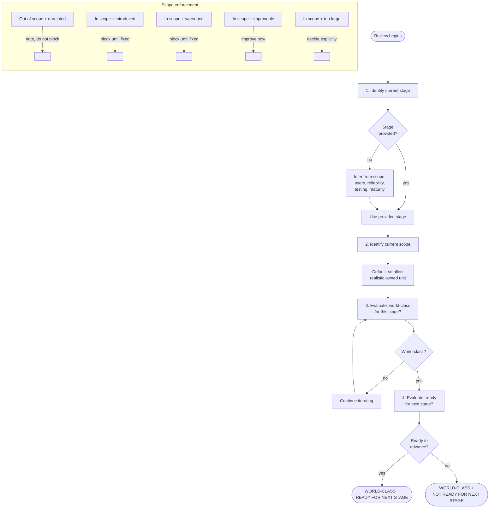

# Stage Detection and Enforcement

Before reviewing implementation quality, first determine the current development stage and the scope of the current unit of work.

## Review decision flowchart

## Required order

Always follow this order:

1. Identify the current stage
2. Identify the current scope
3. Evaluate whether the work is world-class for that stage within that scope
4. Evaluate whether the work is ready for the next stage
5. Continue iterating if either judgment fails

Never skip stage detection.
Never skip scope detection.

---

## Stage inference

If the stage is not explicitly provided, infer it from the work based on:
- scope
- intended users
- degree of reliability expected
- testing level
- operational maturity
- whether the goal is learning, proving, validating, or shipping

State the inferred stage explicitly before judging quality.

If the stage is ambiguous, choose the most defensible current-stage interpretation rather than the most flattering one.

Do not silently apply a production bar to earlier-stage work.
Do not silently apply early-stage leniency to later-stage work.

---

## Scope inference

If scope is not explicitly provided, infer it from the active task and changed surface area.

Default scope should be the smallest realistic owned unit of work, usually:
- this task
- this worktree
- this branch
- this PR
- the touched modules and direct interfaces

Do not silently expand scope to the full repository unless the user explicitly asks for a repo-wide assessment.

State the inferred scope explicitly before judging quality.

---

## Scope enforcement

Judge the work primarily within the current scope.

This means:

- Do not fail the work because of unrelated pre-existing weaknesses elsewhere in the repository
- Do fail the work for weaknesses introduced by the current change
- Do fail the work for weaknesses worsened by the current change
- Do require improvement in directly touched weak code when the fix is reasonably in scope
- Do call out broader legacy issues separately when they are real but not blockers for the current scope

Use this rule:
- Out of scope and unrelated — note, do not block
- In scope and introduced — block until fixed
- In scope and worsened — block until fixed
- In scope and clearly improvable now — improve now
- In scope but too large for this unit of work — acknowledge explicitly and decide whether it blocks advancement

Never use narrow scope as an excuse to bless messy touched code.
Never use broad scope as an excuse to block good local work unfairly.

---

## Mandatory dual judgment

For every review, output both:
- verdict for current stage
- readiness for next stage

Never output only one.

Also always include:
- the scope being judged
- out-of-scope issues noticed, if any

---

## Enforcement behavior

If the work is not world-class for the current stage:
- continue iterating

If the work is world-class for the current stage but not ready for the next stage:
- say so clearly
- identify exact advancement blockers
- improve toward those blockers only if that is the current goal

If the work is world-class for the current stage within scope:
- do not invent unrelated blockers from elsewhere in the repository

Do not blur these states:
- not world-class yet
- world-class for current stage but not ready to advance
- ready to advance

They are different outcomes.

---

## PR rule

Do not recommend PR as production-ready unless:
- the current stage is Production
- the production bar is met
- the scoped work passes the world-class standard within its owned surface area

If recommending PR for an earlier-stage checkpoint, explicitly label it as:
- stage-appropriate checkpoint PR

not:
- production-ready PR

A PR may be acceptable even if the whole repository is not world-class, but only when:
- the judgment is properly scoped
- the touched area is strong for its stage
- the PR does not introduce or worsen meaningful weakness
- surrounding risks are identified honestly

---

## Required output contract

Every quality assessment must include:

### Stage
The explicit stage used for evaluation.

### Scope
The explicit scope used for evaluation.

### Verdict for current stage
One of:
- WORLD-CLASS FOR THIS STAGE
- NOT YET WORLD-CLASS FOR THIS STAGE

### Ready to advance?
One of:
- READY FOR NEXT STAGE
- NOT READY FOR NEXT STAGE
- N/A — already Production

### Blocking issues in scope
Issues that prevent world-class status within the current scope.

### Advancement blockers
Issues that prevent movement to the next stage.

### Out-of-scope issues noticed
Unrelated issues that should be noted but are not blockers for this work.

### Next improvements
The exact improvements required now.

---

## Review discipline

Be demanding, but stage-aware and scope-aware.

Do not:
- overbuild because the future might need it
- underbuild because "it's just early"
- reject good scoped work because the wider repo has old flaws
- approve weak scoped work because "that part was already messy"

Do:
- judge the current unit of work honestly
- require the touched area to be strong for its stage
- keep the bar tight on introduced and worsened weakness
- separate local blockers from wider-repo observations

---

## Final instruction

First determine stage.
Then determine scope.
Then judge quality.
Then judge advancement.

If the work does not meet the standard within its scope, continue iterating.
If it meets the current-stage bar but has not earned advancement, say so clearly.
If unrelated repo issues exist, note them separately and do not confuse them with blockers for the current work.
