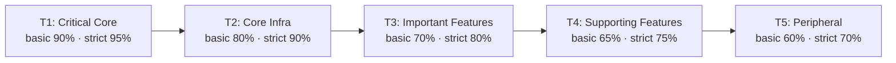

# Tiered Test Coverage

Per-module coverage requirements based on module importance. Each source module is assigned a tier that determines its minimum test coverage threshold.

## Coverage tiers



| Tier | Name | Basic Gate | Strict Gate | Description |
|------|------|-----------|-------------|-------------|
| T1 | Critical Core | 90% | 95% | Core mission modules. Bugs produce incorrect output for every user. High complexity, state mutation, subprocess calls. |
| T2 | Core Infrastructure | 80% | 90% | Modules depended on by many others. Failure cascades across features. |
| T3 | Important Features | 70% | 80% | Significant user-facing features. Bugs affect specific workflows but are containable. |
| T4 | Supporting Features | 65% | 75% | Enhance the system but failure is isolated. Read-only or cosmetic operations. |
| T5 | Peripheral | 60% | 70% | Simple modules with narrow scope, minimal state mutation, low complexity. |

## Classifying a module

Assign a tier by evaluating these factors (highest applicable tier wins):

1. **Mission criticality**: Does every user depend on this module? → T1
2. **Dependency depth**: Do many other modules import it? → T2
3. **Failure impact**: Does a bug cause data loss, security issues, or silent corruption? → T1-T2
4. **State mutation**: Does the module write to the filesystem, call subprocesses, or modify global state? → T1-T2
5. **Complexity**: High cyclomatic complexity, many code paths? → T1-T3
6. **Containment**: Is failure visible to the user and recoverable? → T3-T4
7. **Scope**: Narrow, single-purpose, minimal risk? → T5

New modules default to T5 until explicitly classified in `src/<package>/coverage_tiers.py`.

## Test quality marker (`test_value`)

Annotate tests with `@pytest.mark.test_value("<level>")` to signal their purpose and quality:

| Level | When to use |
|-------|-------------|
| `essential` | Tests a critical behavior whose absence would ship a bug. Verifies a requirement, not an implementation detail. |
| `thorough` | Meaningful edge case, error path, or integration point. Boundary values, error propagation, multi-module interaction. |
| `defensive` | Regression test or guard against a specific past failure mode. |
| `structural` | Enforces project invariants (file exists, schema valid, versions in sync). Tests consistency, not behavior. |

### Marker enforcement

- **T1 modules**: every test function must have a `test_value` marker (blocking).
- **T2 modules**: at least 75% of test functions must have a `test_value` marker (blocking).
- **T3-T5**: advisory (expand over time).

Enforcement runs automatically via `tests/test_test_quality.py::TestTestValueMarkerEnforcement`. To run in isolation:

```bash
pytest tests/test_test_quality.py::TestTestValueMarkerEnforcement -v
```

### Annotation examples

**Function-level** (preferred for mixed files):

```python
@pytest.mark.integration
@pytest.mark.test_value("essential")
def test_scaffold_creates_target_directory(tmp_path):
    """The scaffold function must create the output directory."""
    target = scaffold(metadata=meta, output_dir=tmp_path, skip_git=True)
    assert target.exists()
```

**Class-level** (covers all methods in the class):

```python
@pytest.mark.test_value("essential")
class TestVersionSync:
    def test_catches_version_mismatch(self):
        ...

    def test_passes_when_versions_match(self):
        ...
```

**Module-level** (covers entire file):

```python
pytestmark = [pytest.mark.unit, pytest.mark.test_value("thorough")]
```

### Choosing the right level

- Ask: "If this test were deleted, would we ship a bug?" → `essential`
- Ask: "Does this test a meaningful edge case or error path?" → `thorough`
- Ask: "Is this guarding against a past regression?" → `defensive`
- Ask: "Is this verifying structural consistency (files exist, versions match)?" → `structural`

## Anti-gaming rules

Do not write tests solely to inflate coverage. The following patterns are detected and flagged:

- **Assert-free tests**: test functions with no `assert` and no `pytest.raises`.
- **Trivial identity tests**: sole assertion is `assert result is not None` or `assert isinstance(...)`.
- **Import-only tests**: only import a module and `assert True`.

These are blocking for T1/T2 module test files and advisory warnings for T3-T5.

Detection runs via `tests/test_test_quality.py::TestAntiGamingT1T2`. To run in isolation:

```bash
pytest tests/test_test_quality.py::TestAntiGamingT1T2 -v
```

## Quality-first testing

Prioritize writing thoughtful, high-quality tests over chasing coverage numbers:

- Test behavior and contracts, not implementation details.
- Cover error paths and edge cases, not just the happy path.
- Each test should have a clear reason to exist — if you cannot explain what bug it would catch, reconsider.
- Prefer fewer meaningful tests over many shallow ones.
- Use `test_value` markers to make the purpose explicit.

## Quality-weighted coverage

The system computes a quality-weighted score that combines raw coverage with test quality:

```
weighted_score = raw_coverage × quality_weight
```

Quality weights are derived from `test_value` marker distribution:

| Level | Weight |
|-------|--------|
| essential | 1.0 |
| thorough | 0.8 |
| defensive | 0.6 |
| structural | 0.4 |
| unclassified | 0.3 |

A module with 90% coverage but only unclassified tests scores **27%** (90 × 0.3), while a module with 80% coverage and all essential tests scores **80%** (80 × 1.0). This incentivizes writing thoughtful, well-annotated tests over padding coverage.

To view the quality-weighted report, pass a `test_value_counts.json` file:

```bash
python -m code_practices.coverage_tiers --check coverage.json --gate basic --quality test_value_counts.json
```

Quality-weighted scores are currently informational — they are not enforced as gates.

## Running tiered coverage

```bash
make tiered-coverage
```

Override the gate level:

```bash
GATE=strict make tiered-coverage
```

Or manually:

```bash
pytest tests/ -v --cov=<package> --cov-report=json
python -m code_practices.coverage_tiers --check coverage.json --gate basic
```

## Configuration

Tier definitions and module assignments live in `src/<package>/coverage_tiers.py`. Update that file when:

- Adding a new source module (assign its tier).
- Promoting a module's importance (change its tier level).
- Adjusting thresholds (modify the `CoverageTier` instances).
