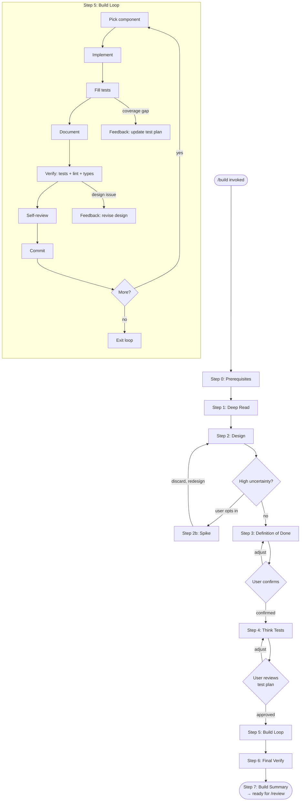
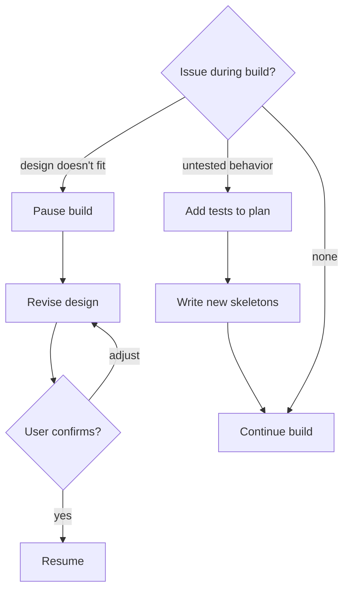

# Build — World-Class Feature Development Pipeline

Orchestrates the disciplined process between "we know what to build" (PRD) and "let's evaluate it" (review). Encodes how world-class developers build features: read before writing, think before coding, define done before starting, verify as you go, review your own work critically, document alongside, and adapt when reality diverges.

---

## Pipeline overview



---

## Depth tier

Before starting, determine the depth tier from the project phase. The pipeline always runs every step — but depth scales:

| Phase | Depth tier | Deep Read | Design | Test Thinking | Self-Review |
|-------|-----------|-----------|--------|---------------|-------------|
| discovery–prototype | Lite | 1 pass | Interfaces only | Behaviors + obvious edges | Mechanical only |
| mvp–alpha | Standard | 2 passes | + failure modes | + systematic edges, failures, key invariants | + key conceptual |
| beta–production | Full | 3 passes | + observability + reversibility | All 6 categories + mutation awareness | Full conceptual + mechanical |

---

## Step 0: Prerequisites

**Actions:**
1. Check for an existing PRD in `docs/prds/` whose scope covers this feature. Match by reading PRD filenames and their `## Scope` section — the PRD whose scope covers the requested feature is the match. If multiple PRDs could apply, ask the user which one. If none exists: "No PRD found for this feature. Run `/prd` first."
2. Read `project-meta.yaml` for phase, stage, quality gate.
3. Read the PRD's scope, success criteria, and affected modules.
4. Determine depth tier from the phase (see table above).
5. Write initial checkpoint per `context-checkpointing.md`.

**Exit gate:** PRD exists. Phase and depth tier determined.

---

## Step 1: Deep Read

Read all code that will be affected. Do not modify anything yet.

### Pass 1 — Comprehension (all tiers)

Read every affected module. For each one, note:
- What does it do? (purpose, responsibilities)
- What does it depend on? (imports, external calls)
- Who depends on it? (callers, consumers)
- What are its side effects? (filesystem, state mutation, subprocess)

### Pass 2 — Evaluation (standard + full tiers)

For each affected module, identify:
- **Existing patterns and idioms** — match them, don't fight them
- **Invariants and contracts** — what must stay true after your change
- **Weak spots and inconsistencies** — improve within scope (boy scout rule)
- **Undocumented assumptions** — document or test them
- **Integration points** — where this module touches others

### Pass 3 — Synthesis (full tier only)

Produce a brief understanding summary:
- Affected module map with dependency relationships
- Existing patterns to follow
- Invariants to preserve
- Weak spots to improve within scope
- Integration points to protect with tests

**Exit gate:** Understanding of all affected modules. Summary exists (standard+full tiers).

**Checkpoint:** After Step 1 — capture understanding summary, affected module map.

---

## Step 2: Design

Design the feature consumer-first and failure-aware.

### Interfaces and contracts (all tiers)

- Define APIs from the consumer's perspective. What does the caller need? What does it return? What errors can it produce? What guarantees does it make?
- Reference `/practices` for language/phase-specific conventions.

### Failure mode analysis (standard + full tiers)

For each component:
- What can go wrong?
- How will we know it failed? (Is the failure visible or silent?)
- How will we recover? (Is data preserved? Is the operation retryable?)

### Observability design (full tier only)

- What should be logged at function boundaries?
- What metrics matter for this feature?
- What failures should be alertable?

### Reversibility assessment (full tier only)

- Can this change be safely rolled back?
- If data models change, what is the migration path?
- Are there one-way doors?

### Spike option (any tier, user opt-in)

If design uncertainty is high (unfamiliar integration point, novel algorithm, unclear performance), suggest a spike:

> Design uncertainty is high because [reason]. Want to spike first?

If accepted:
1. Implement a throwaway prototype focused on answering the specific uncertainty.
2. Document what was learned.
3. **Discard the spike code entirely.** Revert all spike changes (`git checkout -- .` or `git stash drop`). Do not cherry-pick, merge, or copy spike code into the feature branch. It answered a question — the answer is in your understanding, not in the code.
4. Redesign with the new knowledge.

**Exit gate:** Interfaces defined. Failure modes documented (standard+). Observability needs identified (full).

---

## Step 3: Definition of Done

Before implementation, define what "done" means for this feature. Present to the user for confirmation.

### Template

```markdown
## Definition of Done — [feature name]

### Test expectations
- Test thinking categories: [which of the 6 categories apply]
- Coverage tier for new modules: [T1–T5 with rationale]
- Coverage target: [percentage]
- Minimum test_value distribution: [derive from scope — at least 1 essential test per public function for T1/T2 modules, at least 1 thorough test per public function for T3-T5. Adjust up for complex functions.]

### Documentation expectations
- [ ] Docstrings for all new public APIs
- [ ] Comments for non-obvious logic
- [ ] ARCHITECTURE.md updated (if structural change)
- [ ] [other project-specific docs]

### Quality expectations
- Quality gate: [none/basic/strict from project-meta.yaml]
- Lint: ruff check must pass
- Types: mypy must pass
- Coverage: must meet tier targets

### Completion signal
- [ ] All tests pass
- [ ] All DoD items checked
- [ ] Conceptual self-review complete
- [ ] Build summary produced
```

Present to user: "Does this Definition of Done look right? Adjust or confirm."

**This is a mandatory gate.** Do not start building until the user confirms.

**Exit gate:** User-confirmed Definition of Done.

**Checkpoint:** After Step 3 — capture the confirmed DoD.

---

## Step 4: Think Tests

Load `TEST_THINKING.md` from this skill directory. Generate a comprehensive test plan using the six-category framework, depth-adjusted by tier.

### Procedure

1. Work through each applicable category (per depth tier):
   - **Lite:** Categories 1–2 (behaviors, obvious edge cases)
   - **Standard:** Categories 1–4 (+ systematic edges, failure modes, key invariants)
   - **Full:** All 6 categories + mutation awareness

2. For each planned test, specify:
   - Test function name (`test_<what_it_verifies>`)
   - `test_value` classification (`essential`, `thorough`, `defensive`, `structural`)
   - Classification marker (`unit`, `integration`, `edge_case`, `error_handling`, etc.)
   - One-line docstring describing expected behavior

3. Write test skeleton files to `tests/`. A skeleton is a function with its name, markers, docstring, and a `# TODO: implement in Step 5` comment — no assertions, no fixtures, no parametrization yet. Those come during the build loop. If test files already exist for affected modules, append new test functions — do not overwrite.

4. Present the test plan to the user:
   > **Test plan: [N] tests across [M] categories.**
   > [summary table of tests by category and classification]
   > Review and approve, or suggest adjustments.

**Exit gate:** User-approved test plan. Test skeleton files written.

**Checkpoint:** After Step 4 — capture test plan summary and skeleton file paths.

---

## Step 5: Build Loop

Implement the feature incrementally, one component at a time. Order by dependency — build foundations first.

A **component** is the smallest unit that can be tested and committed independently — typically one public function/class and its helpers, or one module if tightly coupled. Identify components during Step 2 (Design) when defining interfaces.

### For each component:

#### 1. Implement
Write the production code for this component. Follow the interfaces designed in Step 2.

#### 2. Fill tests
Fill in the test skeletons for this component. Add assertions, fixtures, and parametrization. If implementation reveals behaviors not covered by existing skeletons, add new tests (see feedback loop below).

#### 3. Document
- Write docstrings for new public APIs.
- Add comments for non-obvious logic (why, not what).
- If the component changes the system's structure, update ARCHITECTURE.md or relevant design docs.

#### 4. Verify
Run mechanical checks:
```bash
pytest tests/ -v                    # Tests pass
ruff check src/ tests/              # Lint clean
mypy src/<package>/                  # Types clean
```

All must pass before continuing. If they fail, fix and re-verify.

#### 5. Self-review
Load `QUALITY_CHECKLIST.md` from this skill directory. Run through the conceptual review questions for this component:

- Does the implementation match the design intent?
- Are all interfaces honored?
- Is every error path intentional?
- Are there coupling issues?
- Would a reader understand each name without context?

If issues are found, fix them before committing.

#### 6. Commit
Commit this component atomically per git rules. One component, one commit.

### Feedback loops



**Design revision feedback:**
If implementation reveals that the design doesn't fit (interface is wrong, failure mode wasn't anticipated, component boundaries are wrong):
1. Pause the build.
2. Identify what's wrong with the design.
3. Propose revised design decisions.
4. Present to user for confirmation.
5. Resume only after confirmation.

**Guardrails:**
- Design revisions require user confirmation — no silent thrashing.
- Test plan changes are forward-only (adding tests, not removing).
- If more than 2 design revisions occur, flag: "The design has changed significantly. Consider re-evaluating scope with the PRD."
- Completed components are preserved across feedback loops.

**Test plan feedback:**
If implementation reveals untested behaviors or new edge cases, add tests to the plan and write new skeletons. This is normal — not a failure.

**Checkpoint:** After each component is committed.

---

## Step 6: Final Verification

After the build loop completes, verify the complete change.

### 1. Full test suite
Run all tests, not just those for this feature:
```bash
pytest tests/ -v
```

### 2. Coverage check
Compare against tier targets for all affected modules:
```bash
pytest tests/ --cov=<package> --cov-report=json
python -m code_practices.coverage_tiers --check coverage.json --gate <gate>
```

### 3. Anti-gaming detection
Check for shallow tests:
```bash
pytest tests/test_test_quality.py::TestAntiGamingT1T2 -v
```

### 4. Conceptual self-review
Re-read ALL changes as a whole — not per-component, but the complete diff:

```bash
git diff origin/<target>...HEAD
```

Ask yourself:
- Does the complete change tell a coherent story?
- Does the mental model match the code?
- Is design intent preserved across components?
- Are there coupling issues between components that weren't visible individually?
- Would a strong reviewer pause at anything?

Load `QUALITY_CHECKLIST.md` for the full checklist.

### 5. Definition of Done check
Check every item in the Definition of Done from Step 3. Mark each PASS or FAIL.

**If issues are found:** Fix them, re-verify. This is a loop, not a single pass.

**Exit gate:** All mechanical checks pass AND conceptual review finds no issues AND Definition of Done is met.

---

## Step 7: Build Summary

Produce a summary and present it.

### Template

```markdown
## Build Summary

**Feature**: [from PRD title]
**PRD**: [prd-id]
**Phase**: [project phase] | **Gate**: [quality gate] | **Depth**: [lite/standard/full]
**Components built**: [count]
**Commits**: [count]

### Definition of Done
- [x] Item 1
- [x] Item 2
...

### Test Coverage
| Module | Tier | Target | Actual |
|---|---|---|---|

### Test Quality
| Level | Count |
|---|---|
| essential | N |
| thorough | N |
| defensive | N |
| structural | N |
| **Total** | **N** |

### Self-Review
[Conceptual review findings, or "No issues — design intent preserved across all components"]

Ready for /review.
```

**Cleanup:** Delete the checkpoint file for the current branch.

---

## Integration with other skills

| Skill | How `/build` integrates |
|-------|------------------------|
| `/prd` | Required input. `/build` reads PRD scope, success criteria, affected modules. Refuses to start without one. |
| `/practices` | Referenced during Step 2 (Design) for applicable conventions. |
| `/review` | Target quality bar. Features built via `/build` should pass `/review` on first or second attempt. Build summary provides context. |
| `/polish` | Safety net. If `/review` finds gaps, `/polish` iterates with fresh-eyes evaluation. `/build` does NOT include fresh-eyes — that is `/polish`'s contribution. |
| `/pr` | `/build` produces atomic commits. Build summary informs PR description. |

---

## When NOT to use /build

- Bug fixes with clear reproduction — just fix, test, commit
- Single-file changes — rename, config tweak, typo
- Test additions for existing code — write the tests directly
- Refactors contained to one module — use `/polish` or do it directly
- When the user says "just do it" or "skip build"
