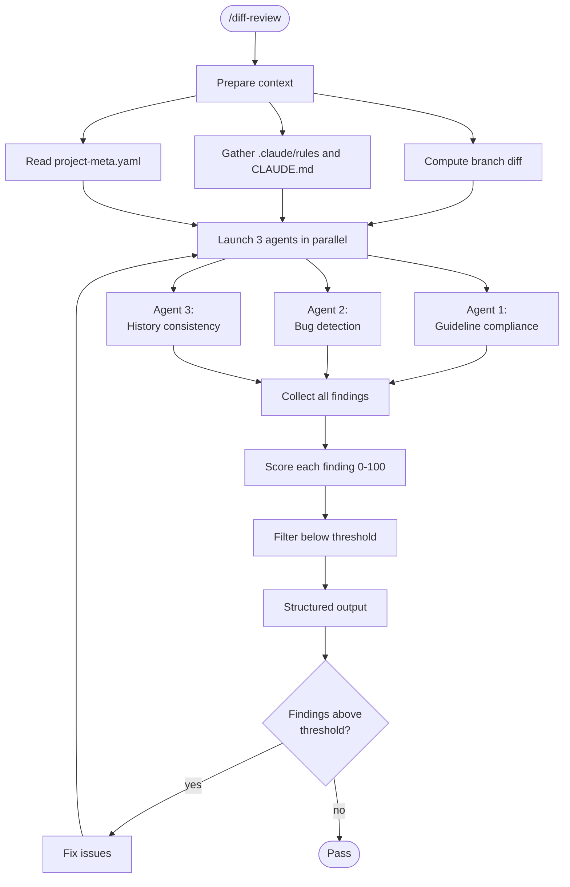

# Diff Review

Multi-agent diff review that launches 3 independent review agents in parallel against the branch diff, scores each finding for confidence, filters low-confidence noise, and produces a structured list of actionable issues.

This is the mechanical issue detection counterpart to `/review` (holistic quality judgment). They answer different questions about the same changed code:

| Aspect | `/diff-review` | `/review` |
|---|---|---|
| **Question** | "Are there specific issues in this diff?" | "Is this work excellent for its stage?" |
| **Scope** | Raw diff hunks + git blame | Touched modules + direct interfaces |
| **Output** | Findings list with confidence scores | Verdict with stage, scope, checklist |
| **Architecture** | 3 parallel independent agents | Single coherent evaluator |

See `.claude/guides/reviews.md` for the full comparison.

---

## When to use

- Standalone: `/diff-review` anytime you want a mechanical scan of recent changes
- Automatic: runs as part of `/pr` Step 4b in parallel with `/review`

---

## Workflow



---

## Step 1: Prepare context

Gather the inputs all three agents need.

### 1a. Determine the target branch

```bash
# Read branching complexity
target=$(python3 -c "
import yaml
with open('project-meta.yaml') as f:
    meta = yaml.safe_load(f)
bc = meta.get('branching_complexity', 'simple')
print('develop' if bc in ('standard', 'full') else 'master')
" 2>/dev/null || echo "master")
echo "$target"
```

### 1b. Compute the branch diff

```bash
git diff "origin/${target}...HEAD"
```

Save this diff — it is the primary input for all three agents.

### 1c. Identify changed files

```bash
git diff "origin/${target}...HEAD" --name-only
```

### 1d. Gather guideline files

Read the following files (skip any that don't exist):

- `CLAUDE.md` (project root)
- All files in `.claude/rules/`
- `ARCHITECTURE.md`

### 1e. Read project metadata

```bash
cat project-meta.yaml
```

Note the `language` field — Agent 2 uses it for language-specific bug patterns.

### 1f. Determine confidence threshold

Read `diff_review_threshold` from `project-meta.yaml`. Default: **80**.

---

## Step 2: Launch agents in parallel

Launch all three agents simultaneously using the Agent tool. Each agent receives only the inputs it needs and produces findings independently. **All three must be launched in a single message** to run in parallel.

Each agent must return its findings as a structured list. Each finding must include:

- `file`: file path
- `line_range`: line number or range (e.g., "42" or "42-47")
- `category`: agent-specific category
- `description`: what the issue is
- `confidence`: 0-100 score
- `evidence`: specific code or guideline reference

### Agent prompts

Use the agent prompts defined in Step 2a, 2b, and 2c below. Pass each agent its required inputs via the Agent tool's prompt parameter.

---

### Step 2a: Agent 1 — Guideline compliance

Launch with `subagent_type: "general-purpose"` and the following prompt:

> You are a guideline compliance auditor. Your job is to audit code changes against project-specific guidelines and report violations.
>
> **Input:**
> - Branch diff (provided below)
> - Project guidelines (provided below)
>
> **Process:**
> 1. Read all guideline files and extract concrete, actionable rules: naming conventions, required patterns, prohibited patterns, required practices.
> 2. Walk each changed hunk in the diff. Focus only on added or modified lines.
> 3. For each potential violation:
>    a. Cite the specific guideline file and rule being violated.
>    b. Cite the file path and line range in the diff.
>    c. Quote the violating code.
>    d. Self-verify: re-read the guideline to confirm this is a real violation, not a misinterpretation. If the guideline is ambiguous about this case, lower your confidence.
> 4. Do NOT flag pre-existing code that was not changed in this diff.
> 5. Do NOT flag style preferences that are not explicitly stated in the guidelines.
>
> **Confidence scoring:**
> - 90-100: Clear violation of an explicit, unambiguous rule with direct evidence
> - 70-89: Likely violation, but the guideline has some ambiguity
> - 50-69: Possible violation — the guideline is vague or the code is borderline
> - Below 50: Weak signal — probably not a real violation
>
> **Output format:**
> Return a markdown list of findings. Each finding must have:
> - `**[compliance]**` prefix
> - File path and line range
> - Confidence score in parentheses
> - The violation description
> - The guideline source (file and specific rule)
>
> If no violations are found, say "No guideline violations detected."
>
> ---
>
> **Branch diff:**
> ```
> {paste the branch diff here}
> ```
>
> **Project guidelines:**
> {paste the contents of CLAUDE.md, .claude/rules/*.md, and ARCHITECTURE.md here}

---

### Step 2b: Agent 2 — Bug detection

Launch with `subagent_type: "general-purpose"` and the following prompt:

> You are a bug detection agent. Your job is to scan new and modified code for implementation bugs. Focus exclusively on code introduced in this branch — do not flag pre-existing issues.
>
> **Language:** {language from project-meta.yaml}
>
> **Patterns to detect:**
> - Resource leaks: files, connections, locks, or handles opened but not closed (missing context managers, missing `finally` blocks)
> - Unhandled exceptions in critical paths: bare `except: pass`, catching too broadly, swallowing errors silently
> - Logic errors: off-by-one, inverted conditions, unreachable code after early returns, wrong comparison operators
> - Missing null/None checks before dereference or attribute access
> - Type mismatches: passing wrong types to functions, returning wrong types
> - Missing cleanup in error paths: `try` without proper `finally` or context manager
> - Incorrect string formatting: f-string syntax errors, wrong format specifiers
> - Race conditions or shared state mutation without protection
> - Incorrect path handling: string concatenation instead of `pathlib`, missing path validation
>
> **Scope rule:** ONLY flag issues in lines that are added (+) or modified in the diff. Pre-existing bugs in unchanged code are out of scope. If a bug exists in an unchanged line that a new line depends on, note the dependency but score confidence lower.
>
> **Confidence scoring:**
> - 90-100: Definite bug — the code will fail or produce wrong results in a concrete scenario you can describe
> - 70-89: Likely bug — the pattern is almost certainly wrong but you cannot construct a guaranteed failure scenario
> - 50-69: Possible bug — the code is suspicious but may work correctly depending on context you cannot see
> - Below 50: Code smell — not a bug but a pattern that often leads to bugs
>
> **Output format:**
> Return a markdown list of findings. Each finding must have:
> - `**[bug]**` prefix
> - File path and line range
> - Confidence score in parentheses
> - Bug category (resource leak, logic error, etc.)
> - Description of what goes wrong and when
>
> If no bugs are found, say "No bugs detected in new code."
>
> ---
>
> **Branch diff:**
> ```
> {paste the branch diff here}
> ```

---

### Step 2c: Agent 3 — History consistency

Launch with `subagent_type: "general-purpose"` and the following prompt:

> You are a history consistency analyzer. Your job is to detect patterns in the existing codebase that the current changes deviate from. Consistency matters because deviations create cognitive overhead and maintenance burden.
>
> **Process:**
> For each file modified in the diff:
> 1. Read the full current file (not just the diff) to understand established patterns.
> 2. Run `git log --oneline -20 -- {file}` to understand recent change patterns.
> 3. Run `git blame {file}` to understand authorship and age of patterns.
> 4. Compare the new/modified code against the patterns established in the rest of the file and its recent history.
>
> **Patterns to check:**
> - Naming conventions: does the file use snake_case but new code adds camelCase? Does it use specific prefixes?
> - Structural patterns: does the module use dataclasses but new code uses plain dicts? Does it use factory functions but new code uses constructors directly?
> - Import patterns: does the module use `pathlib` but new code uses `os.path`? Does it import from specific locations?
> - Error handling: does the module raise `ValueError` but new code raises `RuntimeError` for similar cases? Does it use custom exceptions?
> - Test patterns: do existing tests use `parametrize` but new tests use copy-paste? Do they use specific fixtures?
> - Logging patterns: does the module use `logger.info()` but new code uses `print()`?
> - Documentation patterns: do existing functions have docstrings in a specific format but new ones don't?
>
> **Confidence scoring:**
> - 90-100: Clear deviation from a consistent, unambiguous pattern (e.g., every function in the file uses snake_case except the new one)
> - 70-89: Likely deviation — the pattern is strong but has 1-2 existing exceptions
> - 50-69: Possible deviation — the pattern exists but is not universal in the file
> - Below 50: Weak pattern — the file is already inconsistent
>
> **Output format:**
> Return a markdown list of findings. Each finding must have:
> - `**[history]**` prefix
> - File path and line range
> - Confidence score in parentheses
> - The established pattern (with evidence: "N of M functions follow X")
> - The deviation in the new code
>
> If no deviations are found, say "No pattern deviations detected."
>
> ---
>
> **Changed files:**
> {list of changed files}
>
> **Branch diff:**
> ```
> {paste the branch diff here}
> ```

---

## Step 3: Collect and filter findings

After all three agents return:

1. **Collect** all findings from all agents into a single list.
2. **Filter** out any finding with confidence below the threshold (default: 80).
3. **Sort** remaining findings by confidence (highest first).
4. **Count** total findings, findings above threshold, and findings below threshold.

---

## Step 4: Output results

### Terminal output format

```
## Diff Review

**Agents:** 3 | **Findings:** {above} above threshold ({threshold}) | **Suppressed:** {below} below threshold

### Findings

1. **[compliance]** `src/<pkg>/scaffold.py:142-145` (confidence: 92)
   Naming rule violation: `.claude/rules/conventions/python.md` requires snake_case
   for all functions. `buildContext` should be `build_context`.

2. **[bug]** `src/<pkg>/metadata.py:67` (confidence: 88)
   File handle opened without context manager. If `validate()` raises,
   the file descriptor leaks.

3. **[history]** `src/<pkg>/hooks.py:23-30` (confidence: 85)
   Rest of module uses `logging.getLogger(__name__)` pattern.
   New function uses `print()` for error output.

### Suppressed (below threshold)

- {below} findings between 50-{threshold-1} (run with lower threshold to see all)
```

When no findings are found:

```
## Diff Review

**Agents:** 3 | **Findings:** 0 above threshold ({threshold}) | **Suppressed:** {below} below threshold

No actionable findings. All agents completed successfully.
```

### PR comment format

When invoked from `/pr`, the findings are posted as a PR comment in Step 9. Copy this template exactly — do not reorder, rename, or omit sections:

```markdown
## Diff Review

**Scope:** Raw diff hunks + git blame | **Agents:** 3 | **Findings:** {above} above threshold ({threshold}) | **Suppressed:** {below} below threshold

### Findings

| # | Agent | File | Lines | Confidence | Finding |
|---|---|---|---|---|---|
| 1 | compliance | `src/<pkg>/scaffold.py` | 142-145 | 92 | Naming rule violation: ... |
| 2 | bug | `src/<pkg>/metadata.py` | 67 | 88 | File handle opened without context manager ... |

*All findings were resolved before PR creation. This comment is the audit trail.*

### Agent summaries

- [x] **Guideline compliance** — <1-line summary of what was checked and key finding>
- [x] **Bug detection** — <1-line summary of what was checked and key finding>
- [x] **History consistency** — <1-line summary of what was checked and key finding>
```

When no findings:

```markdown
## Diff Review

**Scope:** Raw diff hunks + git blame | **Agents:** 3 | **Findings:** 0 above threshold ({threshold}) | **Suppressed:** {below} below threshold

No actionable findings.

- [x] **Guideline compliance** — <1-line summary>
- [x] **Bug detection** — <1-line summary>
- [x] **History consistency** — <1-line summary>
```

---

## Step 5: Fix and re-run (if needed)

If findings exist above the threshold:

1. Fix each issue in priority order (highest confidence first).
2. Commit fixes.
3. Re-run only the agent(s) whose findings were addressed — no need to re-run all three if only one agent's findings remain.
4. Repeat until no findings above threshold remain.

When invoked from `/pr`, set `coverage_stale = true` if any code changes are committed.

---

## Failure handling

- **Agent timeout:** If an agent doesn't return within a reasonable time, proceed with findings from the other agents. Note the timeout in the output: "Agent N timed out — results may be incomplete."
- **No findings:** Report "No actionable findings" — this is a valid outcome, not a failure.
- **All agents fail:** Fall back to manual review of the diff. Log: "All diff-review agents failed — manual review required."
- **Git blame unavailable (shallow clone):** Agent 3 degrades gracefully — skip blame-dependent checks and note: "History agent: limited analysis (shallow clone detected)."

---

## Configuration

### `project-meta.yaml` fields

| Field | Default | Description |
|---|---|---|
| `diff_review_threshold` | 80 | Minimum confidence score for a finding to be reported |

### Overriding threshold

To temporarily lower the threshold for a single run, state it when invoking:

> /diff-review with threshold 50

The skill reads this from the user's message and overrides the `project-meta.yaml` value for that run.
