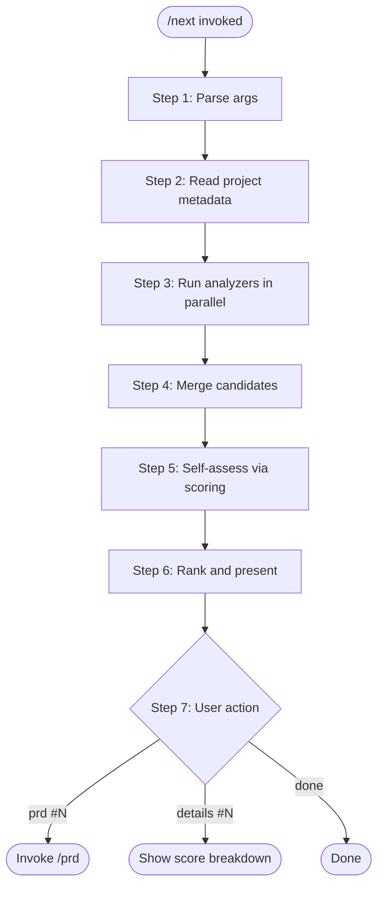

# /next — Discover What to Build Next

Scan project state across 7 dimensions (coverage gaps, test quality, TODOs, complexity debt, structural gaps, documentation gaps, and external best practices), auto-score each candidate via the scoring framework, and present a ranked table sorted by total score.

---

## Trigger

This skill triggers when:

- The user invokes `/next`
- The user asks "what should I work on next?" or similar

## Arguments

- `/next` — default: discover and rank top 10 candidates
- `/next --top N` — show top N candidates (default: 10)
- `/next --dimension <name>` — filter to a single dimension (coverage, test_quality, todos, debt, structure, docs, bestpractices)

---

## Workflow



---

## Step 1: Parse arguments

Extract `--top N` (default 10) and `--dimension <name>` (default: all) from the invocation arguments.

---

## Step 2: Read project metadata

Read `project-meta.yaml` to determine:

- `scoring_profile` — weight profile for scoring (default: check project context, fall back to `solo_dev`)
- `phase` — project maturity phase
- `quality_gate` — current quality gate level
- `language` — primary language

If `project-meta.yaml` doesn't exist, use defaults: `enterprise` profile, `discovery` phase, `none` gate.

---

## Step 3: Run analyzer scripts

Run all 8 analyzer scripts. Each is independent — a failure in one does not block others. Run them in parallel where possible.

### Analyzer registry

| Analyzer | Script | What it scans |
|---|---|---|
| Coverage gaps | `.claude/scripts/next-coverage.sh` | `coverage.json` + tier thresholds |
| Test quality | `.claude/scripts/next-test-quality.sh` | Test files for marker coverage |
| TODOs | `.claude/scripts/next-todos.sh` | TODO/FIXME/HACK/XXX in source |
| Complexity debt | `.claude/scripts/next-debt.sh` | Large files, high-churn files |
| Structural gaps | `.claude/scripts/next-structure.sh` | Missing tests, docstrings, version sync |
| Documentation gaps | `.claude/scripts/next-docs.sh` | Stale docs, draft PRDs, README gaps |
| Best practices | `.claude/scripts/next-bestpractices.py` | Ecosystem tools and conventions |
| Structural health | `.claude/scripts/next-structural-health.py` | Monolith detection, extraction boundaries, score trends |

### Execution

```bash
# Shell analyzers
bash .claude/scripts/next-<name>.sh [--repo-root <path>]

# Python analyzers
python3 .claude/scripts/next-bestpractices.py [--repo-root <path>]
```

Capture stdout (JSON) and stderr (info/errors) separately. If a script exits non-zero, log the error and continue.

### Analyzer output contract

Each analyzer outputs a JSON object to stdout:

```json
{
  "analyzer": "<name>",
  "schema_version": 1,
  "skipped": false,
  "candidates": [
    {
      "title": "Short actionable description",
      "dimension": "<analyzer name>",
      "evidence": "file:metric or file:line reference",
      "effort": "S|M|L",
      "details": "1-2 sentences of context",
      "ivi_hints": {
        "<dimension_key>": "Free-text context for scoring"
      }
    }
  ]
}
```

The `scoring_hints` field is optional — each analyzer provides hints for whichever scoring dimensions are relevant to its candidates. Different analyzers hint at different dimensions.

---

## Step 4: Merge candidates

Collect all `candidates` arrays from all analyzers into a single list. Note any analyzers that failed or were skipped.

If `--dimension <name>` was specified, filter to only candidates from that dimension.

---

## Step 5: Self-assess each candidate via scoring framework

For each candidate, score all active dimensions (0-6) autonomously — **do not ask the user for scores**. This is a self-assessment for ranking purposes.

### How to score

1. Load the scoring framework configuration (the project's framework YAML)
2. Determine active dimensions for the profile (dimensions with weight > 0)
3. For each candidate, evaluate every active dimension using:
   - The candidate's `title`, `evidence`, `details`, and `scoring_hints`
   - The project's phase, stage, and quality gate
   - The dimension's scoring rubric from the framework
   - Your best judgment about the initiative
4. Run the scoring calculator:

```python
# Import the project's scoring calculator
# from <project_scoring_package>.calculator import ScoringCalculator

calc = ScoringCalculator()
result = calc.calculate(scores, profile="<profile>")
```

### Scoring guidelines for self-assessment

Keep these biases in mind to improve scoring quality:

- **Constraints scores high for internal improvements**: Most candidates are internal project improvements with no external blockers — Constraints will naturally score 80-95. This is expected and correct.
- **Inverted dimensions with wrong-direction rubrics**: Some inverted dimensions have rubrics where 0=worst and 6=best (natural order). For these, score LOW when the situation is GOOD so the inversion produces a high adjusted score. Note this in dimension scoring when it occurs.
- **Effort as a proxy for job_size**: Map the candidate's `effort` field: S→5 (small), M→3 (medium), L→1 (large) as a starting point for the `job_size` dimension.
- **Use ivi_hints**: When the candidate provides hints, use them to inform the relevant dimension scores rather than guessing from the title alone.
- **Be discriminating**: Don't give every candidate similar scores. Use the full 0-6 range. A TODO cleanup (low strategic alignment, high capacity) should score very differently from a coverage gap in a T1 module (high strategic alignment, high risk reduction).

### Batch efficiency

Score candidates in batches. You do not need to present each dimension's reasoning — just produce the scores and calculate. Present reasoning only when the user asks `details #N`.

---

## Step 6: Rank and present

Sort candidates by `display_total` descending. Apply `--top N` limit.

Present as a table:

```markdown
## What's Next — <project name>

**Profile:** <profile> | **Phase:** <phase> | **Candidates:** <total> (showing top <N>)

| # | Candidate | Dimension | Value | Risk | Constr | Energy | Score | Effort |
|---|-----------|-----------|-------|------|--------|--------|-----|--------|
| 1 | Increase scaffold.py coverage to T1 gate | coverage | 68 | 71 | 92 | 75 | 74 | M |
| 2 | Add structured logging | bestpractices | 62 | 65 | 88 | 80 | 72 | S |
| 3 | Resolve 14 TODOs in rules_manager.py | todos | 55 | 70 | 95 | 82 | 71 | S |
```

Below the table, show:

```markdown
**Actions:**
- `prd #N` — generate a PRD for candidate N (invokes `/prd`)
- `details #N` — show full scoring dimension breakdown for candidate N
- `done` — finish
```

If any analyzers failed or were skipped, note them below the table:

```markdown
**Notes:**
- Coverage analyzer skipped: no coverage.json found (run `pytest --cov --cov-report=json`)
- Debt analyzer failed: <error message>
```

---

## Step 7: Handle user actions

### `prd #N`

Extract the candidate's title and details. Invoke `/prd` with the candidate as context:

> Build: <candidate title>. Context: <candidate details>. Evidence: <candidate evidence>.

### `details #N`

Show the full scoring dimension breakdown for the candidate, same format as `/prioritize` Step 4:

```markdown
## Scoring Details: <candidate title>

### Value

| Dimension | Score | Meaning | Rationale |
|-----------|-------|---------|-----------|
| Strategic alignment | 4 | Clearly supports one core strategic theme | <why> |
| ... | | | |

### Risk
...

### Constraints
...

### Energy
...

**Bucket scores:** Value: 68 | Risk: 71 | Constraints: 92 | Energy: 75
**Total:** 74
```

The user can then say "adjust strategic_alignment to 5" to override a score, and the score will be recalculated.

### `done`

End the skill. No artifacts to persist — `/next` output is ephemeral.

---

## Graceful degradation

This skill works on any git repository, not just scaffolded projects:

| Missing element | Behavior |
|---|---|
| `project-meta.yaml` | Use defaults for profile, phase, gate |
| `coverage.json` | Coverage analyzer skips |
| `coverage_tiers.py` | Coverage analyzer uses flat 60% threshold |
| `ruff` not installed | Structure analyzer skips lint checks |
| `docs/prds/` | Docs analyzer skips PRD analysis |
| Scoring framework config | Scoring skipped, candidates shown unranked |
| No test directory | Test quality analyzer suggests creating one |
| `pyproject.toml` missing | Best practices analyzer uses limited checks |

---

## Adding a new analyzer

To add a new analysis dimension:

1. Create `.claude/scripts/next-<name>.sh` (or `.py`) following the analyzer contract
2. Add a row to the Analyzer registry table above
3. Copy to the project's content scripts directory for dogfooding parity
4. No other files need modification
