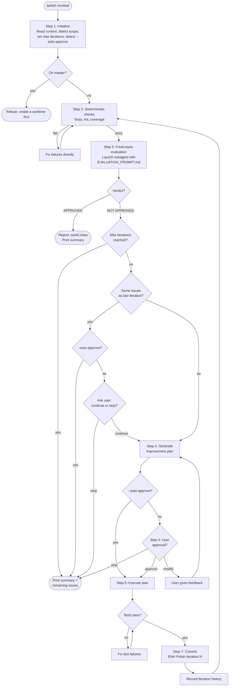

# Polish

Rigorous iterative quality loop that drives work toward production-grade, world-class quality. Each iteration runs deterministic checks (tests, lint, coverage), then launches an independent fresh-eyes evaluation via a subagent that has never seen the code before, generates a structured improvement plan, asks for user approval, executes the plan, commits, and repeats until the work is genuinely world-class.

---

## Purpose and philosophy

The quality bar is absolute, not stage-relative.

The project's development stage (alpha, beta, etc.) describes feature completeness — it does not lower the quality standard. An alpha project can and should have world-class code, tests, documentation, and practices for the features it has. The best teams in the world ship elite-quality work from day one, not just at production launch.

`/polish` exists to automate the loop of: evaluate thoroughly → identify gaps → plan fixes → get approval → execute → re-evaluate. It replaces the manual workflow of repeatedly asking "what prevents this from being world-class?" and acting on the answer.

### Why a hybrid approach

This skill combines techniques from three paradigms to eliminate the weaknesses of each:

1. **Fresh subagent evaluation** (from the Ralph Wiggum technique): each iteration launches a new evaluator that has never seen the code. This eliminates anchoring bias — the evaluator cannot go easy on code it wrote 5 minutes ago because it does not know it wrote it.

2. **Deterministic quality floor**: before subjective evaluation, run tests, linting, and coverage. This provides an unfakeable baseline — no amount of subjective approval can override failing tests.

3. **Structured orchestration with memory**: the main conversation acts as an orchestrator that remembers what was tried, what failed, and what improved. This prevents repeating failed approaches and enables targeted, efficient iteration.

---

## Design comparison

### Dimension scores

| Dimension | Weight | Single-agent loop | Ralph Wiggum | Hybrid |
|---|---|---|---|---|
| **Evaluation integrity** | Critical | 5/10 | 9/10 | 9/10 |
| **Thoroughness** | Critical | 6/10 | 7/10 | 9/10 |
| **Actionability** | High | 8/10 | 4/10 | 9/10 |
| **Stuck recovery** | High | 7/10 | 2/10 | 8/10 |
| **User control** | High | 9/10 | 1/10 | 9/10 |
| **Cost efficiency** | Medium | 9/10 | 3/10 | 6/10 |
| **Simplicity** | Medium | 7/10 | 10/10 | 5/10 |
| **Deterministic floor** | Medium | 2/10 | 2/10 | 8/10 |
| **Scalability** | Medium | 7/10 | 8/10 | 8/10 |
| **Weighted total** | | **6.3** | **5.4** | **8.3** |

### Aspect comparison

| Aspect | Single-agent loop | Ralph Wiggum | Hybrid |
|---|---|---|---|
| **Iteration mechanism** | Single conversation — same context window | Fresh invocation each cycle — clean slate | Single conversation orchestrates, fresh subagent evaluates each iteration |
| **Evaluation freshness** | Degrades — anchored to own prior assessments | Maximum — no memory of previous iterations | Fresh each iteration — subagent evaluates cold |
| **Completion signal** | Subjective: agent declares "world-class" | Deterministic: string match or max iterations | Both: deterministic checks must pass AND fresh subagent approves |
| **Human approval gate** | Mandatory between each iteration | Fully autonomous — no human in the loop | Mandatory — user sees findings and plan before execution |
| **Context available** | Full history of what was tried and failed | None — must re-derive everything each time | Split: evaluator has none (fresh eyes), orchestrator has full history |
| **Anchoring risk** | High by iteration 3-4 | None | None — evaluator never sees its own previous verdicts |
| **Efficiency** | Higher — carries forward understanding | Lower — re-reads everything, may repeat work | Balanced — orchestrator remembers, evaluator starts fresh |
| **Stuck detection** | Plateau detection + user gate | Max iterations only | Plateau detection + iteration history + user gate + max iterations |
| **Self-assessment integrity** | Weakest point — judging own work | Incorruptible — doesn't know it's reviewing own work | Incorruptible — evaluator is always a stranger to the code |
| **Deterministic quality floor** | None — purely subjective | None — purely prompt-driven | Tests, lint, coverage must pass before subjective evaluation runs |

---

## Loop overview



---

## Step 1: Initialize

1. Read `project-meta.yaml` to identify the current `phase`, `language`, `quality_gate`, `test_command`, and `lint_command`. These provide context — they are not quality ceilings.
2. Detect scope: default to the current worktree or branch. Determine changed files by comparing against origin/master.
3. **Guard: refuse to run on master.** If the current branch is `master` or `main`, stop and instruct the user to create a worktree first.
4. Parse optional arguments:
   - **Max iterations**: a bare integer. Default: **5**. Usage: `/polish 10`.
   - **`--auto-approve`**: flag (no value). When present, the user approval gate in Step 5 is skipped — the improvement plan is executed automatically each iteration. Usage: `/polish --auto-approve` or `/polish 10 --auto-approve`.
5. Initialize iteration counter at 0 and iteration log as an empty list.
6. Print initialization summary:

```
## Polish loop started
**Phase:** {phase} | **Scope:** {scope} | **Max iterations:** {N}
**Quality bar:** production-grade (absolute, not stage-relative)
**Deterministic checks:** tests, lint{, coverage if quality_gate != none}
**Mode:** {autonomous (--auto-approve) | interactive}
```

### Checkpoint: after Step 1

Write the checkpoint file per `context-checkpointing.md` (derive path from branch slug). Capture: workflow (/polish), scope (changed files), max iterations, phase, quality gate. This anchors the loop context.

---

## Step 2: Deterministic checks (quality floor)

Before subjective evaluation, establish an unfakeable quality baseline.

Run in order:

1. **Tests**: Run the project's test suite (from `project-meta.yaml` `test_command`, or `pytest tests/ -v`).
2. **Linting**: Run the linter (from `project-meta.yaml` `lint_command`, or `ruff check src/ tests/`).
3. **Coverage** (if quality gate is `basic` or `strict`): Run coverage check against the configured target.
4. **Anti-gaming** (if `tests/test_test_quality.py` exists): Run `pytest tests/test_test_quality.py::TestAntiGamingT1T2 -v`. Detects assert-free tests, trivial identity tests, and import-only tests in T1/T2 module test files. Failures are blocking — tests that inflate coverage without verifying behavior create false confidence.
5. **Security** (if quality gate is `strict`): Run `bandit` and `pip-audit`.

**All must pass before proceeding to Step 3.** If any check fails:
- Fix the failure directly — no subagent needed for deterministic issues.
- Re-run the failing check.
- Do not proceed until all deterministic checks pass.

Record results in the iteration log.

---

## Step 3: Fresh-eyes evaluation (subagent)

This is the core of the hybrid approach. The evaluation is performed by a **fresh subagent** that has no history with the code and cannot be anchored to previous iterations.

### 3a. Prepare the evaluation

1. Read `EVALUATION_PROMPT.md` from this skill's directory.
2. Read `EVALUATION_CRITERIA.md` from this skill's directory.
3. Determine the scope description: branch name, changed files list, and a brief summary of what the branch does.
4. Read the changed files on the branch compared to master.

### 3b. Launch the subagent

Spawn a subagent (using the Agent tool) with:
- The full content of `EVALUATION_PROMPT.md` with `{scope_description}` filled in
- The full content of `EVALUATION_CRITERIA.md` inlined
- The changed files or their contents
- **No iteration history** — the subagent must evaluate with fresh eyes

The subagent has no access to the orchestrator's iteration log, previous verdicts, or improvement plans. It evaluates the current state of the code as a stranger.

### 3c. Parse the evaluation

From the subagent's response, extract:
- **Per-dimension issues**: issues grouped by ISO 25010 characteristic (8 sections), each with blocking/important/minor tables and confidence level
- **Priority matrix**: severity counts and top 3 actions per tier
- **What would move the needle most**: the 3-5 highest-impact actions with issue references
- **Verdict**: APPROVED or NOT APPROVED

Record the full evaluation in the iteration log.

---

## Step 4: Generate improvement plan

The **orchestrator** (not the subagent) generates the plan. The orchestrator has access to:
- The current evaluation verdict and issues from the fresh-eyes subagent
- All previous iteration logs (what was tried, what failed, what improved)
- The full codebase

### Structure

Group improvements into three priority tiers:

**1. Blocking fixes** — Issues with severity "blocking" from the evaluation. Must be resolved.

**2. Important improvements** — Issues with severity "important." Resolving these raises the bar toward approval.

**3. Minor polish** — Issues with severity "minor." Addressed if time permits.

### Format

For each item:

```
- **[file_path:line]**: {what to change} — {why it matters}
```

Order items within each tier by impact (highest first).

End with:

```
**Scope:** {N} files, {M} blocking issues, {K} important issues.
```

### Guidelines

- Be specific about files and changes. No vague advice.
- Focus on the current iteration. Do not try to fix everything at once.
- **Do not repeat approaches that already failed.** Check the iteration log. If a previous iteration tried to fix an issue and the same issue reappeared, try a different approach and note why.
- Do not accept stage-appropriate leniency. If the code would be stronger with a change and the change is feasible, include it.
- If the evaluation is vague, analyze the issues yourself and derive concrete fixes. If you still cannot determine what to fix, ask the user.

---

## Step 5: User approval gate

### Interactive mode (default)

Present the improvement plan and ask the user to choose:

1. **Approve** — Proceed to execute the plan as written.
2. **Modify** — The user provides feedback. Regenerate the plan incorporating their feedback and re-present.
3. **Stop** — Exit the polish loop. Print the termination summary.

**This gate is mandatory in interactive mode.** Never skip it. Never auto-approve unless `--auto-approve` was passed.

### Autonomous mode (`--auto-approve`)

When `--auto-approve` is active:
- Print the improvement plan to keep the user informed, but do not wait for a response.
- Proceed directly to Step 6 (execute the plan).
- On **plateau** (same issues two consecutive iterations): exit immediately with the termination summary. Do not ask the user — the loop cannot make progress and autonomous continuation would be wasteful.
- All other termination conditions (APPROVED, max iterations, oscillation) apply unchanged.

---

## Step 6: Execute the plan

### 6a. Implement

Implement each item in the approved plan:
- Follow existing project conventions (linting rules, type hints, test patterns, naming).
- Make changes in the order listed in the plan.
- If an item is more complex than expected, implement what is reasonable and note what was deferred.

### 6b. Verify

Run the deterministic checks from Step 2 (tests, lint) to catch regressions. If tests fail, fix them before committing. Test fixes count as part of the current iteration.

### 6c. Commit

Follow `.claude/rules/04-git.md` commit conventions:

1. Stage files:
   ```bash
   bash ".claude/scripts/stage-all-files.sh"
   ```
2. Read the resulting diff from the temp file the script outputs.
3. Commit with prefix `ENH`:
   ```
   ENH Polish iteration {N}: {brief summary of changes}
   ```
4. Use a HEREDOC for the commit message.

Each iteration gets its own commit to enable easy revert of individual iterations.

The `--auto-approve` flag state (set at Step 1) persists for all iterations — it is not re-parsed each loop.

---

## Step 7: Record and loop

1. Record in the iteration log:
   - Iteration number
   - Evaluation verdict (APPROVED / NOT APPROVED)
   - Issues found (count by severity)
   - Improvements made (brief list)
   - Files changed

2. Increment the iteration counter.

3. **Checkpoint:** Update the checkpoint file with: current iteration number, evaluation verdict, issues found/fixed this iteration, cumulative iteration history. This ensures the loop can resume after compaction without repeating iterations.

4. Check termination conditions:
   - **Max iterations reached** → print termination summary and exit
   - **Otherwise** → print "Iteration {N} complete. Re-evaluating..." and loop to Step 2

---

## Termination conditions

The loop exits when any of these are true:

1. **APPROVED verdict** from the fresh-eyes subagent (after deterministic checks pass). The work is production-grade.
2. **Max iterations reached** (default 5). Report remaining issues.
3. **User stops** the loop via the approval gate.
4. **Plateau detected**: the same issues appear in two consecutive evaluations despite attempted fixes. Ask the user whether to continue with a different approach or stop.
5. **Oscillation detected**: an issue that was fixed in a previous iteration reappears. Flag it and ask the user.

---

## Termination summary

When the loop exits for any reason, print:

```markdown
## Polish Summary

**Iterations completed:** {N}
**Final verdict:** {verdict}
**Phase:** {phase}
**Scope:** {scope}
**Exit reason:** {APPROVED / max iterations / plateau / user stopped}

### Iteration history

| # | Verdict | Blocking | Important | Minor | Key changes |
|---|---------|----------|-----------|-------|-------------|
| 1 | NOT APPROVED | 3 | 4 | 2 | Fixed rollback cleanup, config mutation |
| 2 | NOT APPROVED | 1 | 2 | 1 | Improved test coverage, error messages |
| 3 | APPROVED | 0 | 0 | 1 | — |

### Remaining issues (if not APPROVED)
- {list of remaining issues, or "None — production-grade quality achieved"}

### What would move the needle next
{Next improvements beyond the current scope — new features, architectural changes, etc.}
```

### Cleanup

Delete the checkpoint file for the current branch if it exists. The polish loop is complete.

---

## Edge cases

### Already production-grade
If the fresh-eyes evaluation returns APPROVED on the first pass, report and exit. Do not invent work.

### Deterministic checks fail repeatedly
If tests or lint fail 3 times on the same issue, ask the user for help rather than looping.

### Oscillation
If the evaluator raises an issue that a previous iteration addressed, the fix may have been insufficient or the evaluator may have a different perspective. Flag it explicitly, show what was done previously, and ask the user whether to try a different approach.

### No test suite
If the project has no tests, skip the test step in deterministic checks. Warn that the quality floor is weakened. The evaluation may flag missing tests as a blocking issue.

### No branch comparison
If there is no base branch to compare against, evaluate all source files rather than just changed ones.

### User makes manual changes between iterations
This is fine. The re-evaluation in Step 3 assesses whatever the current state is. The skill does not track what it changed vs. what the user changed.

### Scope creep
Stay within the scope identified in Step 1. If the evaluation identifies out-of-scope issues, note them in the plan as "out of scope" but do not fix them unless the user explicitly asks.

---

## What `/polish` is not

- **Not a replacement for `/pr`.** `/polish` improves code quality; `/pr` handles the release workflow (tests, coverage gate, risk assessment, changelog, versioning, release, CI). They are complementary — `/pr` Step 5 (code review) may invoke evaluation, but `/polish` is the iterative improvement loop.
- **Not stage-relative.** `/polish` always targets production-grade quality. The project's development stage describes feature completeness, not the quality ceiling.
- **Not a linter.** Deterministic checks are a floor, not the goal. The fresh-eyes subjective evaluation is what drives real quality improvement.

---

## Supporting files

This skill uses two supporting files in the same directory:

- **`EVALUATION_CRITERIA.md`** — The complete quality standard applied by the fresh-eyes evaluator. Covers all 8 ISO/IEC 25010 characteristics (Functional suitability, Reliability, Security, Maintainability, Performance efficiency, Usability, Compatibility, Portability) across 12 evaluation dimensions, plus scope enforcement, universal standards, red flags, and tone discipline.
- **`EVALUATION_PROMPT.md`** — The exact prompt template given to the fresh-eyes subagent each iteration. Structures the output as issues grouped by ISO 25010 dimension with numbered tables, a priority matrix, needle-mover synthesis, and a final verdict.

The orchestrator reads these files and passes them to the subagent. The subagent receives the criteria and prompt but no iteration history — ensuring fresh, independent evaluation every time.
