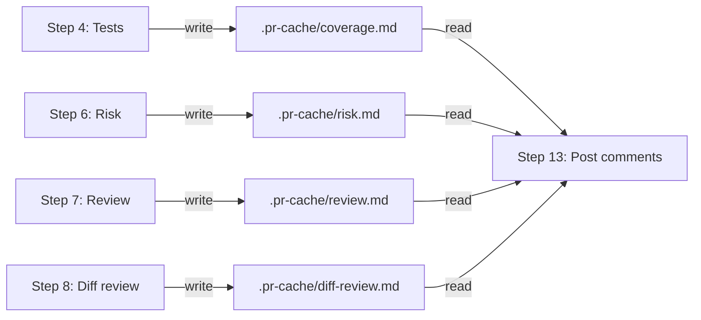
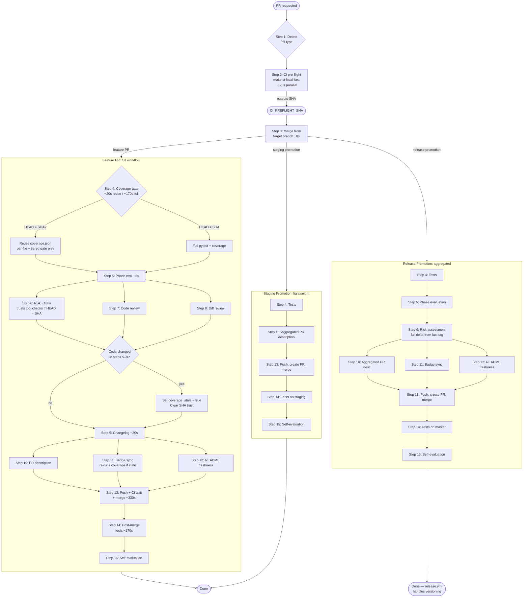
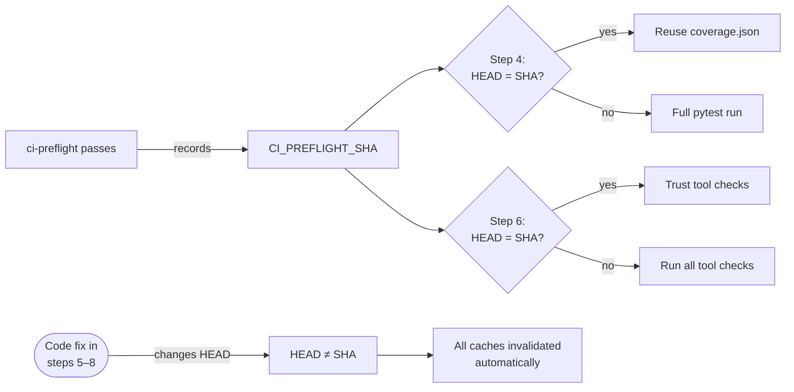
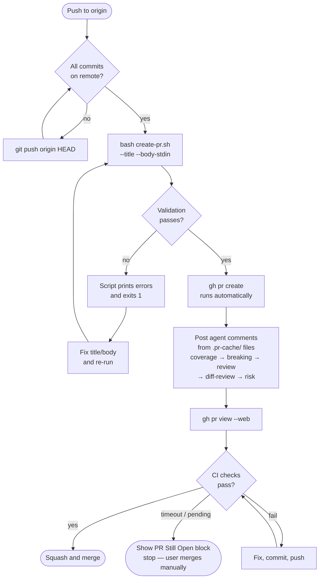

# Pull Requests & Changelog (CRITICAL -- always follow)

When asked to do a PR, start with **Step 1** to detect the PR type, then follow all remaining steps in order. Do not deviate.

## Design rationale: post-merge release automation

Version bumps, changelog assembly, tagging, and GitHub release creation are handled by a **post-merge GitHub Actions workflow** (`release.yml`), not by the agent. This eliminates version race conditions between concurrent PRs — the workflow is serialized via a concurrency group, so only one version computation runs at a time against the true latest state of master.

Feature branches write changelog **fragments** to `changelog.d/<branch>.md` instead of editing `CHANGELOG.md` directly. Each fragment file is unique to its branch, so concurrent branches never conflict. The fragment includes a **bump type** (`patch`, `minor`, or `major`) in YAML frontmatter, which the release workflow uses to determine the version increment.

After the PR is squash-merged to master, `release.yml` collects all pending fragments, determines the highest bump type, runs `finalize-release.sh --auto-bump`, commits the REL version bump directly on master, tags, and creates the GitHub release. A separate `tag-ci.yml` workflow validates each tagged release by running the full test suite.

The agent's responsibility ends at Step 15 (self-evaluation). Everything after that is automated.

## Design rationale: PR comment caching

Agent-posted PR comments (coverage, review, risk assessment, diff review) capture the evaluations performed during the `/pr` workflow. These evaluations are produced in Steps 4, 6, 7, and 8 — but the PR doesn't exist until Step 13. Additionally, conversation context may be compacted between evaluation and posting, losing the evaluation text.

To solve both problems, each evaluation step writes its formatted comment body to `.pr-cache/<type>.md` immediately after the evaluation passes. Step 13 reads from these files when posting comments. This ensures:

- Evaluations survive context compaction and session restarts
- No regeneration or approximation of evaluation results
- Re-running a single step updates only that step's cache file
- `.pr-cache/` is gitignored — it never enters version control



## PR types and branching tiers

The workflow adapts based on the project's `branching_complexity` (derived from `phase` via `PHASE_TO_BRANCHING_TIER` in `metadata.py`) and the PR's target branch:

| Branching tier | Feature PR target | Release path |
|---|---|---|
| **simple** (discovery → alpha) | `master` | 1 PR = 1 release. Current workflow unchanged. |
| **standard** (beta, pilot) | `develop` | Many feature PRs → `develop`. One promotion PR `develop` → `master` = 1 release. |
| **full** (validation, production) | `develop` | Many feature PRs → `develop`. Promotion `develop` → `staging` → `master` = 1 release. |

Three PR variants exist:

| Variant | Source → Target | When |
|---|---|---|
| **Feature PR** | feature branch → `master` or `develop` | Normal development work |
| **Staging promotion** | `develop` → `staging` | Full tier: integration validation gate |
| **Release promotion** | `develop`/`staging` → `master` | Standard/full tier: triggers a release |

Step 1 detects the variant automatically. Each subsequent step notes which variants it applies to. If no variant annotation appears, the step applies to all variants.

## Workflow overview

### Typical step timings (feature PR)

| Step | Typical | Optimized | Notes |
|------|---------|-----------|-------|
| 2 CI pre-flight | ~210s | ~120s | Parallel batches via `ci-local-fast` |
| 3 Merge from target | ~8s | ~8s | Longer if conflicts; ensures all later steps run on merged state |
| 4 Tests & coverage | ~170s | ~20s | Reuses ci-preflight coverage.json if HEAD unchanged |
| 5 Phase evaluation | ~8s | ~8s | Read-only |
| 6–8 Risk / review / diff-review | ~270s | ~180s | Parallel agents; risk skips tool checks if HEAD unchanged |
| 9 Changelog | ~20s | ~20s | |
| 10–12 PR desc / badges / README | ~105s | ~105s | Parallel; LLM-bound |
| 13 Push + CI + merge | ~330s | ~330s | CI wait dominates; opens PR in browser immediately after creation |
| 14 Post-merge tests | ~170s | ~170s | |
| 15 Self-evaluation | ~10s | ~5s | Skipped on clean run |
| **Total wall-clock** | **~1280s** | **~935s** | **Eliminates redundant post-merge test re-run** |

### Feature PR flowchart



### SHA-based cache invalidation

All optimizations use a single mechanism: the ci-preflight SHA. This is the HEAD commit SHA recorded when `make ci-local-fast` passes. Downstream steps compare current HEAD against this SHA before reusing cached results.



The fallback is unconditional: if HEAD differs from the recorded SHA for **any** reason (code fix, merge, amend, rebase), every downstream optimization falls back to running its full check. No manual invalidation is needed.

**Note:** Step 3 (merge from target) runs after ci-preflight and may introduce a merge commit that changes HEAD. If the target branch has new commits, HEAD will differ from `CI_PREFLIGHT_SHA`, and all downstream steps will run their full checks automatically. If the target branch has no new commits (fast-forward or no-op), the SHA remains valid and caches are reused.

---

## Telemetry

The PR workflow records timing and outcome data for each step. This data accumulates in `.claude/telemetry/pr-runs.yaml` (gitignored) and can be summarized with `pr-telemetry-summary.sh`.

### When to call

Call the telemetry script at these points during the workflow:

1. **After Step 1 completes** (PR type detected): start the run

   ```bash
   bash .claude/scripts/pr-telemetry.sh start-run --branch "<branch>" --target "<target>" --pr-type "<feature|staging|release>"
   ```

2. **Before each step starts**: mark step start

   ```bash
   bash .claude/scripts/pr-telemetry.sh start-step --name "<step-name>"
   ```

3. **After each step completes**: mark step end with outcome and optional metrics

   ```bash
   bash .claude/scripts/pr-telemetry.sh end-step --name "<step-name>" --outcome <pass|fail|skip|retry> [--metric key=value ...]
   ```

   For parallel steps (risk, review, diff-review), add `--parallel review`.

4. **After the workflow completes** (Step 15 done, or workflow abandoned): finalize

   ```bash
   bash .claude/scripts/pr-telemetry.sh end-run --outcome <merged|failed|abandoned|pr-open> [--pr-number <N>]
   ```

5. **After a merged run**: persist timing data to version-controlled history

   ```bash
   bash .claude/scripts/pr-telemetry.sh persist-run || true
   ```

### Step names

Use these canonical step names: `ci-preflight`, `merge-from-target`, `tests-and-coverage`, `phase-evaluation`, `risk-assessment`, `code-review`, `diff-review`, `changelog`, `pr-description`, `badge-sync`, `readme-freshness`, `pr-create`, `open-in-browser`, `ci-checks`, `merge`, `post-merge-tests`, `self-evaluation`.

### Metrics per step

Pass step-specific metrics via `--metric key=value`. Common metrics:

| Step | Metrics |
|---|---|
| tests-and-coverage | `coverage_percent=N`, `tests_passed=N`, `tests_failed=N` |
| risk-assessment | `blocking_risks=N`, `advisory_risks=N` |
| diff-review | `findings_above_threshold=N` |
| merge-from-target | `conflicts=N` |
| ci-checks | `check_count=N`, `wait_seconds=N` |
| pr-create | `pr_number=N`, `comments_posted=N` |
| post-merge-tests | `tests_passed=N`, `tests_failed=N` |

If the telemetry script fails, do not block the PR workflow — wrap calls in `|| true` if needed.

---

## Step 1: Detect PR type

Determine the PR variant before proceeding. This step requires no user input — it derives the type from git state and project metadata.

### Procedure

1. Read `branching_complexity` from `project-meta.yaml`. If not set, derive it from `phase` using `PHASE_TO_BRANCHING_TIER`.

2. Determine the target branch:
   - **simple tier**: target is `master`.
   - **standard tier**: target is `develop` for feature PRs, `master` for promotion PRs.
   - **full tier**: target is `develop` for feature PRs, `staging` for staging promotions, `master` for release promotions.

3. Detect the PR variant:

   ```bash
   current_branch=$(git branch --show-current)
   ```

   | Current branch | Target | Variant |
   |---|---|---|
   | `develop` | `staging` | **Staging promotion** |
   | `develop` or `staging` | `master` | **Release promotion** |
   | Any feature branch | `develop` or `master` | **Feature PR** |

4. Print the detected variant and target:

   ```
   [--] PR type: <variant> (<source> → <target>)
   [--] Branching tier: <tier> (phase: <phase>)
   ```

### Simple tier shortcut

If `branching_complexity` is `simple`, the variant is always **Feature PR** targeting `master`. Skip the detection logic and proceed directly to Step 2 — the entire workflow is identical to the current behavior.

### GitHub account switch

After detecting the PR type, switch to the project's configured GitHub account:

```bash
PREV_GH_ACCOUNT=$(bash .claude/scripts/gh-switch.sh)
```

If `github_account` is set in `project-meta.yaml`, this switches the active `gh` account and prints the previous account to `PREV_GH_ACCOUNT`. If not set, it is a no-op that still captures the current account for a symmetric restore at Step 15.

Store `PREV_GH_ACCOUNT` in the checkpoint file — it must survive context compaction for the restore at Step 15.

---

## Step 2: CI pre-flight

> **Applies to:** all variants.

Run all locally-runnable CI checks before starting PR-specific work. This catches lint, type, security, and structural issues immediately — before investing time in coverage gates, risk assessment, or review.

```bash
make ci-local-fast
```

This runs the same checks as `make ci-local` but groups independent targets into parallel batches for faster execution. On success, the last line of output contains `CI_PREFLIGHT_SHA=<sha>` — **capture this value**. It is used by Steps 4 and 6 to safely reuse ci-preflight results instead of re-running expensive checks. Set `ci_preflight_sha = <sha>` for use in later steps.

If `make ci-local-fast` is unavailable (e.g., in a downstream project), fall back to:

```bash
make -k ci-local
```

In this case, set `ci_preflight_sha` to the output of `git rev-parse HEAD` after all checks pass. The SHA mechanism is the same — it records the commit at which checks passed.

- If **any check fails**, fix all reported issues and re-run before proceeding to Step 3.
- Do not skip this step. If ci-preflight passes, CI will pass (minus PR-only checks like description validation).

---

## Step 3: Merge from target branch

> **Applies to:** all variants.

Before running tests, reviews, or any analysis, merge the latest target branch into the feature branch. This ensures all subsequent steps evaluate the true merged state — not a stale base that will change later.

**Why early:** Merging before analysis avoids wasted work. If the target branch has new commits that cause conflicts or test failures, it is better to discover this before investing minutes in coverage gates, risk assessment, and code review. It also eliminates the redundant post-merge test re-run that was previously needed when the merge introduced new code.

### Procedure

1. Fetch the target branch and check whether a merge is needed:

   ```bash
   git fetch origin <target-branch>
   if git merge-base --is-ancestor origin/<target-branch> HEAD; then
     echo "[ok] Already up-to-date with <target-branch> — CI_PREFLIGHT_SHA remains valid"
   else
     git merge origin/<target-branch>
   fi
   ```

   If the target is already an ancestor of HEAD (no new commits on the target since branching), skip the merge entirely. `CI_PREFLIGHT_SHA` remains valid and all downstream caches are preserved.

2. If the merge was skipped (already up-to-date), proceed immediately to Step 4.

3. If the merge introduces new commits:
   - HEAD changes, which automatically invalidates `CI_PREFLIGHT_SHA`. All downstream steps will run their full checks.
   - Set `coverage_stale = true` if it was previously set to `false`.

4. If conflicts occur:
   - Read each conflicted file in full — do not resolve from diff markers alone.
   - If the conflict is in code you did not write (from another branch), show the user both versions and ask which to keep.
   - **Never discard the other branch's work.** The default resolution must preserve functionality from both sides. If both branches added code to the same region, include both additions. Only drop code if the user explicitly confirms it should be removed.
   - After resolving all conflicted files: `git add <files>` and complete the merge commit.

5. Run a quick smoke test to verify the merge did not break basic functionality:

   ```bash
   pytest tests/ -x -q --timeout=30 2>/dev/null || true
   ```

   If this fails, investigate and fix before proceeding. The full test suite runs in Step 4.

### Opt-in rebase

If the user explicitly requests a rebase instead of merge:

1. `git rebase origin/<target-branch>`.
2. If more than 3 conflict steps occur, abort (`git rebase --abort`) and fall back to merge. Inform the user.
3. If the branch was already pushed, use the safe push wrapper: `bash .claude/scripts/post-rebase-push.sh`. Never use raw `git push --force-with-lease`.
4. Never force-push without explicit user approval.

Merge never rewrites history, so no force-push is needed — even if the branch was already pushed.

---

## Step 4: Run tests and coverage gate

> **Applies to:** all variants.

This step combines testing and coverage into a single test suite execution. Do not run a separate `pytest` before this step.

**Set `coverage_stale = false`.** This flag tracks whether code changes occur in later steps. If any step between now and Step 11 commits code changes (fixes from risk assessment or code review), set `coverage_stale = true`. Step 11 uses this flag to decide whether to re-run coverage or reuse the data from this step. Note: the target branch merge already happened in Step 3, so merge-related staleness is already accounted for.

### If the project has a quality gate (`basic` or `strict`)

Run with the ci-preflight SHA to reuse the existing `coverage.json` from Step 2:

```bash
bash .claude/scripts/check-pr-coverage.sh --reuse-coverage "$ci_preflight_sha"
```

If `ci_preflight_sha` is available and HEAD has not changed since ci-preflight, the script reuses the existing `coverage.json` (skipping the full pytest run) and applies only the per-changed-file gate and tiered coverage enforcement. This saves ~150s.

**Automatic fallback:** If HEAD differs from the SHA (because Step 2 fixes changed code, or Step 3 merged new commits), or if `coverage.json` is missing or corrupt, the script falls back to a full pytest run automatically. No manual intervention is needed.

If `ci_preflight_sha` is not available, run without the flag to force a full test run:

```bash
bash .claude/scripts/check-pr-coverage.sh
```

This compares the branch against `origin/master`, identifies changed Python source files (excluding `tests/`), runs the full test suite with coverage, and checks that each changed file meets a minimum coverage threshold (default: 65%). If tests fail, they fail here. If coverage is insufficient, it fails here.

- If the gate **fails**, fix the issue (write tests or fix code), commit, and set `coverage_stale = true` before re-running. The `--reuse-coverage` flag becomes ineffective after a commit (HEAD changes), so the re-run will execute the full test suite automatically.
- To override the minimum threshold for a specific PR, pass `--min-coverage <N>` (e.g., `--min-coverage 40`). Only do this when the user explicitly requests it.
- To target a different base branch, pass `--target <branch>`.

After this step passes, `coverage.json` in the project root contains the coverage data. This will be reused in Step 11 if `coverage_stale` remains `false`. The script also runs tiered coverage enforcement (`coverage_tiers --check --gate basic`) to ensure per-module tier thresholds (T1: 90%, T2: 80%, etc.) are met, matching what CI checks.

### If the project has no quality gate

Run:

```bash
pytest tests/ -v
```

Skip this step only if the user explicitly says to skip tests.

### Quality gate reference

| Gate | What it enforces |
|---|---|
| `none` | No automated enforcement. Tests and linting are recommended but not required. |
| `basic` | Linting must pass. All tests must pass. Test coverage must meet the configured target (default 60%). |
| `strict` | Everything in basic, plus: coverage target defaults to 80%, dependency audit (`pip-audit`) must be clean, static security analysis (`bandit`) must pass. |

When `quality_gate` is not explicitly set in `project-meta.yaml`, it is derived from the project phase:

| Phases | Default gate |
|---|---|
| discovery, poc, prototype | `none` |
| mvp, alpha | `basic` |
| beta, pilot, validation, production | `strict` |

### Save for PR comment: coverage report

After the coverage gate passes, write the formatted coverage comment to `.pr-cache/coverage.md` using the cache writer script:

```bash
bash .claude/scripts/write-pr-cache.sh coverage.md <<'EOF'
<coverage report content>
EOF
```

Write a markdown file containing the coverage report table (overall coverage, per-module coverage with tier, required threshold, pass/fail). Include quality-weighted scores if available. This file will be piped to `pr-comment-agent-coverage.sh` in Step 13.

Example content for `.pr-cache/coverage.md`:

```markdown
### Coverage Report

**Overall:** 90%

| Module | Coverage | Tier | Required | Status |
|--------|----------|------|----------|--------|
| `scaffold.py` | 92.5% | T1 | 90% | PASS |
| `metadata.py` | 91.0% | T1 | 90% | PASS |
```

If the project has no quality gate or no Python source changes, write a minimal report noting this.

### Checkpoint: after Step 4

Write the checkpoint file per `context-checkpointing.md` (derive path from branch slug). Capture: PR type (from Step 1), branch, target, test results (pass/fail, coverage %), quality gate level. This is the first checkpoint — include user instructions if any were given.

---

## Step 5: Evaluate project maturity stage and phase

> **Applies to:** feature PR, release promotion. **Skip for:** staging promotion.

Read the `stage` and `phase` fields in `project-meta.yaml` and review the changes in this PR against the phase definitions below.

If the work in this PR moves the project to a new phase:

1. Update both the `stage` and `phase` fields in `project-meta.yaml`.
2. Commit the change.
3. Set `phase_changed = true` and `new_phase = <phase>` for use in Step 9.

If unsure whether a phase transition has occurred, ask the user before proceeding.

**Important:** The phase determined here is used in Step 6 for risk assessment. If the phase advances (e.g., prototype → MVP), the risk assessment uses the **post-PR phase** with its higher tier requirements.

### Phase transition tracking

When a phase transition occurs, two things happen downstream:

1. **Changelog entry (Step 9):** The changelog fragment must include a `### Changed` entry describing the transition and its effects (quality gate, risk tier, branching complexity changes). The fragment also gets a `phase: <name>` field in its YAML frontmatter via `--phase <name>`.
2. **Phase tag (release.yml):** After merge, the release workflow detects the `phase:` frontmatter and creates an annotated `phase/<name>` tag on the release commit. This tag does not trigger a release — it marks when the project crossed the phase threshold, discoverable via `git tag -l 'phase/*'`.

### Phase definitions

| Phase | Callout |
|---|---|
| discovery | Exploring the problem space — not yet building. |
| poc | Testing feasibility — this is an experiment. |
| prototype | Early interactive model — not production-ready. |
| mvp | Minimum viable product — usable but minimal. |
| alpha | Internal testing — expect bugs and breaking changes. |
| beta | External testing — gathering feedback from real users. |
| pilot | Limited live deployment — refining operations. |
| validation | Feature-complete — focused on stability and security. |
| production | Stable and production-ready. |

### Stage-to-phase mapping

| Stage | Phase | Description |
|-------|-------|-------------|
| ideation | discovery | Research & requirements |
| ideation | poc | Feasibility test |
| ideation | prototype | Early interactive model |
| build | mvp | Minimum viable product |
| build | alpha | Internal testing |
| build | beta | External testing |
| launch | pilot | Small-scale live deployment |
| launch | validation | Stability & final sign-off |
| launch | production | Full-scale production |

---

## Steps 6–8: Risk assessment, code review, and diff review (parallel)

> **Applies to:** feature PR, release promotion (with modifications). **Skip for:** staging promotion (code was already reviewed per-feature PR).

These three steps have no data dependency on each other — all read the same diff and produce findings independently. **Run them concurrently** by launching all as parallel tool calls, then collect all findings and fix them in a single pass afterward.

If any step produces findings that require code changes, fix all issues from all steps, commit, set `coverage_stale = true`, and re-run **only the step(s) that failed** until all pass. Note: committing a fix changes HEAD, which automatically invalidates the `ci_preflight_sha` — any subsequent re-run of risk assessment or coverage will fall back to full checks without manual intervention.

### Step 6: Risk assessment

Read `.claude/rules/risk-assessment.md` and follow its assessment process.

#### Feature PR variant

Pass `--trust-tool-checks` with the ci-preflight SHA to skip redundant ruff/mypy/bandit/pip-audit runs. If HEAD has changed since ci-preflight (e.g., code fixes in Step 5), the script automatically falls back to running all tool checks.

If the phase was updated in Step 5, pass the new phase:

```bash
bash .claude/scripts/check-risk-assessment.sh --phase <new-phase> --trust-tool-checks "$ci_preflight_sha"
```

If the phase did not change:

```bash
bash .claude/scripts/check-risk-assessment.sh --trust-tool-checks "$ci_preflight_sha"
```

If `ci_preflight_sha` is not available, omit `--trust-tool-checks` to run all checks:

```bash
bash .claude/scripts/check-risk-assessment.sh
```

#### Release promotion variant

For release promotions, the risk assessment must scope against the **full delta since the last release tag**, not just the promotion merge commit. This is because the promotion bundles all feature PRs merged to develop since the last release.

```bash
# Get the last release tag
last_tag=$(git describe --tags --abbrev=0 origin/master 2>/dev/null || echo "")

# Run risk assessment — the script evaluates the current branch state
bash .claude/scripts/check-risk-assessment.sh
```

For the semantic evaluation (Step 2 of risk-assessment.md), scope the diff against the last tag:

```bash
# Full delta for semantic evaluation
git diff "${last_tag}...HEAD" --name-only
```

If no tags exist (first release), scope against the full history on master.

---

The script produces a structured sign-off log. If any deterministic check fails, fix the issue and re-run.

After deterministic checks pass, complete the semantic evaluation per `.claude/rules/risk-assessment.md`.

If the overall risk assessment verdict is FAIL, fix all blocking risks and re-assess before proceeding.

#### Save for PR comment: risk assessment

After the risk assessment passes, write the formatted risk comment to `.pr-cache/risk.md` using the cache writer script:

```bash
bash .claude/scripts/write-pr-cache.sh risk.md <<'EOF'
<risk assessment content>
EOF
```

Include: phase, tier, changed file count, deterministic check results (with sign-off log in a `<details>` block), semantic evaluation (blocking risks, advisory risks, AI risk controls), and sign-off summary. This file will be piped to `pr-comment-agent-risk.sh` in Step 13.

### Step 7: Code review

> **Release promotion variant:** Skip the full `/review` invocation — code was already reviewed per-feature PR. Instead, run a lightweight **promotion checklist**:
>
> - [ ] All feature PRs merged to develop had passing CI
> - [ ] No unreviewed commits on develop (check for direct pushes: `git log --no-merges origin/master..HEAD`)
> - [ ] No known blockers or regressions flagged in prior feature PR reviews
> - [ ] Changelog fragments in `changelog.d/` accurately reflect the bundled changes
>
> If any checklist item fails, stop and resolve before proceeding.

**Feature PR variant (default):**

Invoke the `/review` skill to evaluate quality against the current stage. Also review the diff against this checklist, focusing on the changed files only:

#### Correctness

- Does the code do what it claims to do?
- Are edge cases handled (empty inputs, missing data, boundary values)?
- Are error conditions caught and handled appropriately?

#### Security

- No secrets, tokens, or credentials in code or config files.
- User input is validated and sanitized before use.
- No injection vectors (SQL, shell, template).
- File paths are validated to prevent directory traversal.

#### Maintainability

- Naming is clear and follows project conventions.
- No dead code, commented-out code, or unused imports.
- Functions are focused — each does one thing.
- No unnecessary abstractions or premature generalizations.

#### Testing

- New behavior has tests.
- Existing tests still pass.
- Edge cases and error paths are covered.
- Tests are readable and test behavior, not implementation.

#### Documentation audit

Walk every changed file in the diff and check the following. Do not rubber-stamp — each item requires evidence from the diff or a file read.

**Docstrings**

- Every public function, method, or class that was **added or modified** has an accurate docstring.
- If a change alters the **behavior** of a function (return value, side effects, parameters, exceptions) but does not touch the function's own file, check whether that function's docstring is still accurate. Trace one level of callers/callees in the changed files.
- Docstrings describe *what* and *why*, not *how*. Implementation details belong in inline comments.

**Inline comments**

- Comments inside changed hunks still match the code. A renamed variable, changed condition, or removed branch can leave a comment lying.
- Non-obvious logic has a brief comment explaining *why* (not *what*).
- Remove stale TODO/FIXME comments that this PR resolves.

**Design docs**

If the project has a `docs/designs/` directory, check the module-to-doc mapping in `.claude/rules/design-doc-maintenance.md`. For each changed source module:

1. Does a design doc describe this module?
2. If yes, does this PR's change add, remove, or rename a component, change the data model, control flow, or failure handling?
3. If yes, update the design doc in this PR: bump `updated:` to today's date and edit the affected sections.

If no design docs exist or no mapping applies, skip this check.

**ARCHITECTURE.md**

If the project has an `ARCHITECTURE.md` and this PR adds, removes, or renames source modules or changes the component structure, verify `ARCHITECTURE.md` is still accurate. Update if stale.

**README.md**

README badge and metadata sync is handled in Step 11, and README content freshness is handled in Step 12. Here, only flag obvious README gaps if noticed during code review — Step 12 will do the systematic check.

**Test paradigm**

If tests were added or removed and the project has a `tests/TEST_PARADIGM.md`, run `make test-paradigm` to regenerate it. Commit if changed.

If any documentation issue is found, fix it and commit before proceeding.

#### Save for PR comment: code review

After the code review passes, write the formatted review comment using the cache writer script:

```bash
bash .claude/scripts/write-pr-cache.sh review.md <<'EOF'
<review content>
EOF
```

Include: stage, scope, verdict, readiness for next stage, summary, blocking weaknesses, advancement blockers, and out-of-scope issues. This file will be piped to `pr-comment-agent-review.sh` in Step 13.

### Step 8: Diff review

> **Release promotion variant:** Skip — code was already diff-reviewed per-feature PR.

**Feature PR variant (default):**

Invoke the `/diff-review` skill. This launches 3 independent review agents in parallel (guideline compliance, bug detection, history consistency) against the branch diff. Each finding is scored for confidence (0-100) and filtered against the project's threshold (default: 80).

`/diff-review` runs in parallel with Step 6 (risk assessment) and Step 7 (code review) — it has no data dependency on either.

If `/diff-review` produces findings above the threshold:

1. Fix all issues.
2. Commit fixes and set `coverage_stale = true`.
3. Re-run `/diff-review` until no findings above threshold remain.

See `.claude/guides/reviews.md` for how `/diff-review` and `/review` complement each other.

#### Save for PR comment: diff review

After the diff review completes, write the formatted diff review comment using the cache writer script:

```bash
bash .claude/scripts/write-pr-cache.sh diff-review.md <<'EOF'
<diff review content>
EOF
```

Include: scope, agent count, findings count (above and below threshold), findings table, and resolution status. This file will be piped to `pr-comment-agent-diff-review.sh` in Step 13.

### Checkpoint: after Steps 6–8

Update the checkpoint file. Add: risk assessment verdict (PASS/FAIL, blocking count, advisory count), review verdict (PASS/FAIL, key findings), phase evaluation result (if run). Preserve all prior checkpoint content.

---

## Step 9: Write changelog fragment

> **Applies to:** feature PR only. **Skip for:** staging promotion, release promotion (fragments already exist from the feature PRs that landed on develop).

Write changelog entries as a **fragment file** instead of editing `CHANGELOG.md` directly. This avoids merge conflicts when multiple branches merge concurrently.

### Determine the bump type

Review the branch's changes and determine the appropriate semver bump:

- **MAJOR**: incompatible or fundamental changes. Exception: avoid jumping to `1.0.0` if the codebase is not production-ready.
- **MINOR**: new features or capabilities that are backward-compatible.
- **PATCH**: backward-compatible bug fixes or minor enhancements that don't add features.

Additional guidelines:
- Initial development starts at `0.1.0`.
- When incrementing MAJOR, reset MINOR and PATCH to zero.
- Pre-release versions: `1.0.0a1`, `1.0.0rc1`, `1.0.0.post1`.
- Deprecated features remain until the next MAJOR increment.

### Write the fragment

Pipe the changelog content to the script via `--stdin`. This handles everything in a single command — no manual `mktemp` or `cat` needed:

```bash
bash .claude/scripts/write-changelog-fragment.sh "<branch-name>" --stdin --bump <type> <<'EOF'
### Added

- New feature description

### Fixed

- Bug fix description
EOF
```

Replace `<type>` with `patch`, `minor`, or `major` as determined above.

**If `phase_changed = true` from Step 5**, add the `--phase` flag and include a `### Changed` entry describing the transition:

```bash
bash .claude/scripts/write-changelog-fragment.sh "<branch-name>" --stdin --bump <type> --phase <new_phase> <<'EOF'
### Changed

- Advance project phase from <old_phase> to <new_phase> — quality gate moves to <gate>,
  risk tier to <tier>, branching complexity to <complexity>

### Added

- Feature description
EOF
```

The `--phase` flag writes a `phase: <name>` field in the fragment's YAML frontmatter. The post-merge release workflow reads this to create a `phase/<name>` tag.

Do NOT use manual `mktemp` + `cat` + `--file` sequences. The `--stdin` flag handles temp files internally in a single auto-approved command.

Rules:

- Use Keep a Changelog subsection headings (`### Added`, `### Changed`, `### Deprecated`, `### Removed`, `### Fixed`, `### Security`).
- Do **not** include a `## [X.Y.Z]` version heading — the release workflow adds that.
- The fragment file is named after the branch: `changelog.d/<branch-name>.md`.
- The `--bump` flag writes the bump type as YAML frontmatter in the fragment. The post-merge release workflow reads this to determine the version increment.
- The `--phase` flag writes the new phase as YAML frontmatter. Only use when a phase transition occurred in Step 5.
- Commit the fragment file before proceeding.

---

## Steps 10–12: PR description, badge sync, and README freshness (parallel)

These three steps have no data dependency on each other — Step 10 reads the commit log, Step 11 reads coverage data and metadata, and Step 12 checks whether the PR diff requires README content updates. **Run them concurrently** by launching all as parallel tool calls.

If Step 11 needs to re-run coverage (because `coverage_stale = true`), it may take longer than Step 10. That's fine — all three must complete before proceeding to Step 13.

### Step 10: Generate the PR description

**Why after integration:** Step 3 may have added a merge commit or (if opt-in rebase was used) rewritten commit SHAs. Since integration happened before analysis, all commit references are already final and will resolve correctly on GitHub.

### Get the commit history

**Feature PR variant:**

1. Run `bash ".claude/scripts/get-pr-commit-log.sh"`.
2. It prints a path to a temporary file.
3. Read that file's content -- it contains the commit messages and a `REPOSITORY URL` label at the top.

**Promotion variant (staging or release):**

1. Run `bash ".claude/scripts/get-pr-commit-log.sh" --aggregate`.
2. It prints a path to a temporary file.
3. Read that file's content -- it contains all squash-merge commit messages on the source branch since the last promotion or release tag, plus the repository URL.

### Write the PR description

**Promotion variant (staging or release):**

For promotion PRs, the description aggregates all bundled feature PRs instead of describing individual commits. Follow these rules:

- **H1 title**: `Promote <source> to <target> — <date>` (e.g., `Promote develop to master — 2026-03-18`). For release promotions, prefer `Release — <summary>` if a clear theme exists.
- **Bundled PRs section**: list each feature PR that was merged since the last promotion, with its squash-merge commit hash and original PR title. Group by category (features, fixes, maintenance).
- **Changelog preview**: list the changelog fragments in `changelog.d/` that will be processed by `release.yml` after merge. Read each fragment and summarize.
- Same formatting rules as feature PRs (no AI attribution, passive/imperative voice, clickable commit references).

#### Example promotion PR format

```markdown
# Promote develop to master — 2026-03-18

### Features

- Add promotion-aware PR workflow ([abc1234](<URL>/commit/abc1234))
- Add scoring profile support for enterprise teams ([def5678](<URL>/commit/def5678))

### Fixes

- Fix false TODO count in retro debt analyzer ([9ab0123](<URL>/commit/9ab0123))

### Maintenance

- Bump version to 0.38.1 ([456cdef](<URL>/commit/456cdef))

### Changelog fragments

<details>
<summary>4 fragments pending (highest bump: minor)</summary>

- `2026-03-18-feat-promotion-pr-workflow.md` — minor
- `2026-03-18-feat-ivi-profiles.md` — minor
- `2026-03-18-fix-retro-todo-count.md` — patch
- `2026-03-18-maint-version-bump.md` — patch

</details>
```

**Feature PR variant (default):**

Use the commit history to produce a categorised PR description following these rules:

- **H1 title**: a single overarching title for the pull request. **NEVER** include `(#N)` PR number references in the title — GitHub adds these automatically on squash merge. Commit messages from master often contain `(#N)` suffixes; strip them.
- **Categorised sections** with bullet points describing what was done.
- Each bullet point must contain **clickable commit-ID references** in the format `([abcdef0](<URL>/commit/abcdef0))`, where `<URL>` is the `REPOSITORY URL` from the file. On GitHub you only need `(abcdef0)` because GitHub auto-links commit SHAs.
- **NEVER** write "We did X" -- use passive or imperative voice.
- **NEVER** include a final summary paragraph or a request for review.
- **Intra-branch fixes belong under features**: if a commit fixes or improves something introduced earlier in the same branch, group it under the feature, not under "Fixes" or "Improvements". The changelog compares release-to-release, not commit-to-commit.
- **NEVER** reuse commit messages as the PR body. The PR description is a separate artifact — always write it from scratch using the format below, even for single-commit PRs.
- **NEVER** include AI attribution lines such as "Generated with Claude Code", "Co-Authored-By: Claude", "🤖", or any similar footer indicating AI involvement. PR descriptions must not contain any AI tool branding or attribution.

#### Example format

```markdown
# Provider architecture and core orchestration setup

### Core service architecture

- Establishes the modular prompt-orchestration layer with skeletal classes for request preparation, execution, parsing, and validation ([65e9987](<URL>/commit/65e9987)).
- Implements a YAML-driven configuration system with default/override merging and type enforcement ([8d6c1c4](<URL>/commit/8d6c1c4), [d7b6324](<URL>/commit/d7b6324), [c5a6606](<URL>/commit/c5a6606)).

### Provider integration

- Introduces an extensible `ProviderAdapter` abstraction plus an `OpenAIAdapter` ([d3e9307](<URL>/commit/d3e9307)).
- Registers adapters dynamically through a `ProviderRegistry` ([3bb20fd](<URL>/commit/3bb20fd), [ee7a1a0](<URL>/commit/ee7a1a0)).
```

### Risk summary line

After the categorised sections, append a single risk summary line at the bottom of the PR body. Generate it by running:

```bash
bash .claude/scripts/run-risk-summary.sh --deterministic-pass --semantic-pass
```

Pass the actual results of the deterministic and semantic checks via flags:
- `--deterministic-pass` or `--deterministic-fail` (based on Step 6 results)
- `--semantic-pass` or `--semantic-fail` (based on Step 6 results)

If the check results are not yet available, omit the risk summary line entirely rather than using default values.

If the script fails (e.g., `risk_filter` module unavailable), omit the line. Do not fabricate the numbers.

### PRD integration

Check whether an active PRD exists for the current branch:

```bash
bash .claude/scripts/check-active-prds.sh
```

If no active PRD matches the current branch, skip this sub-section entirely.

If an active PRD is found:

1. Read the PRD's **Success Criteria** section. For each criterion, evaluate whether this PR addresses it (fully, partially, or not at all).

2. **If ALL success criteria are fully addressed:** update the PRD file on the feature branch before pushing:
   - Change `status: draft` to `status: implemented`
   - Update `updated:` to today's date (run `date +%Y-%m-%d`)
   - Commit the change on the feature branch. It will be squash-merged with the rest of the PR.

3. **If only some criteria are addressed**, do not change the PRD status — the PRD spans multiple PRs.

4. **In the PR description**, after the risk summary line, append:

```markdown
**PRD:** <prd-id>

<details>
<summary>PRD success criteria</summary>

| # | Criterion | Status |
|---|-----------|--------|
| 1 | <criterion text> | Addressed / Partial / Not addressed |
| 2 | ... | ... |

</details>
```

---

### Step 11: Update badges and sync metadata

> **Applies to:** feature PR, release promotion. **Skip for:** staging promotion (no release, badges updated at release time).

After integrating the target branch in Step 3 (so the branch has the latest target state), update badges and verify metadata sync.

#### Update coverage badge

If the project has a quality gate (`basic` or `strict`):

- **If `coverage_stale = true`:** Re-run coverage to get fresh data:

  ```bash
  bash .claude/scripts/update-coverage-badge.sh
  ```

- **If `coverage_stale = false`:** The `coverage.json` from Step 4 is still valid. Extract the coverage percentage using the script and update the badge directly in README.md without re-running the test suite:

  ```bash
  bash .claude/scripts/read-coverage-percent.sh
  ```

  This prints the total coverage percentage from `coverage.json`. Update the badge line in README.md to match.

If the badge changed, commit the update.

#### Check README.md vs project-meta.yaml

Read both `README.md` and `project-meta.yaml` in full before comparing. Run the metadata sync validator to catch mismatches programmatically:

```bash
bash .claude/scripts/validate-metadata-sync.sh
```

If the script does not exist in this project, skip the automated check and compare manually.

The README must accurately reflect:

- Project name, description, and summary
- Stage, phase, language, and category in the metadata line
- Installation instructions (language, runtime, install_command)
- Usage section (run_command)
- Testing section (test_command, linting tools)
- Project structure (directories that exist)
- Any other sections that reference metadata values

**Do not check the version badge** — the post-merge release workflow updates it. Checking it here would create a false mismatch.

If the README is outdated, update it and commit the change.

#### Check pyproject.toml vs project-meta.yaml

Read both `pyproject.toml` and `project-meta.yaml` in full before comparing. The following fields must stay in sync:

- `description` — must match project-meta.yaml summary
- `license` — must match project-meta.yaml license
- `keywords` — should reflect project-meta.yaml tags
- `requires-python` — must match project-meta.yaml language_version
- `dependencies` — should include packages actually imported by the project
- `[project.optional-dependencies]` — dev and test groups should be current

**Do not check or bump version** — the post-merge release workflow handles it.

If pyproject.toml is outdated, update it and commit the change.

#### Refresh tracked stats

Run `make refresh-stats` to update any drifted counts in tracked documentation files (rule counts, script counts, test paradigm). If any files changed, commit the update.

### Step 12: README content freshness check

> **Applies to:** feature PR, release promotion. **Skip for:** staging promotion.

Check whether the PR diff introduces changes that require updates to **any** README.md in the repository — not just the root one. Projects may have README files in subdirectories (e.g., `docs/README.md`, `src/pkg/lib/README.md`, `examples/README.md`). Step 11 catches metadata drift in the root README (badges, project name, phase); this step catches **content drift** across all READMEs.

#### Procedure

1. **Discover all README files** in the repository:

   ```bash
   find . -name "README.md" -not -path "./.git/*" -not -path "./node_modules/*" -not -path "./.venv/*"
   ```

2. **Get the list of changed files** in this PR against the target branch.

3. **For each README.md**, evaluate whether any changed files in the diff affect content that README describes. Use proximity and scope to determine relevance:

   - A **root README.md** is affected by project-wide changes (new top-level modules, changed public API, new dependencies, changed project structure).
   - A **subdirectory README.md** is affected by changes to files within or near that subdirectory (new files in the same package, changed interfaces, removed modules).

4. For each affected README, evaluate whether any of the following apply:

   | Change type | What to look for | README section affected |
   |---|---|---|
   | **New CLI command or flag** | New Click commands, argparse arguments, or CLI entry points | Usage, API reference |
   | **New public API** | New exported functions/classes in `__init__.py` | Usage, API reference |
   | **Changed public API** | Renamed or removed public functions, changed signatures | Usage, API reference |
   | **New dependency** | Added to `pyproject.toml` `[project.dependencies]` | Installation, Dependencies |
   | **New source module** | New `.py` file in `src/` | Project structure |
   | **Removed source module** | Deleted `.py` file from `src/` | Project structure |
   | **New directory** | New package or directory under `src/` | Project structure |
   | **Changed project structure** | Moved or renamed directories | Project structure |
   | **New environment variable** | New `os.environ` or `os.getenv` usage | Configuration |
   | **New integration or capability** | A2A, MCP, webhooks, new external service | Features, Architecture |

5. **If no content updates are needed** for any README: no action required — proceed to Step 13.

6. **If content updates are needed:**
   - Update the relevant sections of each affected README.
   - For the root README: if the project uses `make update-readme` (template-based rendering), run it instead of editing directly.
   - Run `make refresh-stats` if the change affects tracked counts (e.g., new scripts, rules, or skills).
   - Commit all README updates together.

#### What this step does NOT check

- Badge accuracy in the root README (handled by Step 11)
- Metadata sync between root README and project-meta.yaml (handled by Step 11)
- Auto-calculated stats like test counts and coverage (handled by `refresh-stats`)

This step focuses exclusively on whether the **prose content** of every README in the repository accurately describes what the project does after this PR lands.

### Checkpoint: after Steps 10–12

Update the checkpoint file. Add: PR title, PR description summary (first 3 lines), badge sync status, README freshness verdict, changelog fragment path. This is the final checkpoint before PR creation — it contains everything needed to resume if compaction hits before Step 13.

---

## Step 13: Create the PR on GitHub

### Flowchart



### Procedure

1. Push all locally committed changes to origin: `git push -u origin HEAD`.
2. Verify the push landed: run `git log origin/<branch>..HEAD --oneline`. If it shows any commits, the push did not include everything — run `git push origin HEAD` and check again.
3. Resolve merge conflicts if any exist before proceeding.
4. Prepare the PR description:
   - **Title**: the H1 title from the PR description.
   - **Body**: pipe the PR description to the validated wrapper via `--body-stdin`. This handles temp files internally — no manual `mktemp` or `cat` needed:

   ```bash
   bash .github/scripts/create-pr.sh --title "<title>" --body-stdin <<'EOF'
   <PR description here>
   EOF
   ```

   To pass additional `gh pr create` flags (e.g. `--base`, `--draft`, `--reviewer`, `--label`), add them after `--`:

   ```bash
   bash .github/scripts/create-pr.sh --title "<title>" --body-stdin -- --draft --label "enhancement" <<'EOF'
   <PR description here>
   EOF
   ```

   Do NOT use manual `mktemp` + `cat` + `--body-file` sequences. The `--body-stdin` flag handles temp files internally in a single auto-approved command. Do NOT call `gh pr create` directly — always use the `create-pr.sh` wrapper which validates the description first.

   If the script exits with an error, fix the title or body and re-run.
5. **Post agent comments on the PR** (from cached evaluation files).

   > **Applies to:** feature PR only. **Skip for:** staging promotion, release promotion (code review and risk assessment are skipped or lightweight for these variants).

   After the PR is created, capture the PR number and post comments by reading from the `.pr-cache/` files written in earlier steps. This ensures the exact evaluation text is posted, even if conversation context was compacted between evaluation and posting.

   ```bash
   PR_NUMBER=$(gh pr view --json number --jq '.number')
   ```

   Post in this exact order (GitHub shows oldest first, so comment 1 appears at the top):

   **Comment 1: Coverage report** (posted first — top of timeline)

   ```bash
   bash .claude/scripts/pr-comment-agent-coverage.sh "$PR_NUMBER" < .pr-cache/coverage.md || true
   ```

   **Comment 2: Breaking changes** (conditional — skip if no API changes)

   ```bash
   bash .claude/scripts/pr-comment-breaking.sh \
     --marker "<!-- agent-breaking-changes -->" \
     "origin/${TARGET_BRANCH}" \
     "src/<project_slug>/" \
     "$PR_NUMBER" || true
   ```

   The script exits silently if no breaking changes are detected — no empty comment is posted.

   **Comment 3: Code review verdict** (quality evaluation)

   ```bash
   bash .claude/scripts/pr-comment-agent-review.sh "$PR_NUMBER" < .pr-cache/review.md || true
   ```

   **Comment 4: Diff review findings** (mechanical issue detection)

   ```bash
   bash .claude/scripts/pr-comment-agent-diff-review.sh "$PR_NUMBER" < .pr-cache/diff-review.md || true
   ```

   **Comment 5: Risk assessment** (posted last — closest to merge button)

   ```bash
   bash .claude/scripts/pr-comment-agent-risk.sh "$PR_NUMBER" < .pr-cache/risk.md || true
   ```

   **Missing cache files:** If a `.pr-cache/<type>.md` file does not exist (e.g., a step was skipped or the project has no quality gate), skip that comment silently. Do not regenerate the evaluation from memory — the cache file is the source of truth.

   **Error handling:** Each comment post is wrapped in `|| true` — a failed comment must not block the PR workflow.

   **Re-runs:** If the `/pr` skill is re-run on the same PR (e.g., after fixing review findings), each script updates its existing comment in place using the HTML comment marker. No duplicate comments are created.

6. **Open the PR in the browser** immediately after creation so it is visible and not lost:

   ```bash
   gh pr view --web
   ```

7. **Wait for PR checks to pass** before merging. If the repository has GitHub Actions or other CI checks configured:

   a. List the checks on the PR:

      ```bash
      gh pr checks
      ```

   b. If checks are still running, wait (up to 10 minutes):

      ```bash
      gh pr checks --watch --fail-fast
      ```

      If the 10-minute wait expires and checks are still running (exit code 8 — pending), do not attempt to merge. Show the **PR Still Open** block (see below) and stop. The user must monitor CI and merge manually.

   c. If any check fails, inspect the failure logs:

      ```bash
      gh run view <run-id> --log-failed
      ```

      Fix the issue on the current branch, commit, and push. Then re-check. Do not merge until all checks pass. If the fix will take significant time, show the **PR Still Open** block and stop — let the user resume.

   d. If no checks are configured, proceed immediately.

8. **Squash and merge** the PR:

   ```bash
   gh pr merge --squash
   ```

   If this reports "Pull request ... was already merged", treat it as success — the PR was already merged (e.g., manually by the user, or by a prior run of the workflow). Do not re-run or flag as an error.

### PR Still Open block

Any time the PR was created but could **not** be merged in this run (CI timeout, check failure requiring a fix, or any other blocker), emit this block prominently at the end of output before stopping:

```
╔══════════════════════════════════════════════════════════════╗
║  ⚠  PR STILL OPEN — MERGE REQUIRED                          ║
╠══════════════════════════════════════════════════════════════╣
║  The PR has been created and is ready for review/merge.      ║
║                                                              ║
║  PR: <title>                                                 ║
║  URL: <gh pr view --json url --jq '.url'>                    ║
║                                                              ║
║  Reason not merged: <one-line reason>                        ║
║                                                              ║
║  ACTION REQUIRED:                                            ║
║    1. Open the PR URL above (already opened in browser).     ║
║    2. Wait for CI checks to pass.                            ║
║    3. Merge with:  gh pr merge --squash                      ║
╚══════════════════════════════════════════════════════════════╝
```

Substitute real values: get the URL via `gh pr view --json url --jq '.url'` and fill in the reason (e.g., "CI checks still running after 10-minute wait", "check failure: <check-name>", "fix required before merge").

After showing the block, record the outcome and stop the workflow:

```bash
bash .claude/scripts/pr-telemetry.sh end-run --outcome pr-open --pr-number "$PR_NUMBER" || true
```

9. After the merge completes, switch to the target branch and pull:

   ```bash
   git checkout <target-branch> && git pull
   ```

10. If the branch was developed in a worktree, remove the worktree **before** deleting the branch (git refuses to delete a branch checked out in a worktree):

    ```bash
    git worktree remove ../<repo>-<branch-name>
    ```

    Verify with `git worktree list` that only the main checkout remains. If the worktree directory has untracked files that block removal, ask the user before using `--force`.

11. Delete the local and remote branch:

    ```bash
    git branch -d <merged-branch>
    git push origin --delete <merged-branch>
    ```

---

## Step 14: Run tests on the merged branch

After switching to the target branch and pulling, run the project's test suite again to verify the merge is clean. Skip this step only if the user explicitly says to skip tests.

**Feature PR to master / release promotion:** After tests pass, proceed to Step 15. The post-merge `release.yml` GitHub Actions workflow handles version bumping, tagging, and creating the GitHub release automatically. The `tag-ci.yml` workflow validates each tagged release by running the full test suite against the tagged version.

**Feature PR to develop:** After tests pass, proceed to Step 15. No release is triggered — fragments accumulate on develop until a promotion PR carries them to master.

**Staging promotion:** After tests pass, proceed to Step 15. The code is now on staging for validation. A subsequent release promotion PR from staging to master triggers the release.

### Cleanup

Delete the checkpoint file for the merged branch. Since we have already switched to the target branch, pass the feature branch name explicitly:

```bash
bash .claude/scripts/cleanup-session-state.sh <merged-branch-name>
```

(`.pr-cache/` is gitignored and lives in the worktree, so it is removed automatically when the worktree is deleted in Step 13.)

---

## Step 15: Self-evaluation

Review your execution log from Steps 1–14 and identify everything that did not succeed on the first attempt. This is a pure context review — do not re-run any commands.

### What to look for

Scan the conversation history for:

- **Commands that returned non-zero exit codes** and were subsequently re-run or fixed
- **Test failures** that required code changes before passing
- **Lint, type-check, or formatting errors** that required fixes
- **Coverage shortfalls** that required additional tests
- **Review findings** (Steps 6–8) that required code changes before the review passed
- **Merge conflicts** in Step 3 that required manual resolution
- **CI check failures** in Step 13 that required fixes and re-pushes
- **Script errors or permission issues** — pipeline infrastructure that broke
- **Retry loops** — any command that was attempted more than once
- **Incorrect assumptions** — values that had to be re-derived or corrected

### Classify each finding

For each issue found, note:

1. **Step number** where it occurred
2. **What failed** — one-line description
3. **Category**: `code` (issue in the PR's code) or `pipeline` (issue in the PR infrastructure/scripts)
4. **What was done** — how it was resolved

### Output

If **no issues** were found:

> **Self-evaluation:** Clean run — all steps passed on the first attempt.

If **issues were found**, present them as a bullet list:

```
**Self-evaluation:** N issue(s) found during this PR run.

- **Step X — <what failed>** (code/pipeline): <how it was resolved>
- **Step Y — <what failed>** (code/pipeline): <how it was resolved>
```

Then ask:

> Any of these worth a `/prd` to address systematically?

Wait for the user's response. If they say yes and name specific items, invoke `/prd` for those items. If they say no or do not respond, the workflow is complete.

### Restore GitHub account

After the self-evaluation output, restore the original `gh` account that was active before Step 1:

```bash
bash .claude/scripts/gh-switch.sh --restore "$PREV_GH_ACCOUNT"
```

If `github_account` was not set in `project-meta.yaml`, this is a no-op (the account was never changed).

### After context compaction

If early steps have been compacted, check the checkpoint file (`.claude/session-state-<branch-slug>.md`) for recorded step outcomes. Report what is available and note which steps were compacted beyond recovery.

The PR workflow is complete.
