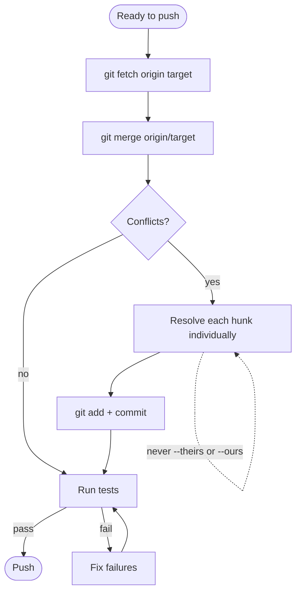
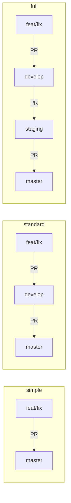

# Branching and Branch Cleanup

## The real cost of long-lived branches

Long-lived branches accumulate merge debt. The symptom — large, painful merges — is not the real problem. The real problem is **divergent mental models**: the author of a long-lived branch is building against their mental snapshot of the codebase from the day they branched, while the rest of the team continues modifying the real codebase. The longer the branch lives, the further apart these mental models drift, and the more subtle the integration bugs become.

The relationship between integration pain and time is superlinear. A branch that lives twice as long as another doesn't produce twice as many merge conflicts — it produces significantly more, because divergence compounds. Teams that discover this empirically often describe it as "the last week of a two-week branch is harder than the first five days of a one-week branch."

The practical implication: if a branch has been open for more than a few days, check in. Not to ask "is it done?" but to ask "is it still tracking the target branch?"

## Branch naming and types

Work branches use a date-prefixed format with a type identifier:

```
{yyyy-mm-dd}/{type}/{name}
```

Always derive the date by running `date +%Y-%m-%d` — never guess it.

| Type | Purpose | Example |
|------|---------|---------|
| `feat` | New feature or enhancement | `2026-03-17/feat/user-auth` |
| `fix` | Bug fix | `2026-03-17/fix/null-pointer` |
| `maint` | Maintenance, refactoring, dependency updates | `2026-03-17/maint/dep-updates` |
| `rel` | Release preparation | `2026-03-17/rel/v1.4.0` |
| `hotfix` | Critical production fix | `2026-03-17/hotfix/payment-crash` |

If a branch with the chosen name already exists, append an incrementing suffix: `-2`, `-3`, etc.

## Why merge over rebase for AI-assisted development

Rebase requires resolving conflicts per-commit. For a branch with 8 commits where 3 touch the same file as a concurrent change, that means 3 separate conflict resolution sessions, with the system in an intermediate state between each one. This is hard for humans; it's particularly error-prone for AI agents that need to maintain coherent state across multiple conflict resolution steps.

Merge resolves all conflicts in a single pass. The cognitive load is higher per-session but there's only one session. The failure mode is also more recoverable: an aborted merge leaves you where you started, while an aborted rebase can leave you in a partially-replayed state that's difficult to reason about.

Use merge as the default. Rebase only when the user explicitly requests it for history cleanliness before a PR, with the understanding that the branch will be force-pushed.

## Always use a worktree for isolation

Multiple Claude Code sessions may run concurrently on the same repository. To avoid conflicts:

```bash
bash .claude/scripts/create-worktree.sh <type> <name> [base-branch]
```

This handles date derivation, branch naming, worktree creation, venv setup, and permission registration in one step. The last line of output is the worktree path.

Never switch branches in the current checkout when another session may be running. The worktree model is: one directory per branch, always.

## Integrating changes from the target branch

Before pushing for PR, merge the latest target branch to surface conflicts early:



**Critical constraint on conflict resolution**: never use `git checkout --theirs <file>` or `git checkout --ours <file>`. These discard one side entirely per file, silently dropping content. Changelog entries, config additions, and documentation updates are routinely lost this way. Resolve each conflict hunk individually.

**Append-only files need special care**: for files where both branches add content (CHANGELOG.md, migration lists, registry files), the correct resolution is almost always to keep both additions in the right order — not to pick one side.

## Feature flags vs feature branches

Use **feature branches** when:
- Work is incomplete and shouldn't be deployed yet
- A large refactor needs to be developed in isolation
- Exploratory work may be abandoned

Use **feature flags** when:
- The code is production-ready but the feature rollout should be gradual
- You want A/B testing or canary rollout capability
- The feature affects user experience and you want the ability to kill-switch it without a deployment

The common mistake: using long-lived feature branches for gradual rollout. This gives you neither the safety of a flag (instant rollback without deployment) nor the cleanliness of a branch (no divergence debt). If a feature is code-complete but not ready for all users, it belongs behind a flag, not a branch.

## When to break the rules

Spike branches are the main exception to short-lived branch discipline. A spike is an exploration of multiple competing approaches where you don't know which will work. Spike branches:

- May be long-lived by design (you're exploring, not delivering)
- May be abandoned without merging (the value is the learning, not the code)
- Should never be used as the base for production work

Name spike branches explicitly: `2026-03-17/spike/auth-approach-comparison`. The naming signals to the team that this branch has different lifecycle expectations.

## Branch cleanup

Stale branches are broken windows. They signal that nobody is responsible for the state of the repository, which creates uncertainty about what branches are active, what work is in progress, and whether a branch someone sees is relevant or abandoned.

### After a PR merge

1. Remove worktree permissions: `bash .claude/scripts/cleanup-worktree-permissions.sh ../<repo>-<branch-name>`
2. Remove the worktree: `git worktree remove ../<repo>-<branch-name>`
3. Delete the local branch: `git branch -d <branch-name>`
4. Delete the remote branch: `git push origin --delete <branch-name>`

Remote branches are restorable via GitHub's "Restore branch" button on the merged PR page — deleting them is safe and recoverable.

### When asked to clean up branches

1. Delete the branches the user explicitly mentions.
2. Also delete any local branches already merged via a PR.
3. Delete the corresponding remote branches for all of the above.
4. Never delete unmerged branches.

### Protected branches — never delete

- `master` / `main`
- `develop` (standard and full tiers)
- `staging` (full tier)
- `release/*` branches with unreleased patches

### Release branch cleanup

Delete release branches (`release/X.Y`) only when:
- The release is fully end-of-life (no more patches expected)
- A newer release branch supersedes it and backports are no longer needed
- The user explicitly requests it

Always confirm with the user before deleting a release branch — they cannot be trivially recreated.

## Branching tiers

The project's `branching_complexity` in `project-meta.yaml` determines the active workflow:



- **Simple**: work branches target `master` directly. For solo devs, prototypes, and early-phase projects.
- **Standard**: work branches target `develop`. `develop` promotes to `master` at release.
- **Full**: `develop` → `staging` → `master`. For production systems with pre-production validation.
