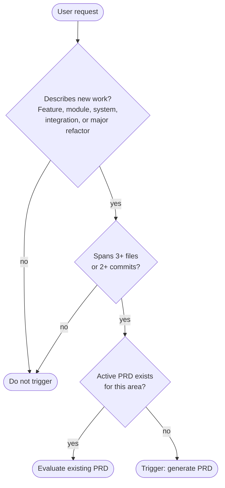
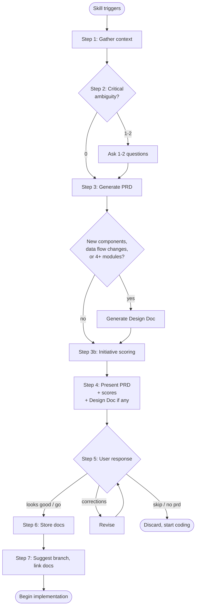
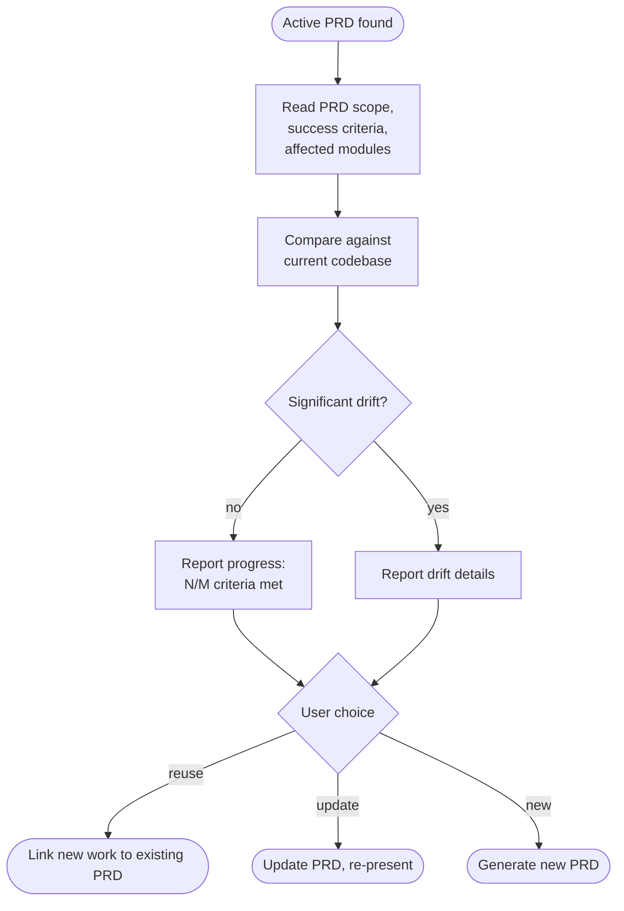

# PRD & Design Doc Generation

This skill generates two artifacts before implementation begins:

1. **PRD** — defines the problem, scope, and success criteria (always generated when skill triggers)
2. **Design Doc** — defines architecture and implementation plan (generated when architecturally non-trivial)

---

## Trigger decision tree



### Trigger when ALL three hold

1. The request describes **new work** — a feature, module, system, integration, or significant refactor
2. The work will likely span **3+ files** or **2+ commits**
3. No existing PRD in `docs/prds/` covers this work

### Skip when ANY of

- Bug fix with a clear reproduction
- Question or exploration ("how does X work?", "what does Y do?")
- Single-file change (rename, config tweak, typo, dependency bump)
- Test addition for existing code
- Refactor contained to one module
- User says "just do it", "skip prd", "no prd", or equivalent
- Another skill was explicitly invoked (`/pr`, `/review`)

---

## Workflow



---

## Step 1: Gather context

Read these files to inform the PRD:

1. `project-meta.yaml` — project phase, stage, category, language, capabilities
2. `ARCHITECTURE.md` — component relationships, data flow
3. Scan `src/` — identify modules that will be affected
4. Check `docs/prds/` — verify no existing PRD covers this work

Do not ask the user for information you can derive from the codebase.

---

## Step 2: Assess ambiguity and ask clarifying questions

Determine how many critical ambiguities exist. A **critical ambiguity** is one where the PRD would be materially wrong without the answer. Non-critical ambiguity can be resolved during implementation.

| Ambiguity count | Action |
|---|---|
| 0 | Generate PRD immediately, no questions |
| 1 | Ask 1 question, then generate |
| 2 | Ask both questions in one message, then generate |
| 3+ | Make reasonable assumptions, flag them in the **Assumptions** section |

Rules:
- Never ask more than 2 questions
- Never ask about things derivable from the codebase
- Frame questions as choices, not open-ended ("Should this extend the existing config system or be a new module?" not "How should this work?")
- If unsure whether to ask, don't — assume and flag

---

## Step 3: Generate PRD (and optional Design Doc)

### When to also generate a Design Doc

Generate a Design Doc alongside the PRD when the work:
- Introduces **new components** (new source modules, new subsystems)
- Changes **data flow** between existing components
- Spans **4+ modules**
- Involves **new interfaces** (APIs, protocols, plugin contracts)

Otherwise, the PRD alone is sufficient.

### PRD template

````markdown
---
id: prd-YYYY-MM-DD-<slug>
title: <short descriptive name>
owner: <from project-meta.yaml author or git config>
created: YYYY-MM-DD
updated: YYYY-MM-DD
status: draft
priority: P0 | P1 | P2 | P3
related_docs: []
---

# <Title>

## Problem

<1-3 sentences: the system limitation or user pain. Focus on what does not
work and why it matters. Do not describe the solution.>

## Context

<Background necessary to understand the problem. Existing system behavior,
historical decisions, constraints. Keep it brief.>

## Goals

<Outcomes this work should achieve. Direction, not exact behavior.>

- Goal
- Goal

## Non-Goals

<What this work will NOT solve. Prevents scope creep.>

- Not doing X
- Not supporting Y

## Scope

### In Scope

<Observable capabilities included in this work.>

- Capability
- Capability

### Out of Scope

<Related items intentionally excluded.>

- Exclusion
- Exclusion

## Success Criteria

<Numbered, measurable, testable outcomes.>

1. Criterion
2. Criterion

## Users and Stakeholders

<Who directly interacts with this capability. Who is affected.>

## Requirements

### Functional

<System behaviors: "System must...">

- System must ...
- System must ...

### Non-Functional

<Performance, reliability, security, observability constraints. Omit if none.>

## Affected Modules

<File paths with impact annotation.>

| Module | Impact | Tier |
|---|---|---|
| `src/<pkg>/module.py` | core | T1 |

## Dependencies

<External or internal systems required. Omit if none.>

## Risks

<Possible problems.>

- Risk
- Risk

## Assumptions

<Things assumed true due to incomplete information. Must be validated.>

- Assumption
- Assumption

## Open Questions

<Must be resolved before or during implementation. Each question includes a
recommendation so the user can approve, reject, or refine rather than answering
from scratch.>

- **Q:** Question
  **Recommendation:** Suggested answer with brief rationale.
- **Q:** Question
  **Recommendation:** Suggested answer with brief rationale.

## Prioritization

<Auto-generated by Step 3b. Omit if scoring was skipped.>

**Profile:** <scoring_profile from project-meta.yaml or solo_dev>

| Bucket | Score |
|--------|-------|
| Value | <score> |
| Risk | <score> |
| Constraints | <score> |
| Energy | <score> |
| **Total** | **<score>** |

**Interpretation:** <1-2 sentences: what the score means and whether to proceed>

**Top concerns:** <weakest bucket and its lowest-scoring dimensions>
````

### Design Doc template

Only generate when the criteria in "When to also generate a Design Doc" are met. Omit sections that do not apply — the template is a ceiling, not a floor.

````markdown
---
id: design-YYYY-MM-DD-<slug>
title: <system name>
author: <from project-meta.yaml author or git config>
created: YYYY-MM-DD
updated: YYYY-MM-DD
status: draft
related_prd: prd-YYYY-MM-DD-<slug>
---

# <Title>

## Overview

<Purpose, relationship to PRD, high-level functionality.>

## Background

<Current architecture, existing limitations, related systems.
Do not restate the PRD.>

## Goals

<Technical outcomes the design must achieve.>

## Non-Goals

<Design constraints — what this design intentionally does not address.>

## Architecture

<High-level structure. Major components and relationships.
Include a Mermaid diagram.>

## Component Design

<For each major component: purpose, responsibilities, interfaces, lifecycle.
Use sub-headings per component.>

## Data Model

<Core data structures, schemas, relationships. Omit if no new data models.>

## API Design

<Method signatures, request/response format, error behavior.
Omit if no new APIs or interfaces.>

## Control Flow

<Execution paths: startup, main flow, shutdown.
Sequence diagrams are useful here.>

## Failure Handling

<How failures are handled: crashes, timeouts, partial failures, retry strategies.>

## Security Considerations

<Permission model, input validation, resource limits. Omit if not applicable.>

## Performance Considerations

<Expected load, caching, concurrency, lazy loading. Omit if not applicable.>

## Observability

<Metrics, logs, tracing. Omit if not applicable.>

## Rollout Plan

<How the system is introduced safely. Omit for internal-only changes.>

## Alternatives Considered

<Other designs evaluated. For each: approach, advantages, why rejected.
Critical for long-term maintainability.>

## Risks

<Potential problems with the design.>

## Open Questions

<Unresolved items. Each includes a recommendation.>

- **Q:** Question
  **Recommendation:** Suggested answer with brief rationale.
````

---

## Step 3b: Initiative Scoring

After generating the PRD (and optional Design Doc), score the initiative using the scoring framework. This embeds quantitative prioritization into the PRD so the document is self-contained.

### Procedure

1. **Determine profile**: Read `project-meta.yaml` for `scoring_profile`. If not set, default to `solo_dev`.
2. **Load framework**: Read the project's scoring framework configuration to get dimensions, weights, and rubrics. Apply profile weight overrides.
3. **Score dimensions**: Using the PRD's Problem, Goals, Scope, Risks, Affected Modules, and Success Criteria as context, score all active dimensions yourself across the 4 buckets (Value, Risk, Constraints, Energy). Follow the same scoring rules as `/prioritize` Step 4 — score 0-6 per dimension with rationale and confidence.
4. **Calculate results**: Use the project's scoring calculator:
   ```python
   # Import the project's scoring calculator
   # from <project_scoring_package>.calculator import ScoringCalculator
   calc = ScoringCalculator()
   result = calc.calculate(scores, profile="<profile>")
   ```
5. **Populate the PRD**: Fill in the "Prioritization" section of the PRD template with the results.

### Auto-deriving priority

Map the scoring total to the PRD `priority` field:

| Total Score | Priority | Meaning |
|-----------|----------|---------|
| 70+ | P0 | Critical — high-value, low-risk, proceed immediately |
| 50-69 | P1 | Important — worth investing in, review weak buckets |
| 30-49 | P2 | Moderate — significant concerns, address blockers first |
| Below 30 | P3 | Low — reconsider or defer |

The auto-derived priority replaces the manual assignment in the frontmatter.

### Skipping

If the user says "skip scoring", "no scoring", or the project does not have a scoring calculator, omit the scoring section and set `priority` manually.

### Checkpoint: after Step 3/3b

Write the checkpoint file per `context-checkpointing.md` (derive path from branch slug). Capture: workflow (/prd), PRD title, scoring total and priority, whether a Design Doc was generated, open questions and recommendations. This is the most context-heavy point — the PRD content itself is about to be presented and may span many tokens that get compacted before the user responds.

---

## Step 4: Present to user

Present the PRD (and Design Doc if generated) in full.

After the full PRD, append a **plain-English summary** aimed at a non-technical reader. This section is mandatory — it must appear at the end of every PRD presentation.

### Layman summary format

```markdown
---
## In Plain English

**What problem are we solving?**
<1-2 sentences: the pain or gap in plain language, no jargon>

**What will be built?**
<2-3 sentences: what the system will do, from a user perspective>

**What won't be included?**
<1-2 sentences: the most important non-goals in plain language>

**How will we know it worked?**
<1-3 bullets: the success criteria rephrased as observable outcomes>

**Rough size:** Small | Medium | Large — <1 sentence: why>
```

Rules for the layman summary:
- No technical jargon (no module names, file paths, or engineering terms)
- Write as if explaining to a product manager, founder, or client who cares about outcomes, not implementation
- "Rough size" maps to: Small = 1-2 days, Medium = 3-7 days, Large = 1+ week
- Keep the whole block under 15 lines

End with:

> **Ready to proceed?** Say "go" to save and start implementation, or suggest changes.

Do not start coding until the user confirms.

---

## Step 5: Handle feedback

- **"looks good" / "go" / "yes"**: proceed to Step 6
- **Corrections**: revise the affected sections, re-present, wait for confirmation
- **"skip" / "no prd" / "just do it"**: discard the PRD, start coding immediately
- **"add design doc"**: generate a Design Doc if one wasn't included
- **"drop design doc"**: remove the Design Doc, keep only the PRD
- **"skip scoring" / "no scoring"**: remove the scoring section, set priority manually, re-present
- **"rescore"**: re-run scoring (e.g., after revising Goals or Scope)

---

## Step 6: Store documents

### Derive the date

Run `date +%Y-%m-%d` to get the current date. Never guess.

### Storage locations

- PRDs: `docs/prds/<prd-id>.md`
- Design Docs: `docs/designs/<design-id>.md`

Create the directories if they don't exist. Do not commit yet — the documents will be committed with the first implementation commit or as a standalone `DOC` commit if the user prefers.

### Assessment storage

If scoring was performed, also save the assessment YAML:

```python
# Import the project's scoring calculator for persistence
# from <project_scoring_package>.calculator import save_assessment, update_index

save_assessment(
    path=Path(f"docs/prioritization/{date}-{slug}.yaml"),
    initiative=prd_title,
    slug=slug,
    assessed_by=owner,
    assessed_on=date,
    scores=scores,
    result=result,
    profile=profile,
    dimension_details=dimension_details,
)
update_index(Path("docs/prioritization"))
```

Add the assessment path to the PRD's `related_docs` field.

### Cross-linking

- PRD `related_docs` field: add the Design Doc id and assessment path if they exist
- Design Doc `related_prd` field: already set to the PRD id

---

## Step 7: Suggest branch and begin implementation

Suggest a branch name following the project's branching rules (date-prefix format from `.claude/rules/05-branching.md`). Link the PRD by updating its `branch:` field after branch creation.

Then begin implementation.

### Cleanup

Delete the checkpoint file for the current branch if it exists. The PRD workflow is complete and implementation is starting (which may write its own checkpoints).

---

## Evaluating existing PRDs

When the skill triggers but an active PRD already exists for the same feature area:



### What "evaluate" checks

1. **Success criteria progress** — which are done, which are still open
2. **Scope accuracy** — do the affected modules still match reality
3. **Drift** — have modules changed significantly since the PRD was written

Report findings to the user. Do not auto-update — the user decides whether to update, reuse, or create a new PRD.

### Design Doc evaluation (when one exists)

When a Design Doc exists for the feature area being worked on:

1. Does the architecture section still match the actual component structure?
2. Does the data model match actual code structures?
3. Do referenced modules/APIs still exist?
4. Have alternatives been added or invalidated since the doc was written?

This is advisory — flag discrepancies, let the user decide whether to update.

---

## Integration with other skills

### `/review` integration

When `/review` runs and an active PRD exists whose `branch` matches the current branch:

- Check scope adherence: does the work stay within the PRD's Scope?
- Check non-goal violations: does the work touch anything in Non-Goals?
- Check success criteria: which are being addressed by this PR?
- Report as a **PRD alignment** section in the review verdict

### `/pr` integration

When `/pr` runs and an active PRD exists for the current branch:

- Include `PRD: <prd-id>` reference in the PR description
- Annotate which success criteria this PR addresses
- After merge: update PRD status to `implemented` if all success criteria are met

### `/prioritize` integration

Scoring is embedded in the PRD workflow (Step 3b). The PRD's structured content (Problem, Goals, Scope, Risks, Affected Modules) provides the context for scoring — the user does not need to re-describe the initiative.

- Scoring runs automatically after PRD generation, before presentation
- Results appear in the PRD's "Prioritization" section
- The scoring total auto-derives the PRD `priority` field (P0-P3)
- Standalone `/prioritize` continues to work independently for initiatives that don't need a PRD
- The stored assessment YAML (in `docs/prioritization/`) is saved alongside the PRD in Step 6

---

## Size guidelines

| Artifact | Target |
|---|---|
| PRD | 1-3 pages (40-80 lines) |
| Design Doc | 3-6 pages (80-150 lines) |

Keep both documents concise. The PRD defines the problem, not the solution. The Design Doc defines the architecture, not the code. If either is becoming a novel, it's too detailed.

---

## Open question recommendations

Every open question must include a recommendation. The user should be able to approve, reject, or refine — never forced to answer from scratch.

### How to formulate recommendations

- **Ground in context**: derive recommendations from the codebase, `project-meta.yaml`, existing patterns, and the PRD's own Goals/Scope/Risks sections.
- **Be specific**: "Use the existing `config.py` registry pattern" not "Consider a suitable approach."
- **State the rationale**: a brief "because..." clause so the user can evaluate the reasoning.
- **Acknowledge tradeoffs**: if the recommendation has a downside, name it. "Recommended X because Y, though this means Z."
- **Default to the simpler option**: when two approaches are roughly equivalent, recommend the one with less complexity.

### Format

```markdown
- **Q:** Should the new validator run at scaffold time or as a post-hook?
  **Recommendation:** Run at scaffold time, inside `scaffold.py` after template
  rendering. This catches errors before any files are written, matching the
  existing rollback-on-failure pattern.
```

---

## Common failure modes to avoid

- **PRD that dictates implementation**: bad ("Build a Redis cache for X"), good ("Reduce latency for X")
- **Design Doc that restates the PRD**: the Design Doc explains architecture, not the problem
- **Documents that become novels**: PRD ~2 pages, Design Doc ~4 pages
- **Triggering on small tasks**: the skip conditions exist for a reason — use them
- **Asking too many questions**: max 2, prefer 0
- **Open questions without recommendations**: every open question must have a recommendation — never leave the user with a blank to fill
