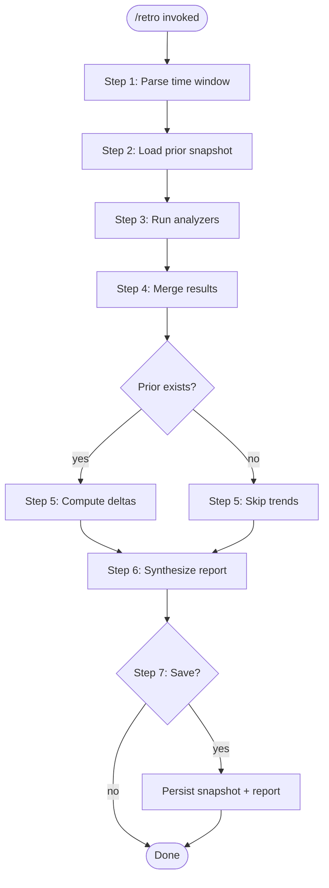

# /retro — Data-Driven Retrospective

Analyze a time window of project history across 7 dimensions: delivery, quality, velocity, technical debt, convention compliance, strategic alignment, and feature evolution. Each dimension is computed by an independent script outputting structured JSON. Results are compared against the prior retro for trend tracking, then synthesized into a narrative report with 3 actionable recommendations.

---

## Trigger

This skill triggers when:

- The user invokes `/retro`
- The user asks for a retrospective, review of recent work, or project health check

## Arguments

- `/retro` — default: analyze since last retro or last 14 days
- `/retro --last-n-days N` — analyze the last N days
- `/retro --since YYYY-MM-DD --until YYYY-MM-DD` — analyze a specific window
- `/retro --compare` — compare the two most recent retro snapshots

---

## Workflow



---

## Step 1: Parse time window

Determine `SINCE` and `UNTIL` dates.

**Priority order:**
1. If `--since` and `--until` are provided, use them directly
2. If `--last-n-days N` is provided, compute: `UNTIL=$(date +%Y-%m-%d)`, `SINCE=$(date -v-Nd +%Y-%m-%d)` (macOS) or `SINCE=$(date -d "$N days ago" +%Y-%m-%d)` (Linux)
3. If a prior retro snapshot exists in `docs/retros/`, use its `window.until` as `SINCE`
4. Default: `SINCE` = 14 days ago, `UNTIL` = today

Always derive dates from `date` commands — never guess.

---

## Step 2: Load prior snapshot

Check for existing retro snapshots:

```bash
ls docs/retros/retro-*.json 2>/dev/null | sort | tail -1
```

If a snapshot exists, read it. This will be used in Step 5 for trend comparison. If no snapshot exists or the file is corrupt, proceed without trend data.

---

## Step 3: Run analyzer scripts

Run all 7 analyzer scripts. Each script is independent — a failure in one does not block others. Run them in parallel where possible.

### Analyzer registry

| Analyzer | Script | Output key | Description |
|---|---|---|---|
| Delivery | `.claude/scripts/retro-delivery.sh` | `delivery` | What was built: feature/fix/maintenance ratio, PRD completion |
| Quality | `.claude/scripts/retro-quality.sh` | `quality` | How good: coverage, lint issues, test-to-code ratio |
| Velocity | `.claude/scripts/retro-velocity.sh` | `velocity` | How fast: cadence, sessions, PR patterns, hourly distribution |
| Debt | `.claude/scripts/retro-debt.sh` | `debt` | What's accumulating: hotspots, TODOs, stale branches |
| Compliance | `.claude/scripts/retro-compliance.sh` | `compliance` | Convention adherence: prefixes, message quality, branch naming |
| Alignment | `.claude/scripts/retro-alignment.sh` | `alignment` | Strategic focus: directory distribution, focus score, PRD linkage |
| Evolution | `.claude/scripts/retro-evolution.py` | `evolution` | Feature maturity over time: ISO 25010 buckets, per-commit scores, trend tracking |
| Decomposition | `.claude/scripts/retro-decomposition.py` | `decomposition` | Extraction opportunities: module clusters, reuse potential, cross-repo candidates |

### Execution

For each analyzer, run:

```bash
# Shell analyzers
bash .claude/scripts/retro-<name>.sh --since "$SINCE" --until "$UNTIL"

# Python analyzers (evolution)
python3 .claude/scripts/retro-<name>.py --since "$SINCE" --until "$UNTIL"
```

Capture stdout (JSON) and stderr (info/errors) separately. If a script exits with code 1, log the error and continue with remaining analyzers. Note the failure in the report.

### Adding a new analyzer

To add a new analysis dimension:
1. Create `.claude/scripts/retro-<name>.sh` (or `.py` for complex analyzers) following the analyzer contract (see below)
2. Add a row to the registry table above
3. No other files need modification

### Analyzer contract

Every analyzer script must:
- Accept: `--since <ISO-date> --until <ISO-date> [--repo-root <path>]`
- Output to stdout: a single JSON object with these required fields:
  - `"analyzer": "<name>"` — self-identification
  - `"schema_version": 1` — for forward compatibility
  - `"skipped": true/false` — whether the analyzer had sufficient data
  - `"metrics": { ... }` — numeric values for trend tracking
  - `"findings": [ ... ]` — human-readable observations (strings)
- Output to stderr: info (`[--]` prefix) and errors (`[!!]` prefix)
- Exit 0 on success, 1 on failure

---

## Step 4: Merge results

Collect all analyzer outputs into a single object:

```json
{
  "schema_version": 1,
  "retro_id": "retro-YYYY-MM-DD-NNN",
  "generated_at": "<ISO-8601 timestamp>",
  "window": { "since": "<SINCE>", "until": "<UNTIL>" },
  "project": {
    "name": "<from project-meta.yaml if exists>",
    "phase": "<from project-meta.yaml if exists>",
    "version_at_end": "<current version from project-meta.yaml or git tag>"
  },
  "analyzers": {
    "delivery": { <delivery output> },
    "quality": { <quality output> },
    "velocity": { <velocity output> },
    "debt": { <debt output> },
    "compliance": { <compliance output> },
    "alignment": { <alignment output> },
    "evolution": { <evolution output> }
  },
  "recommendations": []
}
```

Read `project-meta.yaml` if it exists to populate the `project` fields. If it doesn't exist (non-scaffolded project), use the git remote name and latest tag.

---

## Step 5: Compute deltas (trend comparison)

If a prior snapshot was loaded in Step 2, compute deltas for all numeric metrics:

For each analyzer's `metrics` object, compare current vs prior values:
- Numeric fields: compute `delta = current - prior` and `direction` (up/down/flat)
- Null fields: skip (metric wasn't available in one or both snapshots)
- New fields: show current value only, no delta

Build a trend table:

```markdown
| Metric | Previous | Current | Delta | Direction |
|---|---|---|---|---|
| Feature commits | 12 | 18 | +6 | up |
| Delivery ratio | 0.60 | 0.72 | +0.12 | up |
| Coverage | 72.3% | 75.1% | +2.8% | up |
| TODO count | 14 | 11 | -3 | down (good) |
```

If no prior snapshot exists, skip this step and note: "First retro — no prior data for comparison."

---

## Step 6: Synthesize narrative report

Using the merged data from Step 4 and deltas from Step 5, generate a markdown report. Ground every statement in specific numbers from the analyzer outputs. Do not make claims unsupported by the data.

### Report structure

```markdown
# Retrospective — <SINCE> to <UNTIL>

## Summary
<2-3 sentences: what the numbers tell us about this period. Lead with the most
important signal — is the project moving forward, treading water, or accumulating
debt? Include 2-3 key numbers.>

## Delivery
<Commit type breakdown table. Delivery ratio interpretation. PRD progress
if PRDs exist. What was built vs what was fixed vs what was maintained.>

## Quality
<Coverage, lint, test-to-code ratio. What's improving, what's degrading.
Skip sections where the analyzer reported null/unavailable.>

## Velocity
<Commit cadence, active days, session analysis (deep vs shallow),
PR patterns. Hourly distribution highlights if notable.>

## Technical Debt
<Hotspot files, TODO delta, stale branches. Is debt growing or shrinking?>

## Convention Compliance
<Prefix compliance %, message quality, branch naming. Are conventions
being followed consistently?>

## Strategic Alignment
<Focus score, directory distribution, PRD linkage. Is work concentrated
on the right areas?>

## Feature Evolution
<Render the evolution matrix as an HTML table with pure color-block cells
(no numbers, no borders). The table has three visual layers: dimension
headers (bold, gray background), feature group sub-headers (italic, light
gray, indented), and feature rows (indented further). Each cell gets a
background color from the gradient — the color IS the data.>

#### Evolution matrix rendering

Generate two HTML tables (Completeness 0-10 and Activity 0-100) using this structure:

```html
<table>
  <tr>
    <th>Feature</th>
    <!-- One <th> per month label, with colspan matching day count -->
    <th colspan="N">Mar 2026</th>
  </tr>
  <tr>
    <th></th>
    <!-- One <th> per day column -->
    <th>9</th><th>10</th><th>11</th>
  </tr>
  <!-- Dimension header row -->
  <tr><td colspan="ALL" style="background:#e8e8e8;font-weight:bold;padding:6px">
    Functional Suitability (13)
  </td></tr>
  <!-- Feature group sub-header -->
  <tr><td colspan="ALL" style="background:#f0f0f0;font-style:italic;padding:4px 8px 4px 20px">
    Source Modules
  </td></tr>
  <!-- Feature rows (indented) -->
  <tr>
    <td style="padding:3px 8px 3px 32px">Scaffold</td>
    <!-- Score cells: map 0-10 to background color -->
    <td style="background:COLOR;min-width:18px;height:16px"></td>
  </tr>
</table>
```

The `groups` array in each bucket provides the grouping. Iterate over `bucket.groups`, emitting a sub-header row for each group, then feature rows for that group's features. Use `border-collapse:collapse` on the table and omit all cell borders — the color blocks should flow as a continuous heatmap. Columns are contiguous periods from the first commit date through today — inactive periods show carried-forward completeness scores and 0 activity. Column granularity adapts to time span: ≤30 days → daily, ≤30 weeks → weekly, ≤30 months → monthly, >30 months → quarterly.

#### Color mapping (score 0-10 → background)

Use this HSL gradient — all colors use the same green hue, varying lightness:

| Score | Background | Text color |
|---|---|---|
| 0 | `#ffffff` (white) | `#999` |
| 1 | `#f0f9f0` | `#666` |
| 2 | `#dcf2dc` | `#444` |
| 3 | `#c8ebc8` | `#333` |
| 4 | `#b0e0b0` | `#333` |
| 5 | `#90d490` | `#222` |
| 6 | `#70c870` | `#222` |
| 7 | `#50bc50` | `#fff` |
| 8 | `#38a838` | `#fff` |
| 9 | `#289028` | `#fff` |
| 10 | `#1a7a1a` | `#fff` |

Round each score to the nearest integer to pick the color. Do not show numeric scores — cells are empty, pure color blocks. For the Activity table, use a continuous HSL gradient: `hsl(120, 60%, {95 - score*0.7}%)` for scores 1-100, white for 0.

#### Activity focus summary

Below the Activity table, render a bullet list showing what was primarily worked on in each period. For each column:

1. Sum `activity` scores across all features within each feature group (deduplicating group names that appear in multiple dimension buckets)
2. Compute each group's share of the period's total activity
3. Include groups whose share is ≥ 8% of the period's total, sorted by descending share
4. If no group qualifies, show "(no activity)"

```markdown
- **Mar 11:** Source Modules, Templates
- **Mar 12:** Review & Standards, Repository Setup
- **Mar 13:** Badges, Git & Branching, Process & Documentation
```

This gives a narrative spine to the heatmap — readers can scan the bullet list for the story, then look at the table for detail.

## Trends vs Previous Retro
<Delta table from Step 5. Directional arrows. Skip on first retro.>

## Recommendations
1. <Specific, actionable, grounded in a metric above. "X metric is Y —
   consider Z action.">
2. <Different dimension than #1.>
3. <Different dimension than #1 and #2.>
```

### Report rules

- Every section must reference specific numbers from the analyzer output
- If an analyzer was skipped or failed, note it: "Quality data unavailable — no coverage.json found"
- Recommendations must span at least 2 different dimensions (don't give 3 velocity recommendations)
- Each recommendation must cite the specific metric that triggered it
- Keep the total report under 800 words (excluding tables)
- Use tables for data, prose for interpretation
- Do not editorialize — state what the data shows, let the user draw conclusions about team dynamics

---

## Step 7: Persist (with user confirmation)

Ask the user:

> **Save this retro?** The snapshot (JSON) and report (markdown) will be written to `docs/retros/`. This enables trend tracking in future retros.

If yes:

1. Create `docs/retros/` if it doesn't exist
2. Determine sequence number: count existing `retro-<UNTIL-date>-*.json` files, increment
3. Write `docs/retros/retro-<UNTIL-date>-<NNN>.json` — the merged snapshot from Step 4, with `recommendations` populated
4. Write `docs/retros/retro-<UNTIL-date>-<NNN>.md` — the narrative report from Step 6

Do not commit automatically. The user decides when to commit retro artifacts.

---

## Compare mode

When invoked with `--compare`:

1. Load the two most recent snapshots from `docs/retros/`
2. If fewer than 2 exist, report: "Need at least 2 retro snapshots to compare."
3. Compute deltas between them (same logic as Step 5)
4. Present the trend table only — no full report generation

---

## Graceful degradation

This skill must work on any git repository, not just scaffolded projects:

| Missing element | Behavior |
|---|---|
| `project-meta.yaml` | Use git remote name and tags for project info |
| `coverage.json` | Quality analyzer skips coverage metrics |
| `ruff` not installed | Quality analyzer skips lint metrics |
| `docs/prds/` | Delivery and alignment analyzers skip PRD sections |
| `docs/prioritization/` | Alignment analyzer skips prioritization check |
| No prior retro snapshot | Skip trend comparison, note it's the first retro |
| < 3 commits in window | Produce minimal report: "Not enough history for a meaningful retrospective" |
| An analyzer script fails | Report the failure, continue with remaining analyzers |
