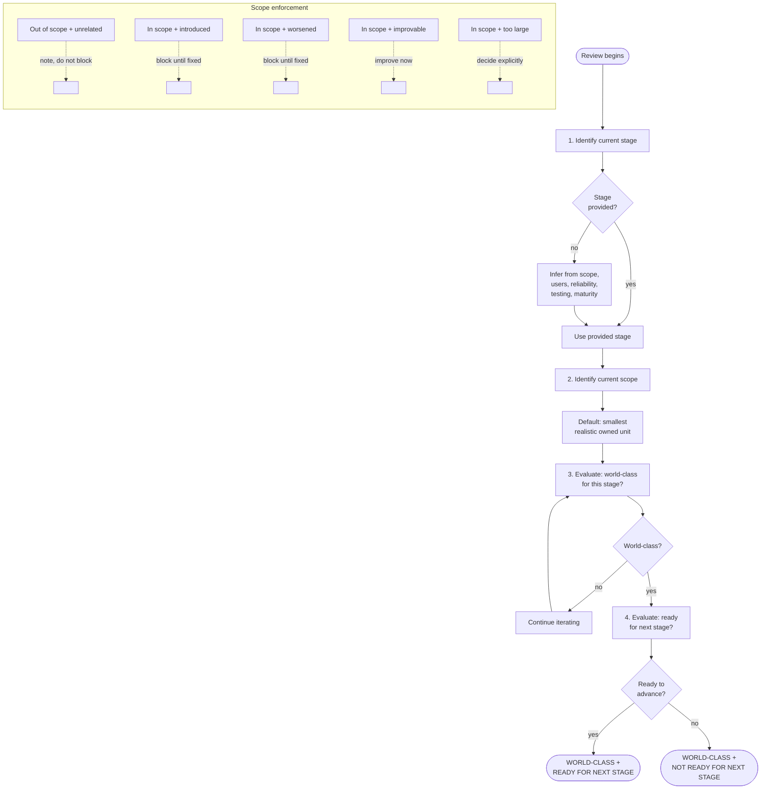
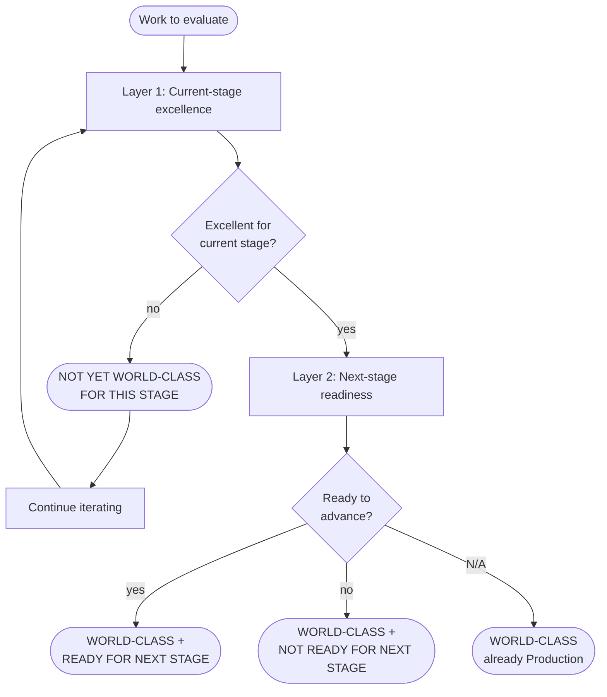
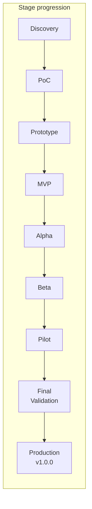
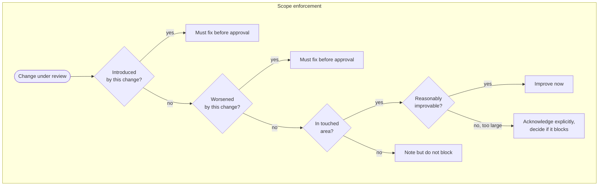

# Quality Review Framework

This skill provides the complete quality review framework: stage detection, world-class development standards, scope enforcement, and review tone discipline.

---

# Stage Detection and Enforcement

Before reviewing implementation quality, first determine the current development stage and the scope of the current unit of work.

## Review decision flowchart



## Required order

Always follow this order:

1. Identify the current stage
2. Identify the current scope
3. Evaluate whether the work is world-class for that stage within that scope
4. Evaluate whether the work is ready for the next stage
5. Continue iterating if either judgment fails

Never skip stage detection.
Never skip scope detection.

---

## Stage inference

If the stage is not explicitly provided, infer it from the work based on:
- scope
- intended users
- degree of reliability expected
- testing level
- operational maturity
- whether the goal is learning, proving, validating, or shipping

State the inferred stage explicitly before judging quality.

If the stage is ambiguous, choose the most defensible current-stage interpretation rather than the most flattering one.

Do not silently apply a production bar to earlier-stage work.
Do not silently apply early-stage leniency to later-stage work.

---

## Scope inference

If scope is not explicitly provided, infer it from the active task and changed surface area.

Default scope should be the smallest realistic owned unit of work, usually:
- this task
- this worktree
- this branch
- this PR
- the touched modules and direct interfaces

Do not silently expand scope to the full repository unless the user explicitly asks for a repo-wide assessment.

State the inferred scope explicitly before judging quality.

---

## Scope enforcement

Judge the work primarily within the current scope.

This means:

- Do not fail the work because of unrelated pre-existing weaknesses elsewhere in the repository
- Do fail the work for weaknesses introduced by the current change
- Do fail the work for weaknesses worsened by the current change
- Do require improvement in directly touched weak code when the fix is reasonably in scope
- Do call out broader legacy issues separately when they are real but not blockers for the current scope

Use this rule:
- Out of scope and unrelated — note, do not block
- In scope and introduced — block until fixed
- In scope and worsened — block until fixed
- In scope and clearly improvable now — improve now
- In scope but too large for this unit of work — acknowledge explicitly and decide whether it blocks advancement

Never use narrow scope as an excuse to bless messy touched code.
Never use broad scope as an excuse to block good local work unfairly.

---

## Mandatory dual judgment

For every review, output both:
- verdict for current stage
- readiness for next stage

Never output only one.

Also always include:
- the scope being judged
- out-of-scope issues noticed, if any

---

## Enforcement behavior

If the work is not world-class for the current stage:
- continue iterating

If the work is world-class for the current stage but not ready for the next stage:
- say so clearly
- identify exact advancement blockers
- improve toward those blockers only if that is the current goal

If the work is world-class for the current stage within scope:
- do not invent unrelated blockers from elsewhere in the repository

Do not blur these states:
- not world-class yet
- world-class for current stage but not ready to advance
- ready to advance

They are different outcomes.

---

## PR rule

Do not recommend PR as production-ready unless:
- the current stage is Production
- the production bar is met
- the scoped work passes the world-class standard within its owned surface area

If recommending PR for an earlier-stage checkpoint, explicitly label it as:
- stage-appropriate checkpoint PR

not:
- production-ready PR

A PR may be acceptable even if the whole repository is not world-class, but only when:
- the judgment is properly scoped
- the touched area is strong for its stage
- the PR does not introduce or worsen meaningful weakness
- surrounding risks are identified honestly

---

# World-Class Development Standard

This defines what "world-class" means across development stages.

Do not judge quality against a single fixed production bar.
Judge it against the current stage, while also evaluating whether the work is ready to advance to the next stage.

A PoC can be world-class as a PoC.
A prototype can be world-class as a prototype.
Production code must be world-class as production code.

These are different standards.

## Dual judgment model







## Core operating model

For every task, always answer both questions:

1. Is this world-class for the current stage?
2. Is this ready to advance to the next stage?

These are separate judgments.

Something may be:
- world-class for its current stage, but not ready to advance
- not yet world-class even for its current stage
- world-class for its current stage and ready to advance

Do not collapse these into one verdict.

---

## Scope of judgment

Judge quality primarily on the scope of the current task, branch, worktree, or PR.

The required standard applies to:
- the code being added or changed
- tests, docs, config, schemas, migrations, prompts, infra, and scripts affected by the change
- directly touched modules, functions, classes, and interfaces
- nearby code that this change meaningfully depends on, reshapes, or relies on for correctness

Do not block the current work because of unrelated pre-existing weaknesses elsewhere in the repository.

However, do not ignore weaknesses inside the touched surface area.

Use this rule:

- Unrelated legacy issues outside scope — note them, but do not fail the work for them
- Weaknesses introduced by this change — must be fixed before approval
- Weaknesses worsened by this change — must be fixed before approval
- Weaknesses in directly touched code that can reasonably be improved within scope — should be improved now
- Large pre-existing structural issues discovered in touched areas but too broad for this change — explicitly acknowledge them and decide whether they block advancement at the current stage

A change is not world-class if it:
- introduces new mess
- spreads existing mess
- builds new work on fragile foundations without acknowledging the risk
- uses narrow scope as an excuse to leave obvious local problems untouched
- makes the touched area harder to maintain, reason about, or validate

A change can still be world-class if:
- the wider repository is imperfect
- this change improves its touched area materially
- no significant weakness remains within the scope it owns
- any remaining out-of-scope issues are clearly identified

## Touched-area rule

Leave the touched surface area in world-class shape for its stage.

Do not use "that was already there" as a blanket excuse when the change passes directly through weak code and has a reasonable opportunity to improve it.

Apply the boy scout rule in a stage-aware way:
- leave touched code clearer, safer, simpler, or better verified than you found it
- do not expand the cleanup beyond scope unless it is necessary
- do not ignore obvious local fixes that would materially improve the touched area

---

## Stage order

Use these stages:

1. Discovery
2. PoC
3. Prototype
4. MVP
5. Alpha
6. Beta
7. Pilot
8. Final Validation
9. Production (v1.0.0)

If the stage is unclear, infer it from the work and state the inferred stage explicitly.

---

## Universal standards

These apply at every stage.

Even early-stage work is not world-class if it fails these.

### Must always be true
- The work matches the actual goal of the stage
- The implementation is honest about what it is and is not
- The code, docs, prompts, or artifacts are clear enough for the current stage
- The solution is correct for the scope it claims to handle
- Known weaknesses are stated plainly
- Complexity is justified by the current stage
- The implementation does not create false confidence
- The implementation does not hide serious risk behind polish
- The design does not sabotage likely future progress
- The work is judged in scope, not against unrelated repo-wide imperfections

### Never acceptable at any stage
- Misrepresenting rough work as production-ready
- Claiming confidence that has not been earned
- Hidden critical flaws
- Needless complexity
- Confusing code without reason
- Fake abstractions for imagined future needs
- Vague or misleading naming
- Untested claims of correctness where verification is feasible
- Avoidable security negligence when handling real users, data, credentials, permissions, or external systems
- Saying "ready for PR" when major weaknesses are known
- Using narrow scope as cover for obvious problems inside the touched area
- Blocking good scoped work because of unrelated legacy issues elsewhere in the repo

---

## Evaluation model

Always evaluate on two layers.

### Layer 1 — Current-stage excellence
Ask:
- Is this genuinely excellent for the current stage?
- Is it fit for purpose?
- Is it honest, clear, and strong within the stage's real goals?

### Layer 2 — Next-stage readiness
Ask:
- Has this work earned promotion to the next stage?
- Are the weaknesses acceptable only for this stage, or do they now block progression?
- Would advancing now create avoidable rework, risk, or false confidence?

---

## Stage definitions and bars

# 1. Discovery

## Intent
Understand the problem, constraints, user needs, risks, and possible solution directions.

## World-class at this stage means
- The problem is framed clearly
- Assumptions are identified
- Unknowns are surfaced
- Risks and constraints are mapped
- The team is not pretending to know what it does not know
- The solution space is explored without premature commitment

## Must be true
- Goals and non-goals are clear
- Key assumptions are named
- Major technical, product, and operational unknowns are visible
- Important constraints are documented
- Obvious dead ends or traps are identified
- Recommendations are grounded and coherent

## Allowed to be weak
- Code may be absent or minimal
- Validation may be qualitative
- Design may remain broad
- Production concerns may be mostly deferred

## Not allowed
- Premature architecture
- Premature optimization
- Acting as though requirements are settled when they are not
- Building before the core uncertainty is understood

## Exit criteria for PoC
- The central question is sharp enough to test
- Success criteria for the PoC are clear
- Main risks and unknowns are explicit

---

# 2. PoC

## Intent
Prove or disprove a core technical or product hypothesis quickly.

## World-class at this stage means
- It answers the right question fast
- It proves feasibility or infeasibility clearly
- It does not pretend to be durable software
- It minimizes time spent on non-essential polish

## Must be true
- The PoC has a sharply defined question
- The result meaningfully answers that question
- The code is clear enough to inspect and reason about
- Known limitations are explicit
- Shortcuts are intentional and labeled
- The work does not create fake confidence about readiness

## Allowed to be weak
- Test coverage can be limited
- UX can be rough
- Architecture can be temporary
- Error handling can be partial
- Hardening can be minimal

## Not allowed
- Mess so severe that the result cannot be trusted
- Unclear outcomes
- Accidental complexity
- Presenting PoC code as a base for production without review
- Hiding severe limitations

## Exit criteria for Prototype
- Feasibility is established or rejected
- The core approach is plausible
- Main unknowns are reduced enough to build a broader end-to-end version

---

# 3. Prototype

## Intent
Make the concept concrete. Show end-to-end shape, workflows, and user experience.

## World-class at this stage means
- The main flow is visible and coherent
- The system can be experienced, not just described
- The design direction is now testable with real usage
- The code is still fast-moving, but no longer careless

## Must be true
- The primary flows exist end-to-end
- The shape of the product is understandable
- Important assumptions are testable through use
- The implementation is organized enough to iterate safely
- Core rough edges are known and visible

## Allowed to be weak
- Incomplete edge-case handling
- Partial tests
- Temporary data models
- Rough UI and operator tooling
- Limited resilience and observability

## Not allowed
- Chaos that prevents iteration
- Core flows that only work by handholding
- Architectural choices that obviously block MVP
- Demo-only behavior presented as real capability

## Exit criteria for MVP
- The essential workflow is real
- Users can get actual value from the main path
- The design is coherent enough to harden selectively

---

# 4. MVP

## Intent
Deliver the smallest version that creates real value for real users.

## World-class at this stage means
- The essential user outcome works reliably enough to matter
- Scope is disciplined
- The implementation is intentionally narrow
- The system is simple, useful, and honest about limits

## Must be true
- The main user journey works reliably
- Scope is minimal and deliberate
- Core failure paths are handled
- The code is maintainable enough to continue building on
- Basic tests exist for critical behavior
- Basic security and data handling are not negligent
- Known limitations are explicit

## Allowed to be weak
- Limited feature breadth
- Partial observability
- Limited performance tuning
- Some technical debt, if contained and documented
- Partial internal tooling

## Not allowed
- Core user journey fragility
- Missing tests on critical behavior
- Major security blind spots
- Unbounded technical debt
- Architecture that already needs to be replaced

## Exit criteria for Alpha
- Real users can get value consistently
- Critical paths are tested
- The codebase can support rapid iteration without decay

---

# 5. Alpha

## Intent
Harden the MVP into a product that works consistently in controlled usage.

## World-class at this stage means
- The core system is stable enough for serious internal or limited external use
- The implementation supports rapid iteration without constant breakage
- The team can learn from usage instead of fighting the codebase

## Must be true
- Core flows are reliable
- Significant edge cases are handled
- Testing covers key paths and regressions
- Basic observability exists
- Error handling is intentional in important paths
- Major architectural risks are under control
- Security basics are in place

## Allowed to be weak
- Some rough UX
- Incomplete secondary workflows
- Limited scale testing
- Some operational manual work

## Not allowed
- Regular regressions in the main path
- Missing visibility into failures
- Design weaknesses that make continued iteration dangerous
- Large unexplained quality gaps

## Exit criteria for Beta
- The product is stable enough for broader user exposure
- The team can identify and diagnose failures
- Quality is no longer dependent on luck

---

# 6. Beta

## Intent
Validate product quality in broader real-world usage.

## World-class at this stage means
- The product works consistently for most intended usage
- The team can observe, diagnose, and fix issues quickly
- The implementation is close to production shape

## Must be true
- Main and secondary flows are reliable
- Meaningful test coverage exists for critical paths
- Core edge cases are covered
- Observability is useful in practice
- Security and permissions are handled responsibly
- Performance is acceptable for expected beta usage
- Documentation for operation and usage exists where needed

## Allowed to be weak
- Some polish gaps
- Some scaling limits outside expected beta use
- Limited automation in non-critical operations

## Not allowed
- Frequent failures in common flows
- Unknown behavior in critical paths
- Serious operational blind spots
- Weak rollback or recovery thinking where relevant

## Exit criteria for Pilot
- The product is trustworthy enough for targeted real deployments
- Operational learning can happen with controlled risk

---

# 7. Pilot

## Intent
Run the product in a real-world setting with selected users, teams, or customers under controlled scope.

## World-class at this stage means
- The product is dependable in real use
- The team can support it operationally
- Risks are controlled and understood
- The implementation is credible in front of real stakeholders

## Must be true
- Reliability is strong on committed workflows
- Support and operational ownership are clear
- Failures can be detected and responded to
- Data handling, permissions, and audit needs are appropriate for the pilot context
- User-facing behavior is consistent enough to build trust
- Important operational runbooks or procedures exist where relevant

## Allowed to be weak
- Some scale limits outside pilot scope
- Some manual processes that are understood and sustainable for pilot size
- Limited non-essential feature completeness

## Not allowed
- Operational chaos
- Weak incident response on important paths
- Unclear ownership
- Features being "real" only because humans constantly patch around them invisibly

## Exit criteria for Final Validation
- The product has demonstrated repeatable value in real conditions
- Remaining gaps are known and finite
- Production hardening has a clear target

---

# 8. Final Validation

## Intent
Prove the product is truly ready for production release.

## World-class at this stage means
- The remaining unknowns are few, explicit, and acceptable
- The system has been validated against production expectations
- There is strong confidence without self-deception

## Must be true
- Release criteria are explicit
- Reliability, security, and operational readiness have been reviewed seriously
- Known risks are documented and accepted intentionally
- Performance and scaling expectations for launch have been checked
- Monitoring, alerting, rollback, and incident handling are ready where relevant
- Migration, deployment, and configuration paths are understood
- Documentation needed for launch exists

## Allowed to be weak
- Minor non-critical polish gaps
- Low-risk backlog items that do not threaten launch quality

## Not allowed
- Launch-critical uncertainty
- Unchecked release paths
- Hand-wavy operational readiness
- "We'll figure it out in production" thinking

## Exit criteria for Production
- The product is launch-ready with no known major weakness that should block release
- The team can operate it responsibly in production

---

# 9. Production (v1.0.0)

## Intent
Ship a dependable production system that users can trust.

## World-class at this stage means
- The implementation is correct, maintainable, robust, observable, secure, and professionally finished
- The code is something strong senior engineers would be comfortable defending in a serious review
- No significant weakness remains that should have been fixed before release

## Must be true
- Correctness is strong across normal and important edge conditions
- Design is clean and maintainable
- Tests are meaningful and catch regressions
- Error handling is intentional and consistent
- Observability is adequate for real operation
- Security, privacy, and permission boundaries are responsibly handled
- Performance is acceptable for expected production usage
- Documentation, configuration, deployment, and rollback concerns are addressed
- The code fits the architecture and conventions of the codebase
- No major reviewer concern remains

## Allowed to be weak
- Minor non-critical follow-up improvements
- Small polish items that do not affect correctness, maintainability, trust, or operations

## Not allowed
- Any known fix-before-merge issue
- Major design awkwardness
- Core path fragility
- Significant untested behavior
- Serious observability, security, or operational gaps
- "Good enough for now" debt that should have been resolved before launch

## Exit criteria
- Ready for PR and release as v1.0.0

---

## Stage-specific review behavior

When reviewing work, do not use production standards to reject valid earlier-stage work.
Also do not use early-stage excuses to approve weak work.

Instead, ask:
- Is this excellent for the stage it is in?
- Is it honest about what is not done yet?
- Does it avoid overbuilding?
- Does it avoid underbuilding?
- Is it clean within scope?
- Is it ready to move forward?

---

## Minimum checklist by stage

Use this checklist every time.

Mark each item:
- PASS
- FAIL
- N/A

# Scope
- [ ] Current judgment is based on this task, worktree, branch, or PR scope
- [ ] No unrelated repo-wide weakness is being used unfairly as a blocker
- [ ] No weakness introduced by this change remains
- [ ] No weakness worsened by this change remains
- [ ] Touched surface area is strong for its stage
- [ ] Nearby code was improved where reasonably in scope

# Universal
- [ ] Current stage is identified correctly
- [ ] The work fits the actual goal of that stage
- [ ] Known weaknesses are stated honestly
- [ ] No needless complexity is present
- [ ] No major hidden risk is being ignored
- [ ] The implementation does not create false confidence
- [ ] Changes comply with applicable `.claude/rules/` and `CLAUDE.md` guidelines

# Discovery
- [ ] Problem framing is clear
- [ ] Unknowns are visible
- [ ] Constraints are visible
- [ ] Risks are identified
- [ ] Proposed next step is coherent

# PoC
- [ ] The core question is sharp
- [ ] The result answers the question
- [ ] Shortcuts are intentional and labeled
- [ ] The code is inspectable enough to trust the result
- [ ] The PoC is not being misrepresented as durable software

# Prototype
- [ ] Main flow exists end-to-end
- [ ] The concept is experientially testable
- [ ] The implementation is organized enough to iterate on
- [ ] Demo-only hacks are not being hidden as real capability
- [ ] MVP blockers are visible

# MVP
- [ ] Main user outcome works reliably
- [ ] Scope is disciplined
- [ ] Critical paths have verification
- [ ] Basic security and data handling are responsible
- [ ] Technical debt is contained

# Alpha
- [ ] Core flows are stable
- [ ] Significant edge cases are handled
- [ ] Regression risk is reduced with tests
- [ ] Failures are observable
- [ ] Architecture is strong enough for continued iteration

# Beta
- [ ] Main and secondary flows are reliable
- [ ] Critical paths are well-tested
- [ ] Operational visibility is useful
- [ ] Performance is acceptable for beta scope
- [ ] The system is close to production shape

# Pilot
- [ ] Real-world use is dependable within pilot scope
- [ ] Operational ownership is clear
- [ ] Failures can be responded to effectively
- [ ] Trust-sensitive behavior is stable
- [ ] Manual operations are sustainable for pilot scope

# Final Validation
- [ ] Release criteria are explicit
- [ ] Launch risks are known and reviewed
- [ ] Monitoring and recovery are ready
- [ ] Deployment and rollback are understood
- [ ] No launch-critical uncertainty remains

# Production
- [ ] Design is clean and maintainable
- [ ] Important behaviors are tested
- [ ] Errors are handled intentionally
- [ ] Security and operational concerns are addressed
- [ ] No significant fix-before-merge weakness remains

Do not claim world-class unless all relevant items pass.

---

## Quantitative gates

These are minimum gates, not replacements for judgment.

## For every stage
- Relevant checklist pass rate must be 100%
- Critical issues must be 0
- Major known issues that contradict the current stage goal must be 0
- Hidden or unexplained shortcuts must be 0
- Weaknesses introduced by this change must be 0
- Weaknesses worsened by this change must be 0
- Known fix-before-merge issues inside the owned scope must be 0

## Additional gates by stage

### Discovery
- Core unknowns identified — at least 80% of obvious major unknowns surfaced
- Problem statement ambiguity blocking next step — 0

### PoC
- Core hypothesis clarity — 100%
- Demonstrated answer to the key feasibility question — required
- Shortcuts explicitly labeled — 100%

### Prototype
- Primary end-to-end flow exists — required
- Demo-only behavior mislabeled as real capability — 0

### MVP
- Critical-path verification present — required
- Known critical security negligence — 0
- Main user journey breakage in normal use — 0

### Alpha
- Regression tests for key flows — required
- Observability for important failures — required
- Repeated unexplained breakage in core flows — 0

### Beta
- Critical-path tests — required
- Useful operational visibility — required
- Serious unresolved issue in a common workflow — 0

### Pilot
- Run or support ownership clear — required
- Failure response path exists — required
- Pilot-critical trust or data risk unresolved — 0

### Final Validation
- Release criteria defined — required
- Rollback or recovery plan exists where relevant — required
- Launch-critical unknowns — 0

### Production
- Fix-before-merge issues — 0
- Critical production concerns unresolved — 0
- Major reviewer concerns that should block PR — 0
- Necessary tests for important behaviors — required

---

## Red flags

Any of these block a world-class verdict for the current stage:

- The work is being judged against the wrong stage
- The work is being judged against the wrong scope
- The implementation is overbuilt for the current stage
- The implementation is underbuilt for the current stage
- Claims are stronger than the evidence
- The code creates false confidence
- Temporary shortcuts are hidden
- Important risks are not named
- The design obviously blocks the next stage
- Testing is absent where it is already required
- Real-user or real-data risk is being treated casually
- A strong reviewer would clearly say "this should not move forward yet"
- The change makes the touched area worse
- The change leaves obvious local weakness untouched without reason
- The review is blocked by unrelated legacy issues elsewhere in the repo

---

## Iteration rule

Your default behavior is to continue improving the work until it is world-class for the current stage.

Then separately determine whether it is ready to advance.

Do not stop at the first working version.
Do not stop at "pretty good".
Do not stop at "probably enough".

If it is not world-class for the current stage, continue iterating.
If it is world-class for the current stage but not ready for the next stage, say so clearly.

Do not recommend PR unless the stage is Production, or unless the user explicitly uses PR as the review checkpoint for an earlier internal stage branch.

Even then, be clear whether the PR is:
- for continued staged work
- or for production-grade release readiness

A scoped PR may be approved even if the full repository is not yet world-class, but only if:
- the judgment is properly scoped
- the touched area is strong for its stage
- the change introduces no significant weakness
- the change does not worsen local quality
- any remaining out-of-scope issues are clearly called out

---

# Review Tone and Decision Discipline

Use direct, decisive review language.

Do not soften real weaknesses.
Do not inflate mediocre work.
Do not hide behind vague praise.

The goal is clear judgment that drives better work.

---

## Tone rules

Be:
- direct
- specific
- honest
- calm
- technically grounded

Do not be:
- gushy
- vague
- hedging
- performatively harsh
- overly verbose

Do not use praise unless it is earned and specific.

Bad:
- looks great overall
- pretty solid
- mostly there
- this should be fine
- likely good enough
- I think this is ready
- probably world-class
- very impressive work

Better:
- the main flow is clean and reliable, but edge-case handling is still weak
- this is world-class for MVP scope, not yet ready for Alpha
- the design is strong, but regression coverage is not sufficient
- this is not ready for PR because the touched area still has two fix-before-merge issues

---

## Decision rules

Every review must end in a clear decision.

Allowed verdicts:
- WORLD-CLASS FOR THIS STAGE
- NOT YET WORLD-CLASS FOR THIS STAGE

Allowed advancement decisions:
- READY FOR NEXT STAGE
- NOT READY FOR NEXT STAGE
- N/A — already Production

Do not invent softer substitutes.

Do not say:
- almost ready
- close enough
- mostly world-class
- probably ready
- ready with minor caveats
- acceptable for now
- we can fix the rest later

If there are real blockers, say it plainly.

---

## Blocking issue language

When something blocks approval:
- say exactly what it is
- say why it matters
- say whether it blocks current-stage quality, next-stage advancement, or both

Prefer:
- blocks current-stage world-class status
- blocks advancement to Beta
- fix-before-merge issue
- introduced by this change
- worsened by this change
- out of scope, not a blocker

Avoid fuzzy wording that hides the decision.

---

## Praise discipline

When the work is strong, praise only what is specifically true.

Good:
- the main path is well-factored and easy to reason about
- the touched area is cleaner than before
- the tests would catch the likely regression
- the scope is disciplined

Avoid:
- amazing
- excellent work
- beautiful implementation
- super clean
- perfect

Specificity is more useful than enthusiasm.

---

## Iteration language

If the work is not ready, do not ask permission to continue improving it.
Continue iterating.

Say what remains:
- two blockers remain in the touched area
- this is world-class for Prototype but not yet ready for MVP
- error handling and verification still need work before this can advance

Do not frame known weakness as optional.

---

## Scope language

Always be explicit about what is and is not being judged.

Say:
- within this PR scope
- within the touched modules
- out of scope for this change
- not a blocker for this work
- blocker inside owned scope

This prevents unfair repo-wide judgments and weak narrow-scope approvals.

---

## Required verdict format

Copy this template exactly. Fill in the placeholders. Do not reorder, rename, or omit sections. Use the same heading levels shown here.

### PR comment template

````markdown
# Code Review

## Stage
<stage name>

## Scope
<what is being judged — e.g., "Touched modules: `foo.py`, `bar.py`, tests, and direct interfaces.">

## Verdict for current stage
<one of: WORLD-CLASS FOR THIS STAGE | NOT YET WORLD-CLASS FOR THIS STAGE>

## Ready to advance?
<one of: READY FOR NEXT STAGE | NOT READY FOR NEXT STAGE | N/A — already Production>

## Summary
<2-4 sentences. Blunt assessment of what the change does and how well it does it.>

## Checklist

### Scope
- [x] PASS — Current judgment is based on this PR scope
- [x] PASS — No unrelated repo-wide weakness used as a blocker
- [x] PASS — No weakness introduced by this change
- [x] PASS — No weakness worsened by this change
- [x] PASS — Touched surface area is strong for its stage
- [x] PASS — Nearby code was improved where reasonably in scope

### Universal
- [x] PASS — Current stage identified correctly
- [x] PASS — Work fits the actual goal of the stage
- [x] PASS — Known weaknesses stated honestly
- [x] PASS — No needless complexity
- [x] PASS — No major hidden risk
- [x] PASS — No false confidence
- [x] PASS — Changes comply with `.claude/rules/` and `CLAUDE.md`

### <Current stage name>
- [x] PASS — <stage-specific check 1>
- [x] PASS — <stage-specific check 2>
- ...

## Findings

<Organized by topic (Correctness, Security, Maintainability, etc.). Use H3 headings per topic. Bullet points within each. Only include topics where there is something to say.>

### <Topic>
- <finding with file:line reference and explanation>

## Weaknesses blocking current-stage world-class status
<bullet list, or "None of significance.">

## Weaknesses blocking advancement
<bullet list, or "None of significance.">

## Out-of-scope issues noticed
<bullet list, or "None of significance.">

## Structural Health (advisory)

If any touched file has a monolith score above the watch threshold, include this section. Run the structural health analyzer against only the PR-touched files:

```bash
python3 .claude/scripts/next-structural-health.py --files <touched-file1> <touched-file2> ...
```

If candidates are returned, list them:

```
- `src/<pkg>/cli.py` — score 78, up 12 in 30d (refactor candidate)
  Suggested: extract validators module, extract diagnostics module
- `src/<pkg>/scaffold.py` — score 55, stable (watch list)
```

If no touched file exceeds the watch threshold, omit this section entirely.

This section is **advisory only** — it does not affect the world-class verdict. Monolith growth is incremental; no single PR creates a monolith. The `/next` pipeline is the right place for prioritized refactoring decisions.

## Verdict
**<PASS or FAIL>** — <one-line summary of merge readiness>
````

### Formatting rules

- **Checklist items**: Use `- [x] PASS` for passing items, `- [ ] FAIL` for failing items. Always include the label after the checkbox.
- **Stage-specific checklist**: Include only the checklist section for the current stage (from the "Minimum checklist by stage" section above). Do not include checklists for other stages.
- **Findings section**: Replace the old separate sections (Correctness, Security, Maintainability, Dogfooding, etc.) with a single `## Findings` section using H3 sub-headings per topic. Only include topics with actual content.
- **Verdict line**: End with a single bold verdict line (`**PASS**` or `**FAIL**`) followed by a dash and one-line merge readiness summary.
- **Heading levels**: H1 for title, H2 for main sections, H3 for subsections within Checklist and Findings.
- **No filler**: Do not add sections not shown in the template. Do not add trailing summaries.

---

## Review mindset

Be demanding, but stage-aware and scope-aware.

Reject false polish.
Reject false confidence.
Reject premature architecture.
Reject premature approval.

Also reject lazy early-stage work that is unclear, misleading, or structurally careless.

The target is not perfection.
The target is true excellence for the current stage, within the current scope, and honest judgment about whether advancement has been earned.

---

## Final instruction

Never use the phrase "world-class" without attaching it to a stage and a scope.

Always judge:
- world-class for the current stage
- readiness for the next stage
- quality within the current scope

If there is meaningful doubt, it is not world-class yet.
If advancement has not been earned, do not advance it.
If the touched area is not strong enough, do not approve it.
Continue iterating.

Make the judgment crisp.

A strong engineer reading the review should know:
- what stage is being applied
- what scope is being judged
- whether the work is world-class for that stage
- whether it is ready to advance
- exactly what still blocks it, if anything

No mushy language.
No fake certainty.
No vague approval.
