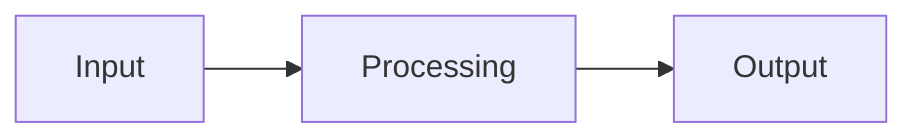

<!-- markdownlint-disable MD013 MD028 MD033 MD041 MD060 -->
<a name="readme-top"></a>
<br />

<div align="center">
  <a href="https://github.com/decide-as/workflow-hub">
    
  </a>

<h3 align="center">Workflow-Hub</h3>

  <p align="center">
    Desktop app for managing and launching AI workflow sessions
    <br />
    <a href="https://github.com/decide-as/workflow-hub"><strong>Explore »</strong></a>
  </p>

     

</div>

> **MVP** — Minimum viable product — usable but minimal.


<details>
  <summary>Table of Contents</summary>
  <ul>
    <li><a href="#about">About</a></li>
    <li><a href="#demo">Demo</a></li>
    <li>
      <a href="#getting-started">Getting Started</a>
      <ul>
        <li><a href="#prerequisites">Prerequisites</a></li>
        <li><a href="#installation">Installation</a></li>
      </ul>
    </li>
    <li><a href="#usage">Usage</a></li>
    <li><a href="#testing">Testing</a></li>
    <li><a href="#software-quality">Software Quality</a></li>
    <li><a href="#how-it-works">How It Works</a></li>
    <li><a href="#project-structure">Project Structure</a></li>
    <li><a href="#roadmap">Roadmap</a></li>
    <li><a href="#contributing">Contributing</a></li>
    <li><a href="#security">Security</a></li>
    <li><a href="#license">License</a></li>
    <li><a href="#acknowledgments">Acknowledgments</a></li>
    <li><a href="#contact">Contact</a></li>
  </ul>
</details>

## About

Desktop app for managing and launching AI workflow sessions

<!-- Why does this project exist? What problem does it solve? What motivated you to build it? -->

<p align="right">(<a href="#readme-top">back to top</a>)</p>

## Demo

<!-- Add a screenshot, GIF, or terminal recording (e.g. asciinema) showing the project in action -->
<!-- Example: -->
<!--  -->

<p align="right">(<a href="#readme-top">back to top</a>)</p>

## Getting Started

### Prerequisites

- Node.js 20+

### Installation

```bash
git clone https://github.com/decide-as/workflow-hub
cd workflow-hub
npm install
```


<p align="right">(<a href="#readme-top">back to top</a>)</p>

## Usage

**Development** — runs with hot reload, lives in the terminal:

```bash
npm run dev
```

**Standalone macOS app** — packages as a native `.app` launchable from Spotlight or the Dock:

```bash
make dist
```

Open the generated `dist/Workflow Hub-<version>-arm64.dmg`, drag `Workflow Hub.app` into `/Applications`, and launch it like any native Mac app. On first open, right-click → Open to bypass the Gatekeeper prompt (unsigned personal build).

<p align="right">(<a href="#readme-top">back to top</a>)</p>

## Testing

 

```bash
npm test
```


### Quality metrics

<!-- STATS:quality-metrics-table -->
| Metric | Target | Current | Tool | Quality dimension |
| ------ | ------ | ------- | ---- | ----------------- |
| All tests pass | Yes | — | npm test | Reliability |
| Test coverage | >= 60% | — | jest --coverage | Functional suitability |
| TQS | — | — | test_analytics_stats | Test depth |
<!-- /STATS:quality-metrics-table -->

### Test Quality Score

<!-- STATS:tqs-gate-status -->
_No TQS data available._
<!-- /STATS:tqs-gate-status -->
<!-- PLOT:tqs-freq-dist source:tests/.analytics/**/*.json hash:c56bb9b84b2214dc -->

<!-- /PLOT:tqs-freq-dist -->
<!-- PLOT:tqs-signal-quality source:tests/.analytics/**/*.json hash:c56bb9b84b2214dc -->

<!-- /PLOT:tqs-signal-quality -->
<!-- PLOT:tqs-cdf source:tests/.analytics/**/*.json hash:c56bb9b84b2214dc -->

<!-- /PLOT:tqs-cdf -->

### Scope x intent matrix

<!-- STATS:scope-intent-matrix -->
_Run `make refresh-stats` to populate._
<!-- /STATS:scope-intent-matrix -->

<p align="right">(<a href="#readme-top">back to top</a>)</p>

## Software Quality

  

This project enforces a **basic** quality gate (discovery phase), informed by [ISO/IEC 25010](https://www.iso.org/standard/35733.html) (SQuaRE) software quality characteristics mapped to practical engineering checks.

### Quality metrics

| Metric | Target | Tool | ISO 25010 |
|---|---|---|---|
| Test coverage | >= 60% | jest --coverage | Functional suitability |
| All tests pass | Yes | npm test | Reliability |
| Linting clean | Yes | eslint | Maintainability |

### Gate levels

Quality gates auto-derive from the project [phase](.claude/rules/phase-maturity.md) unless explicitly overridden in `project-meta.yaml`:

| Gate | Phases | What it enforces |
|---|---|---|
| `none` | discovery, poc, prototype | No automated enforcement |
| `basic` | mvp, alpha | Lint + tests + coverage >= 60% |
| `strict` | beta, pilot, validation, production | Basic + coverage >= 80% + security scanning |

<details>
<summary>ISO/IEC 25010 quality model mapping</summary>

The quality gates operationalize key characteristics from the ISO/IEC 25010 (SQuaRE) software quality model:

| Characteristic | Engineering practice | Gate |
|---|---|---|
| **Functional suitability** | Test coverage, test pass rate | basic |
| **Reliability** | Error handling tests, edge case coverage | basic |
| **Security** | Dependency scanning (`pip-audit`), static analysis (`bandit`) | strict |
| **Maintainability** | Lint compliance, consistent style, test coverage | basic |
| **Performance efficiency** | Benchmark tests *(planned)* | — |
| **Usability** | CLI help text, error message quality, output consistency | basic |
| **Compatibility** | API stability, schema backward-compat, integration contracts | basic |
| **Portability** | Portable paths, platform guards, min-version constraints | basic |

This mapping is informational — the gates enforce the engineering practices; the ISO model provides the conceptual framework for why each check matters.
</details>

### Running quality checks locally

```bash
make test          # Run tests
make lint          # Lint check
make quality        # All of the above
```

### Coverage tiers

Per-module coverage is enforced by importance tier. Critical modules require higher coverage than peripheral ones.

<!-- TIER-TABLE-START -->
<!-- TIER-TABLE-END -->

Update the table after running tests:

```bash
make update-tier-badge
```


<p align="right">(<a href="#readme-top">back to top</a>)</p>

## How It Works

<!-- Replace this example with your actual architecture -->



<p align="right">(<a href="#readme-top">back to top</a>)</p>

## Built With

- [Node.js](https://nodejs.org) — Core runtime
<!-- Add other key dependencies here -->

<p align="right">(<a href="#readme-top">back to top</a>)</p>

## Project Structure

```
workflow-hub/
├── scripts/                # Source code
├── tests/                  # Test suite
├── assets/                 # Project assets (logo, images)
├── .claude/                # Claude Code rules and scripts
├── .github/                # CI workflows
├── project-meta.yaml         # Project metadata
├── CLAUDE.md               # Claude Code instructions
├── ARCHITECTURE.md         # System architecture
├── CHANGELOG.md            # Version history
└── README.md               # This file
```

<p align="right">(<a href="#readme-top">back to top</a>)</p>

## Roadmap

- [ ] Feature 1
- [ ] Feature 2
- [ ] Feature 3

See the [open issues](https://github.com/decide-as/workflow-hub/issues) for a full list of proposed features and known issues.

<p align="right">(<a href="#readme-top">back to top</a>)</p>

## Contributing

Contributions are welcome! If you have a suggestion, please fork the repo and create a pull request, or open an issue with the tag "enhancement".

1. Fork the Project
2. Create your Feature Branch (`git checkout -b feature/AmazingFeature`)
3. Commit your Changes (`git commit -m 'Add some AmazingFeature'`)
4. Push to the Branch (`git push origin feature/AmazingFeature`)
5. Open a Pull Request

See `.claude/rules/` for project conventions.

<p align="right">(<a href="#readme-top">back to top</a>)</p>

## Security

To report a security vulnerability, please open a private issue or contact the maintainer directly. Do not disclose vulnerabilities publicly until they have been addressed.

<p align="right">(<a href="#readme-top">back to top</a>)</p>

## License

All Rights Reserved. This software may not be used, copied, modified, or distributed without explicit permission from the author.

<p align="right">(<a href="#readme-top">back to top</a>)</p>

## Acknowledgments

<!-- Add acknowledgments, credits, and references here -->

<p align="right">(<a href="#readme-top">back to top</a>)</p>

## Contact

 — [github.com/decide-as](https://github.com/decide-as)

Project Link: [https://github.com/decide-as/workflow-hub](https://github.com/decide-as/workflow-hub)

<p align="right">(<a href="#readme-top">back to top</a>)</p>
