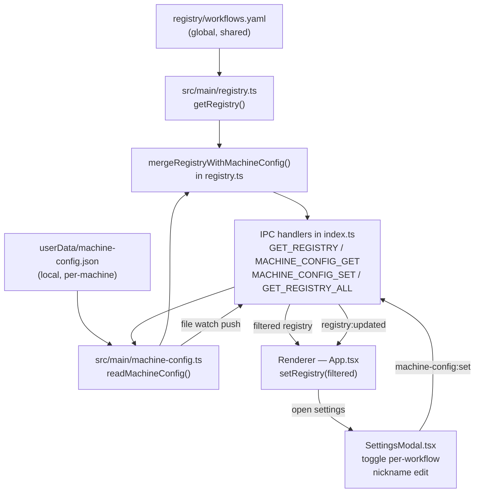
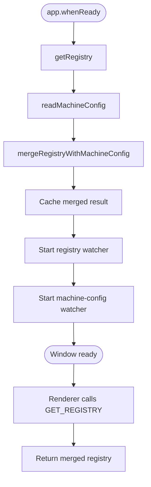
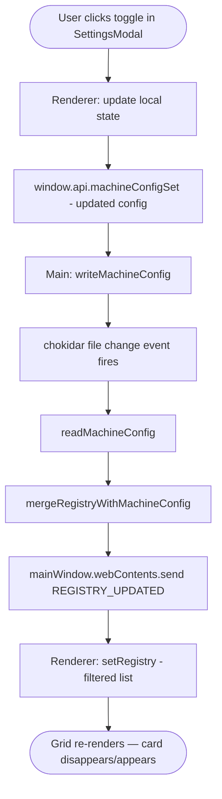

# Per-Machine Workflow Availability — Phase 1

## Overview

Introduces a local machine config layer that overlays the global workflow registry. The main process merges the two before serving the workflow list to the renderer. A Settings modal in the renderer lets the user toggle per-workflow availability and set a machine nickname. Phase 2 org-permission stubs are included as inert types only.

## Background

The registry (`registry/workflows.yaml`) is a shared file that lists all workflows globally. Its `status` field (`active | inactive | draft`) is a global setting — there is no mechanism to show different subsets on different machines. The Electron `userData` path (`~/Library/Application Support/Workflow Hub/` on macOS) is the conventional per-machine storage location and is available via `app.getPath('userData')`.

## Goals

- Each machine independently controls which workflows appear in the UI.
- The global registry is never modified by this feature.
- New workflows default to visible on all machines (opt-out model).
- The filtered registry is shape-compatible with the existing `Registry` type.

## Non-Goals

- Syncing configs between machines.
- Role or policy-based access control (phase 2).
- Any server-side component.

## Architecture



## Component Design

### `src/main/machine-config.ts` (new)

Owns all read/write/watch operations for the local machine config. Key exports:

- `getMachineConfigPath()` — returns `userData/machine-config.json`
- `readMachineConfig()` — reads and parses the file; returns a default empty config if absent or corrupt
- `writeMachineConfig(config)` — serialises and writes the config atomically
- `watchMachineConfig(onChange)` — uses chokidar (already a dependency via the registry watcher) to push changes to the caller

The default config when the file is missing:
```json
{ "machine_id": "<os.hostname()>", "workflows": [] }
```

An empty `workflows` array means all workflows are enabled — the merge treats any absent entry as enabled.

### `src/main/registry.ts` — `mergeRegistryWithMachineConfig()`

Added as a pure function after `watchRegistry`. Accepts a `Registry` and a `MachineConfig` and returns a new `Registry` with disabled workflows filtered out:

```ts
export function mergeRegistryWithMachineConfig(
  registry: Registry,
  config: MachineConfig,
): Registry {
  const disabled = new Set(
    config.workflows.filter((e) => !e.enabled).map((e) => e.id),
  );
  if (disabled.size === 0) return registry;
  return {
    ...registry,
    workflows: registry.workflows.filter((w) => !disabled.has(w.id)),
  };
}
```

### `src/main/index.ts` — new IPC handlers

Three new handlers added alongside existing ones:

- `MACHINE_CONFIG_GET` — returns `readMachineConfig()`
- `MACHINE_CONFIG_SET` — calls `writeMachineConfig(config)`, returns `{ success, error? }`
- `GET_REGISTRY_ALL` — returns the unmerged `getRegistry()` (used by SettingsModal to show all workflows including currently-disabled ones)

The existing `GET_REGISTRY` handler is updated to return `mergeRegistryWithMachineConfig(getRegistry(), readMachineConfig())`.

A `watchMachineConfig` call is added in `app.whenReady()` alongside the existing `watchRegistry` call. When the file changes, it re-merges and sends `REGISTRY_UPDATED` to the renderer.

### `src/renderer/src/components/SettingsModal.tsx` (new)

Modal overlay following the same pattern as `WorkflowModal`. On mount:
1. Calls `window.api.machineConfigGet()` to load current config.
2. Calls `window.api.registryGetAll()` to load the unfiltered workflow list.

Renders:
- Machine nickname field (editable inline; writes on blur/enter).
- Machine ID shown beneath the nickname in muted text.
- Scrollable list of all workflows, each with a toggle checkbox and the workflow name + cluster.
- "Done" button to close.

Toggling a workflow immediately writes the updated config via `window.api.machineConfigSet()`. The file watcher in the main process picks this up and pushes a `REGISTRY_UPDATED` event, which `App.tsx` already handles to re-render the grid.

### `src/renderer/src/App.tsx`

Minimal changes:
- Import `SettingsModal` and the `Settings` icon from lucide-react.
- Add `settingsOpen` state boolean.
- Add a Settings gear button in the header's `no-drag` button group.
- Render `<SettingsModal />` when `settingsOpen` is true.

The existing `onRegistryUpdated` listener already calls `setRegistry`, so no additional wiring is needed for the grid to update after a toggle.

## Data Model

```ts
// shared/types.ts additions

export interface MachineWorkflowEntry {
  id: string;
  enabled: boolean;
}

export interface MachineConfig {
  machine_id: string;
  nickname?: string;
  workflows: MachineWorkflowEntry[];
  policy_source?: string; // phase 2 stub — ignored in phase 1
}

export interface MachineConfigResult {
  success: boolean;
  config?: MachineConfig;
  error?: string;
}

// Phase 2 stubs — no runtime use in phase 1
export interface OrgGroup { ... }
export interface OrgAccessRule { ... }
export interface OrgPolicy { ... }
```

## Control Flow

### Startup



### User toggles a workflow



## Failure Handling

- **Missing config file**: `readMachineConfig` returns a default empty config; all workflows remain visible. The file is created on the first `writeMachineConfig` call.
- **Corrupt config JSON**: `readMachineConfig` catches parse errors and returns the empty-config default. Logs a warning.
- **Write failure**: `MACHINE_CONFIG_SET` returns `{ success: false, error }`. SettingsModal surfaces the error (toggle reverts).
- **Concurrent writes**: impossible — all writes go through the single main-process IPC handler.

## Alternatives Considered

### Store availability in the registry YAML (hostname sections)

Adding an `availability: { hostname: [id1, id2] }` block to `workflows.yaml`. Rejected: the registry is a shared/committed file; per-machine state doesn't belong there. Also breaks the clean separation between "what workflows exist" and "what's enabled here."

### Opt-in model (new workflows hidden by default)

Safer for org deployment but annoying for personal use — every newly registered workflow would require explicit enablement on each machine. Opt-out is correct for solo/personal use. This default will need to invert when a `policy_source` is configured in phase 2.

### Store config in the registry itself as per-workflow host lists

`allowed_hosts: ["mini", "laptop"]` per workflow entry. Rejected for the same reason as above — registry is shared and shouldn't carry machine-specific state. Also harder to change without touching the registry.
