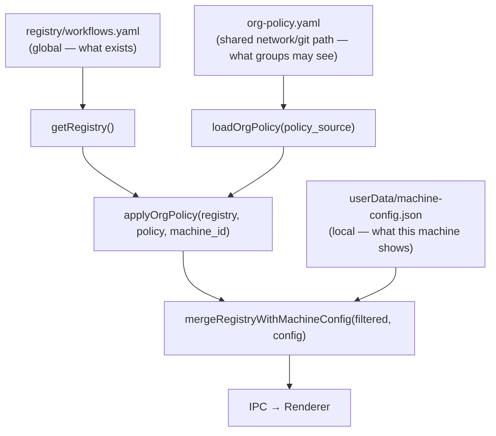

# Org-Wide Workflow Permissions — Phase 2

> **Status: design only.** No code is written for this phase. The phase 1 implementation includes inert type stubs (`OrgPolicy`, `OrgGroup`, `OrgAccessRule`, `policy_source` on `MachineConfig`) that establish the extension points this design builds on.

## Problem

The phase 1 machine-config model is personal — each machine owner decides what they see. When Workflow Hub is deployed across an organisation, this breaks down:

- An admin cannot control which workflows are available to a team member's machine.
- There is no concept of roles, groups, or access control.
- A new employee installs the app and sees every workflow in the registry, including ones their team has no business running.
- Removing access requires physically editing a file on the target machine.

## Context

Phase 1 establishes:
- `MachineConfig` with a `policy_source?: string` stub field.
- The three-step merge: global registry → (stub) → machine config → renderer.
- IPC channels for reading/writing the machine config.

Phase 2 fills the middle step: an org policy file that sits between the global registry and the per-machine toggle layer.

## Goals

- Admins can define which workflows are available to which groups of machines/users.
- The policy is version-controlled and human-readable (git-managed YAML).
- Individual machines can still restrict further but cannot expand beyond what the policy allows.
- The path to a lightweight server is clear when audit logs or real-time revocation are needed.

## Non-Goals

- Real-time policy revocation (requires a server — deferred to phase 2c).
- User authentication or SSO (also deferred to phase 2c).
- Workflow creation or editing through the policy system.
- Phase 2 implementation in this PR.

## Architecture



### Three-layer merge order

| Layer | Source | Effect |
|---|---|---|
| 1 — Global | `workflows.yaml` | All workflows that exist |
| 2 — Org policy | `org-policy.yaml` at `policy_source` | Restrict to what the machine's group is allowed |
| 3 — Machine config | `userData/machine-config.json` | Further restrict what this machine shows |

A machine cannot grant itself access to workflows the policy layer denied. A machine can hide workflows the policy permits.

## Data Model

```ts
// These types are already stubs in shared/types.ts from phase 1.

export interface OrgGroup {
  id: string;
  name: string;
  members: string[]; // machine_ids (os.hostname) in phase 2a; emails in 2c
}

export interface OrgAccessRule {
  group_id: string;
  workflow_ids?: string[];   // grant access to specific workflows
  cluster_ids?: string[];    // grant access to entire clusters
  allow: boolean;
}

export interface OrgPolicy {
  version: string;
  default_deny: boolean; // when true: deny unless explicitly allowed
  groups: OrgGroup[];
  rules: OrgAccessRule[];
}
```

### Policy file format (YAML)

```yaml
# org-policy.yaml
version: "1"
default_deny: true

groups:
  - id: finance-team
    name: Finance Team
    members:
      - christianbraathen-macmini   # os.hostname() of each machine
      - accountant-macbook

  - id: all-staff
    name: All Staff
    members: ["*"]   # wildcard: all registered machines

rules:
  - group_id: all-staff
    cluster_ids: [general, productivity]
    allow: true

  - group_id: finance-team
    cluster_ids: [finance]
    allow: true
```

## Permission Evaluation

When `policy_source` is set in `machine-config.json`:

1. Load the policy file from `policy_source` (local path or file:// URL in 2a; https:// in 2b).
2. Find all groups whose `members` list includes this machine's `machine_id` (or `*`).
3. Collect all `allow: true` rules for those groups → build a set of permitted workflow IDs.
4. If `default_deny: true`, filter the registry to only permitted workflows.
5. Pass the filtered result through the existing `mergeRegistryWithMachineConfig` (phase 1 layer).

When `policy_source` is absent or empty, skip the policy layer entirely (phase 1 behaviour).

## Rollout Path

### Phase 2a — Shared config file (no server)

- Policy file lives on a network share or in a git repo synced to each machine.
- `policy_source` is an absolute path: `/Volumes/SharedDrive/workflow-hub/org-policy.yaml`
- App loads the file at startup and caches it; re-reads when the app is foregrounded.
- No server infrastructure. Suitable for small teams with a shared drive or Dropbox/iCloud.

### Phase 2b — Simple HTTP server

- Policy file served from a lightweight HTTP endpoint: `https://internal.decide.as/workflow-hub/policy.yaml`
- App fetches at startup with a 5-minute in-memory cache and ETag-based revalidation.
- No auth (policy file is not sensitive at this level — workflow names are not secrets).
- Adds real-time policy changes without requiring machines to sync a file.

### Phase 2c — Full identity + real-time revocation

- User authenticates (SSO / email magic link).
- `machine_id` is replaced by a stable user identity.
- Policy server can push changes via WebSocket or long-poll.
- Audit log: who ran what, when.
- This phase requires a proper backend and is out of scope until the org deployment is larger.

## Settings UI Changes (phase 2)

The SettingsModal gains a second section: **"Organisation Policy"**.

- Shows: `Policy source: /path/to/org-policy.yaml` with an edit button.
- Shows: `Machine ID: <hostname>` (for the admin to copy into the policy groups).
- Shows: current group memberships (read-only, derived from loaded policy).
- If policy blocks a workflow, its toggle in the Workflow Availability section is grayed out with a tooltip: "Blocked by org policy".

## Key Design Decisions

### machine_id = os.hostname() until phase 2c

`os.hostname()` is stable, available without login, and human-readable. It breaks if two machines share a hostname, but that is rare in practice and acceptable until real user identity is introduced.

### Opt-in when policy_source is set

When a policy file is present and `default_deny: true`, the model flips from phase 1's opt-out (everything visible) to opt-in (nothing visible unless explicitly allowed). This is the correct default for org deployment: new workflows are hidden until an admin grants access.

### YAML for the policy file

Human-readable, diff-friendly, and already used for the registry. Allows the policy to be git-managed with PR-based approval for access changes — a lightweight alternative to a full RBAC admin UI.

### No encryption of the policy file

Workflow names and cluster names are not sensitive. The policy controls visibility, not data access. If workflow names are sensitive in a particular deployment, the policy file can be placed behind filesystem permissions.

## Open Questions

- **Q:** Should `members: ["*"]` (wildcard group) be explicit in the policy, or should there be a separate `default_allow` rule?
  **Recommendation:** Keep the wildcard in the group member list — it's explicit and visible. A separate `default_allow` flag would be a hidden global setting.

- **Q:** Should the policy layer cache aggressively (minutes) or reload on every request?
  **Recommendation:** Cache for 5 minutes in phase 2a (file system), 5 minutes with ETag in phase 2b (HTTP). Real-time push is a phase 2c concern.
