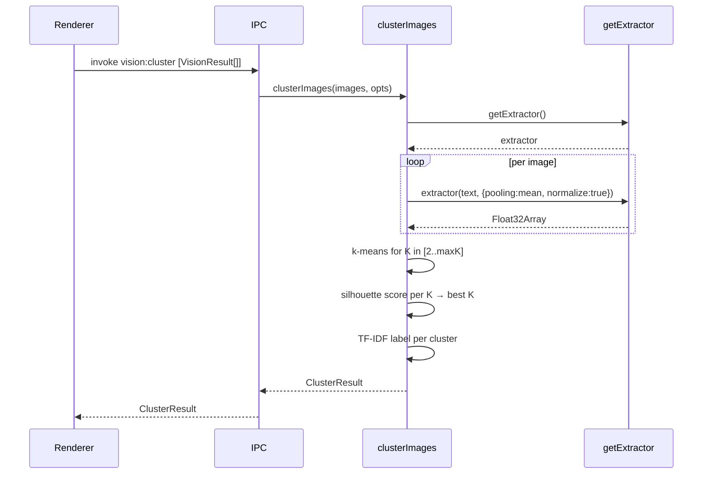

# Image Auto-Clustering — Architecture

## Overview

A new `image-clustering.ts` module that takes an array of `VisionResult`
objects, embeds each one using the existing multilingual model, clusters the
embeddings with k-means, and labels each cluster with a TF-IDF-derived phrase.
Exposed to the renderer via a single IPC channel.

## Architecture

```mermaid
flowchart TD
    Caller([Renderer / workflow]) -->|vision:cluster| IPC[IPC handler\nindex.ts]
    IPC --> C[clusterImages\nimage-clustering.ts]

    C --> E[getExtractor\nembeddings.ts]
    E --> Model[paraphrase-multilingual\n-mpnet-base-v2]
    Model -->|Float32Array per image| C

    C --> KM[k-means\nLloyd's algorithm]
    KM -->|cluster assignments| C

    C --> SK[silhouette scorer\nauto-select K]
    SK --> C

    C --> TF[TF-IDF labeller]
    TF -->|label per cluster| C

    C -->|ImageCluster[]| IPC
    IPC -->|ClusterResult| Caller
```

## Component Design

### `image-clustering.ts`

**Responsibilities:** orchestrate embedding, clustering, and labelling.

**Public API:**
```ts
export async function clusterImages(
  images: VisionResult[],
  opts?: { maxClusters?: number }
): Promise<ClusterResult>
```

**Internal pipeline:**
1. Build input text per image: `"${description}. ${keywords.join(', ')}"`
2. Embed each text via `getExtractor()` → `Float32Array[]`
3. If N < 4: return single cluster with all images
4. Run k-means for each K ∈ [2, min(maxClusters, N÷2)]
5. Score each K with silhouette coefficient; pick highest
6. Label each cluster via TF-IDF on member descriptions
7. Return `ClusterResult`

### k-means (internal)

Lloyd's algorithm with k-means++ initialisation (weighted random seed).
Runs up to 100 iterations or until centroid shift < 1e-6. Returns cluster
assignments as `number[]`.

### Silhouette scorer (internal)

For each point, computes mean intra-cluster distance (a) and mean
nearest-cluster distance (b). Silhouette = (b-a)/max(a,b). Mean over all
points is the K score. O(N²) per K — acceptable for N≤500.

### TF-IDF labeller (internal)

- Tokenise each member's description + keywords into lowercase terms, remove
  stopwords (EN + NO list).
- TF = term frequency within cluster. IDF = log(N_clusters / clusters containing term).
- Pick top-scoring term or bigram (up to 3 words) as the cluster label.
- Fallback: most frequent keyword across cluster members.

## Data Model

```ts
// shared/types.ts additions

export interface ImageCluster {
  label: string;           // TF-IDF derived label, ≤3 words
  keywords: string[];      // top 5 keywords across members
  imagePaths: string[];    // paths of member images
  centroidIndex: number;   // index of the member closest to centroid
}

export interface ClusterResult {
  clusters: ImageCluster[];
  model: string;           // embedding model used
  k: number;               // final cluster count
  silhouetteScore: number; // quality indicator (0-1, higher is better)
}
```

## Control Flow



## Failure Handling

- N < 2: return single cluster containing all images, label from first image's top keyword.
- N 2-3: return single cluster (not enough for meaningful silhouette scoring).
- Embedding failure: throw with message — caller surfaces to user.
- k-means fails to converge: return best assignment found after max iterations.

## Performance Considerations

- Embeddings are the bottleneck: ~50ms/image on Apple Silicon. 500 images ≈ 25 seconds.
- Silhouette scoring is O(K·N²) — for K up to 8 and N=500: under 2 seconds on Apple Silicon.
- The embedding model is shared with `embeddings.ts` and releases on the same schedule as semantic search.

## Alternatives Considered

**DBSCAN instead of k-means:** auto-discovers cluster count and handles noise points. Rejected because it requires tuning `epsilon` (neighbourhood radius in embedding space), which is not meaningful to expose to users and hard to auto-tune reliably.

**LLM-based labelling (ask Ollama for a cluster name):** would produce richer labels but adds a round-trip to Ollama and requires the model to be loaded. TF-IDF is deterministic, fast, and produces labels good enough for folder names.

**Shared k-means with `embeddings.ts`:** the existing embeddings module is workflow-specific. Sharing would create unwanted coupling. New module keeps concerns separate.

## Risks

- k-means is non-deterministic — same input may produce different clusters across runs. Acceptable for file organisation.
- TF-IDF labels may be generic for homogeneous batches (e.g. 20 similar screenshots). Mitigate with keyword frequency fallback.
