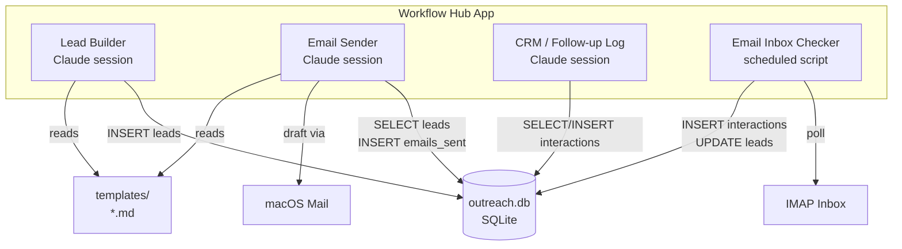
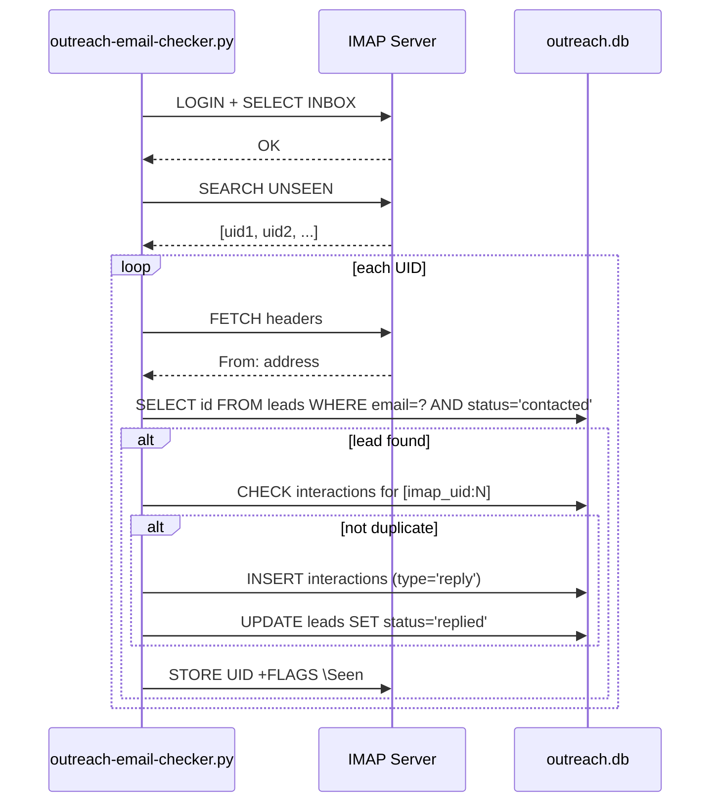

# Cold Outreach System — Architecture

## Overview

Four Workflow Hub cards backed by a single SQLite database. Three cards open Claude sessions (Lead Builder, Email Sender, CRM); one runs a scheduled Python script (Email Inbox Checker). All data lives in `workflow-hub-data/cold-outreach/`.

## Architecture



## Data Model

Single SQLite file: `workflow-hub-data/cold-outreach/data/outreach.db`

```sql
CREATE TABLE leads (
    id              INTEGER PRIMARY KEY AUTOINCREMENT,
    name            TEXT NOT NULL,
    email           TEXT NOT NULL UNIQUE,
    company         TEXT,
    source          TEXT,                  -- e.g. LinkedIn, referral, website
    treatment_group TEXT NOT NULL,         -- e.g. value-first, demo-ask, case-study
    status          TEXT NOT NULL DEFAULT 'new',  -- new | contacted | replied | closed
    created_at      TEXT NOT NULL DEFAULT (datetime('now')),
    notes           TEXT
);

CREATE TABLE emails_sent (
    id            INTEGER PRIMARY KEY AUTOINCREMENT,
    lead_id       INTEGER NOT NULL REFERENCES leads(id),
    subject       TEXT,
    body_preview  TEXT,                  -- first 500 chars
    sent_at       TEXT NOT NULL DEFAULT (datetime('now')),
    template_name TEXT
);

CREATE TABLE interactions (
    id         INTEGER PRIMARY KEY AUTOINCREMENT,
    lead_id    INTEGER NOT NULL REFERENCES leads(id),
    type       TEXT NOT NULL,            -- note | call | reply | meeting
    notes      TEXT,
    created_at TEXT NOT NULL DEFAULT (datetime('now'))
);
```

Idempotency for the inbox checker: the script stores the IMAP message UID in
`interactions.notes` as `[imap_uid:12345]` and checks for its presence before
inserting. This avoids a brittle `UNIQUE` constraint on timestamp.

## Component Design

### Lead Builder (Claude session)

- `repo_path`: `workflow-hub-data/cold-outreach`
- Session opens with context: path to `outreach.db`, path to `templates/`, the user's chosen treatment group (from registry input)
- Claude writes SQL INSERT statements or calls `sqlite3` CLI to add leads
- Outputs: rows in `leads` table

### Email Sender (Claude session)

- `repo_path`: `workflow-hub-data/cold-outreach`
- Session opens with context: list of `status = new` leads, the matching treatment group template
- Claude drafts email, asks user to review, then opens macOS Mail with `open "mailto:..."` or `osascript`
- After sending: Claude inserts into `emails_sent` and updates `leads.status = contacted`

### CRM / Follow-up Log (Claude session)

- `repo_path`: `workflow-hub-data/cold-outreach`
- Session opens with a summary of recent interactions from the DB
- Claude can INSERT new interaction rows (type: note, call, meeting) on user instruction
- Optional filter by contact name or company

### Email Inbox Checker (scheduled script)

- Script: `scripts/outreach-email-checker.py`
- Wrapper: `scripts/outreach-email-checker-wrapper.sh`
- Reads IMAP credentials from `.env`
- Fetches `UNSEEN` messages from INBOX (configurable via `OUTREACH_IMAP_FOLDER` env var)
- For each message: extract `From:` address, look up in `leads` WHERE `status = contacted`
- If matched: INSERT into `interactions`, UPDATE `leads.status = replied`
- Marks processed messages as seen in IMAP
- Trigger type: `scheduled` in the registry card

## Control Flow

### Email Inbox Checker



## Failure Handling

- IMAP connection failure: wrapper script sends Pushover notification and exits non-zero
- Duplicate detection: IMAP UID embedded in `interactions.notes`; script queries before inserting
- Missing `.env`: script logs a clear error and exits with code 1
- Unknown lead email: silently skipped (no entry created)

## Security Considerations

- IMAP credentials stored in `.env` only — never committed
- `.env` is already gitignored project-wide
- No credentials passed as CLI arguments (avoids `ps` exposure)
- IMAP connection uses SSL (`imaplib.IMAP4_SSL`)

## Alternatives Considered

**Full SMTP sending (programmatic):** Enables automatic `sent_at` recording but
removes the human review step. Rejected — personal cold outreach needs eyes on
every message before it leaves.

**Airtable or Notion instead of SQLite:** Requires API keys, network access, and
an external dependency. Rejected — SQLite is inspectable, portable, and already
used in the Reading List workflow.

**Single "outreach" Claude session instead of three cards:** Simpler registry
footprint but conflates distinct jobs (building a list, sending, reviewing
history). Separate cards match how the work actually feels day-to-day.
