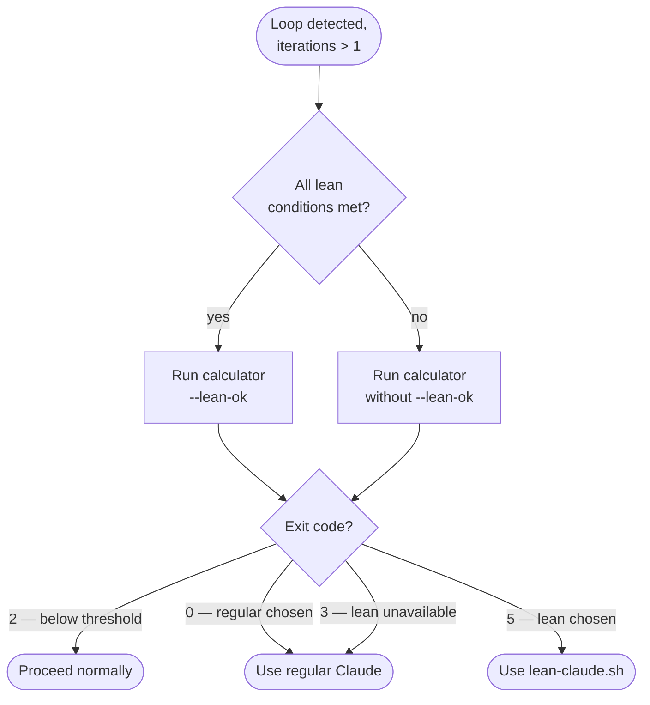

# Loop Token Budget Check

Before executing any Claude loop with more than one iteration, run the token budget calculator. It completes in ~3ms — faster than any heuristic judgment.

## Decision flowchart



## Run the calculator

```bash
bash .claude/scripts/estimate-loop-tokens.sh \
  --iterations N \
  --input-tokens X \
  --output-tokens Y \
  [--lean-ok]        # add when all three lean conditions are met
  [--autonomous]     # add when running in bypass-permissions mode
```

Estimate `--input-tokens` and `--output-tokens` as the average per iteration. Round numbers are fine — the goal is order-of-magnitude accuracy, not precision.

The script exits with a code:

| Exit | Meaning |
|---|---|
| `0` | Proceed with regular Claude |
| `2` | Below 250 000 threshold — proceed normally, no action needed |
| `3` | Above threshold, lean not available |
| `5` | Proceed with lean-claude.sh |

In interactive mode the script prints the comparison table and waits for your answer. In autonomous mode it prints the chosen approach to stderr and exits immediately.

## Lean approach conditions

Lean is only a valid option when all three hold:

1. **Self-contained** — each iteration needs only the data you feed it, not project knowledge or tool access.
2. **Structured or extractive output** — scoring, classification, summarisation, format conversion. Not code changes or architectural decisions.
3. **Context is fully suppliable** — everything the model needs can be embedded in the per-iteration prompt.

If any condition fails, omit `--lean-ok` and the script will present regular-only cost.

## Autonomous mode

When running with explicit bypass-permissions approval, add `--autonomous`. The script selects lean if all conditions are met and savings exceed 40%, otherwise regular. No prompt is shown.

## What counts as a loop

- A shell loop calling `lean-claude.sh` or `claude` per item
- A subagent spawned N times over a list
- A Python/script loop calling the Anthropic API per item
- A skill phase that calls Claude once per file, PR, or dimension

Single multi-shot prompts (one call with the full list) are not loops — no check needed.
