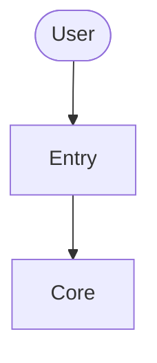
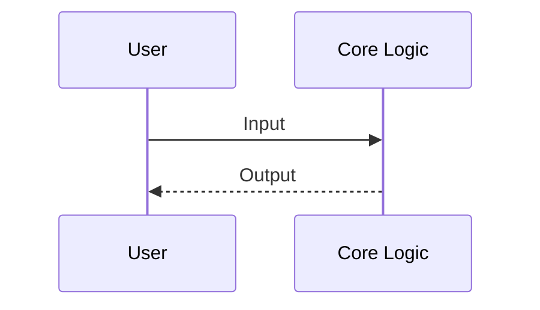

# Architecture — Budget-Variance-Analyst

> This document describes the high-level architecture of Budget-Variance-Analyst.
> Update it as the system evolves — it helps both humans and AI understand
> the codebase before making changes.

## Overview

Compares actuals against approved budget per cost centre and generates board-ready variance commentary

## System diagram

<!-- Replace the diagram above with your actual architecture as the project grows. -->

## Components

| Component | Location | Responsibility |
|---|---|---|
| Core logic | `src/budget_variance_analyst/` | Business logic and orchestration |
| Tests | `tests/` | Test suite |

<!-- Add rows as you create new modules. -->

## Data flow

<!-- Replace with your actual data flow as the project grows. -->

## Key design decisions

<!-- Document important architectural choices and their rationale. -->
<!-- Example: -->
<!-- | Decision | Rationale | -->
<!-- |---|---| -->
<!-- | Use X over Y | Because Z | -->

## Further reading

- [README.md](README.md) — Project overview and getting started
- [CLAUDE.md](CLAUDE.md) — AI coding conventions
- [.claude/rules/](.claude/rules/) — Workflow rules
